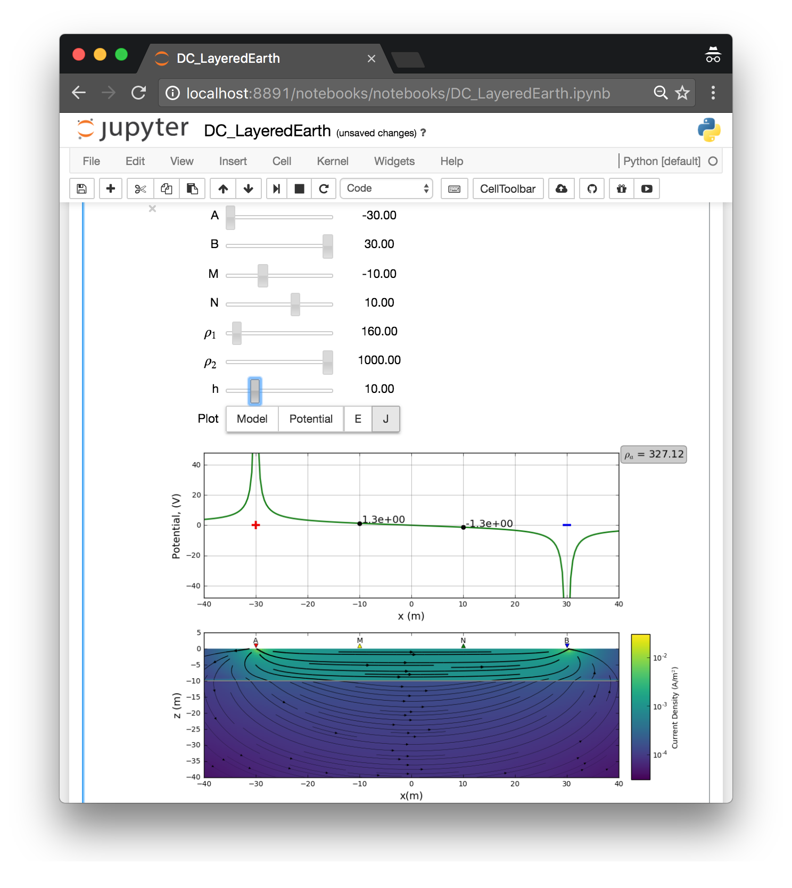
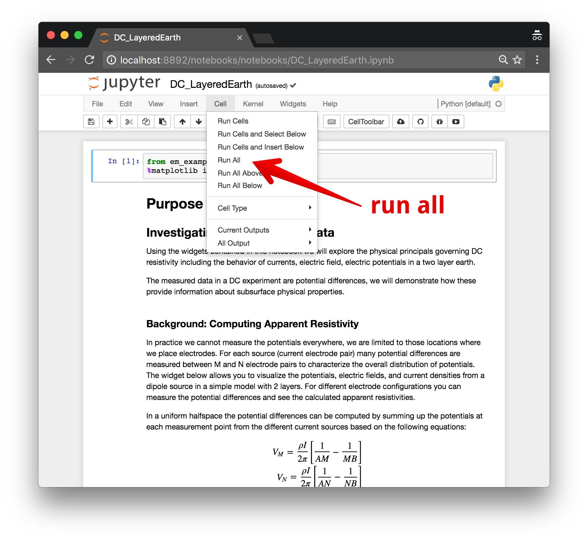
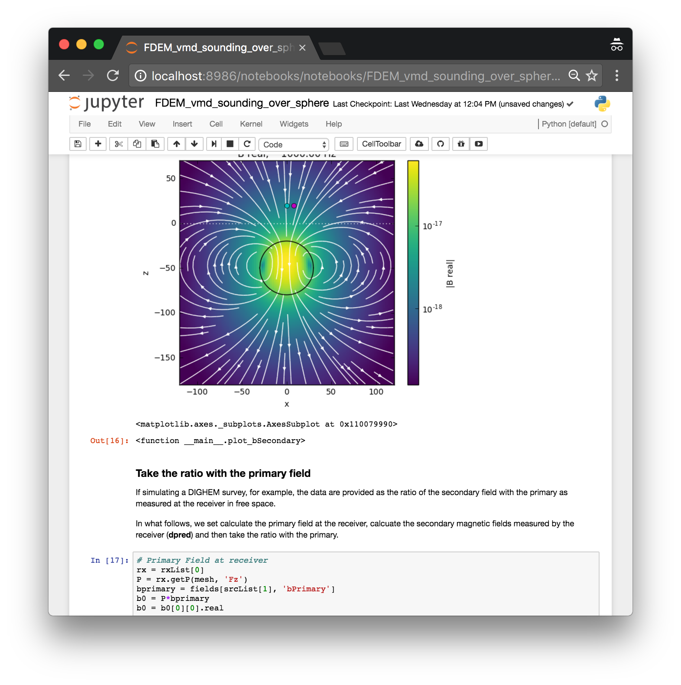

.. _apps_index:

Apps
====

To augment the content in EM GeoSci, a number of `Jupyter
Notebook <https://jupyter.org>`_ apps have been developed.
There are two categories of notebooks

- :ref:`EM Apps <em_apps>`
    - **Purpose:** To provide an interactive way to explore fundamentals of EM geophysics

- :ref:`Simulation Notebooks <simulation_notebooks>`
    - **Purpose:** To be a starting point for getting up and running with the EM Module of SimPEG for performing numerical simulations and inversions

.. We have provided instructions on working with the apps in the `Jupyter
.. Notebook<https://jupyter.org>`_ environment.

If you run into any issues, please let us know at: https://github.com/geoscixyz/em_apps.

.. _em_apps:

EM Apps
-------

There are a few ways you can run the notebooks. We recommend:

- Microsoft Azure (recommended): https://notebooks.azure.com/library/em_apps

Alternatively, you can use:

- Binders (free, no login required, not-so-stable): http://mybinder.org/repo/geoscixyz/em_apps
- Download from Github (free, installation of python required): https://github.com/geoscixyz/em_apps

Within the Jupyter Notebook environment, you can use :code:`shift + enter` to run
each cell of code, or from the menu, select :code:`cell, run all`

Notebooks include
^^^^^^^^^^^^^^^^^

**Physical Properties**

- Cole-Cole response: Complex conductivity

**Maxwell 1: Fundamentals**

- FDEM Planewave in Wholespace
- FDEM Electric Dipole in Wholespace
- FDEM Electric Dipole in Wholespace
- TDEM Electric Dipole in Wholespace
- TDEM Electric Dipole in Wholespace
- Induction RL circuit (two loops)

**Maxwell 2: DC**

- Electrostatic Sphere
- DC Layered Earth
- DC 2D Cylinder in Halfspace
- DC 2.5D Cylinder in Halfspace
- DC 2D Plate in Halfspace
- DC 2.5D Plate in Halfspace
- DC 2D shielding effects in Halfspace
- DC 2.5D shielding effects in Halfspace
- DC Building Pseudosections

**Maxwell 3: FDEM**

- FDEM Vertical Magnetic Dipole in Layered-earth

**Maxwell 4: TDEM**

- TDEM Horizontal Circular loop in Layered-earth

**Geophysical Surveys**

- MT Layered earth

.. _simulation_notebooks:

Simulation Notebooks
--------------------

These notebooks walk through forward simulations of both frequency domain
electromagnetics and time domain electromagnetics using `SimPEG <http://simpeg.xyz>`_.

These notebooks are available at

- Microsoft Azure (recommended): https://notebooks.azure.com/library/electromagnetics

or alternatively:

- Binders (free, no login required, not-so-stable): http://mybinder.org/repo/simpeg/em_notebooks
- Download from Github (free, installation of python required): https://github.com/simpeg/em_notebooks

Further examples and documentation are available at http://simpeg.xyz.

