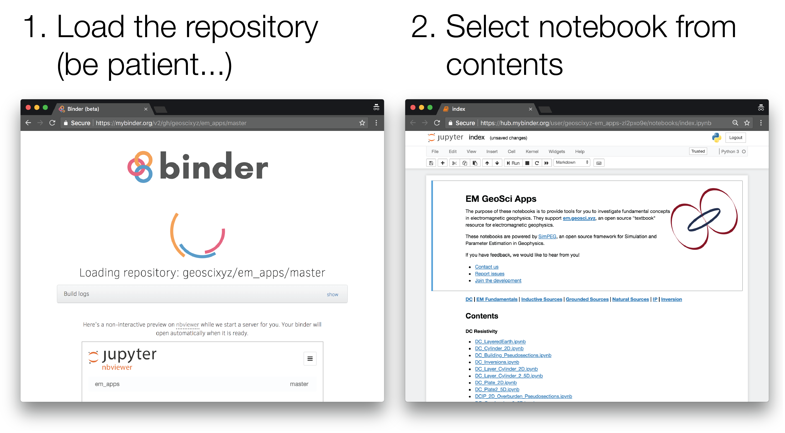
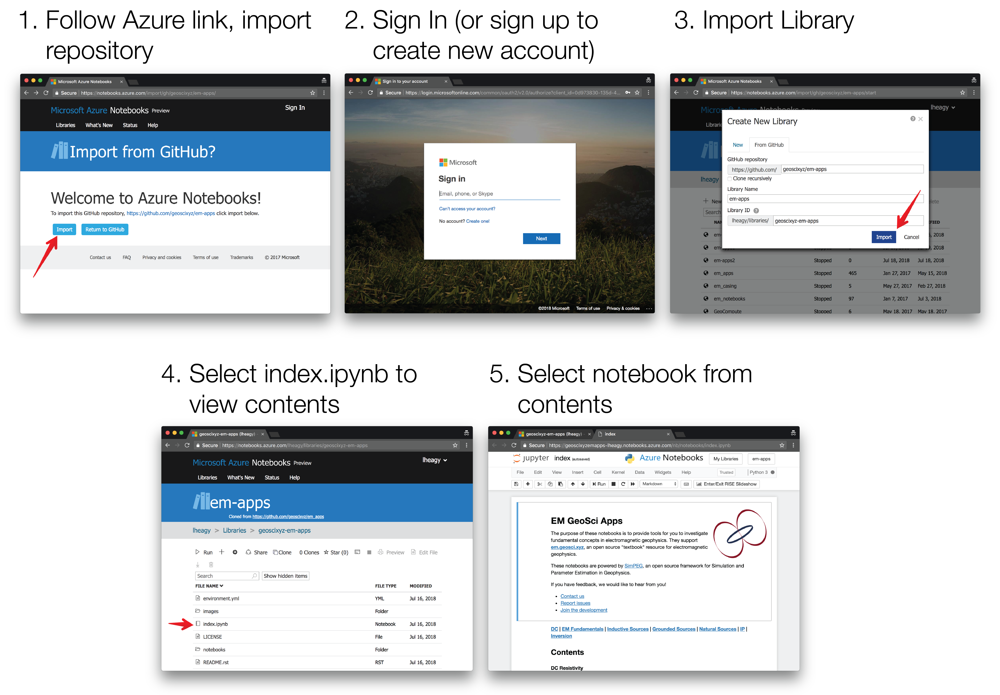

.. _apps_index:

Apps
====

To augment the content in EM GeoSci, a number of `Jupyter
Notebook <http://jupyter.org>`_ apps have been developed.
There are two categories of notebooks

- :ref:`EM Apps <em-apps>`
    - **Purpose:** To provide an interactive way to explore fundamentals of EM geophysics

- :ref:`Simulation Notebooks <simulation_notebooks>`
    - **Purpose:** To be a starting point for getting up and running with the EM Module of SimPEG for performing numerical simulations and inversions

If you run into any issues, please let us know at: http://github.com/geoscixyz/em-apps.

.. _em-apps:

EM Apps
-------

.. image:: https://mybinder.org/badge.svg
    :target: https://mybinder.org/v2/gh/geoscixyz/em-apps/master?filepath=index.ipynb
    :alt: Binder

.. image:: https://notebooks.azure.com/launch.png
    :target: https://notebooks.azure.com/import/gh/geoscixyz/em-apps
    :alt: Azure notebooks

.. image:: images/DC_LayeredEarth_notebook.png
    :width: 45%
    :alt: dc-layered-earth-app
    :align: right

There are a few ways you can run the notebooks. We provide instructions using:

- :ref:`Binder <binder>` (free, no login required)
- :ref:`Microsoft Azure <azure>` (free, login required)

Alternatively, they can be downloaded from GitHub and run locally.
Please see instructions at: https://github.com/geoscixyz/em-apps

.. _jupyter_notebooks:

Jupyter Notebooks
^^^^^^^^^^^^^^^^^

Within the Jupyter Notebook environment, you can use :code:`shift + enter` to run
each cell of code, or from the menu, select :code:`cell, run all`

.. image:: images/run_all_cells.png

.. _binder:

Binder
^^^^^^

.. image:: https://mybinder.org/badge.svg
    :target: https://mybinder.org/v2/gh/geoscixyz/em-apps/master?filepath=index.ipynb
    :alt: Binder

1. Launch the binder by clicking on the badge above or going to: https://mybinder.org/v2/gh/geoscixyz/em-apps/master?filepath=index.ipynb.
   This can sometimes take a couple minutes, so be patient...

2. Select the notebook of interest from the contents

3. :ref:`Run the Jupyter notebook <jupyter_notebooks>`

.. _azure:

Azure Notebooks
^^^^^^^^^^^^^^^

.. image:: https://notebooks.azure.com/launch.png
    :target: https://notebooks.azure.com/import/gh/geoscixyz/em-apps
    :alt: Azure notebooks

1. Navigate to Azure notebooks by clicking on the badge above or going to: https://notebooks.azure.com/import/gh/geoscixyz/em-apps,
   and select :code:`Import` to import the library

2. Sign in to your microsoft account (or `Create One` if you do not already have an account)

3. Create the new library: Select Import

4. Select :code:`index.ipynb` to view the notebook contents

5. Select the notebook of interest from the contents

6. :ref:`Run the Jupyter notebook <jupyter_notebooks>`

.. _simulation_notebooks:

Simulation Notebooks
--------------------

.. image:: ./images/FDEM_sounding_over_sphere.png
    :width: 45%
    :alt: dc-layered-earth-app
    :align: right

.. image:: https://mybinder.org/badge.svg
    :target: https://mybinder.org/v2/gh/simpeg/em-notebooks/master?filepath=index.ipynb
    :alt: Binder

.. image:: https://notebooks.azure.com/launch.png
    :target: https://notebooks.azure.com/import/gh/simpeg/em-notebooks
    :alt: Azure notebooks

These notebooks walk through forward simulations of both frequency domain
electromagnetics and time domain electromagnetics using `SimPEG <http://simpeg.xyz>`_.

See the above instructions to run the notebooks from Binder or Azure. Note that the url's are different.

- :ref:`Binder <binder>` (free, no login required): https://mybinder.org/v2/gh/simpeg/em-notebooks/master?filepath=index.ipynb
- :ref:`Microsoft Azure <azure>` (free, login required): https://notebooks.azure.com/import/gh/simpeg/em-notebooks

Alternatively, they can be downloaded from GitHub and run locally.
Please see instructions at: https://github.com/simpeg/em-notebooks

Further examples and documentation are available at http://simpeg.xyz.

