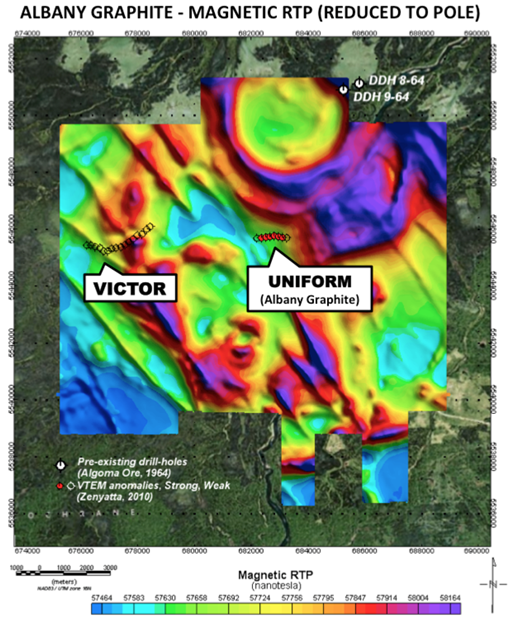
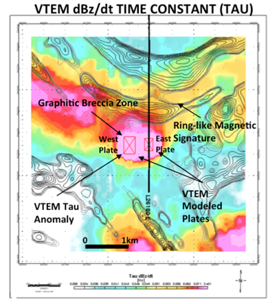
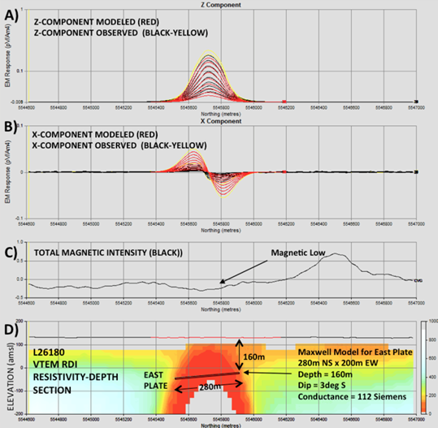
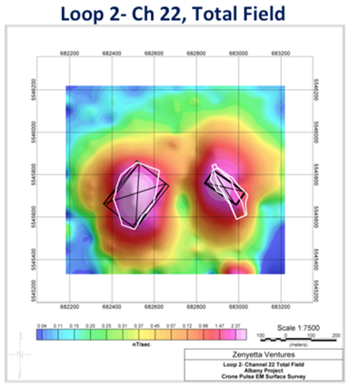

.. _albany_interpretation:

Interpretation
==============

Airborne EM-Magnetic Data
-------------------------

The VTEM EM and magnetic surveys identified two EM and magnetic targets of significance (Victor & Uniform; Legault, 2010) as shown in :numref:`MagData_interp`. They lie in close proximity to a distinctive ring-like magnetic anomaly over the Nagagami Alkalic Complex to the northeast (:numref:`PlaneLines_survey`) and a more subtle zoned magnetic anomaly, in the center-west region, that corresponds to the Albany Alkalic Complex.

    Magnetic reduced to pole image over Albany graphite property, showing, VTEM magnetic anomalies (Legault, 2010).

The Albany Graphite Deposit EM anomaly is observed along multiple survey lines that suggest as many as 2 separate zones and with relatively high values of Time Constant (Tau) between 1ms to 3 ms that indicate high conductance (:numref:`VTEMlatetime_interp`). Resistivity-depth imaging of the VTEM results (:numref:`MagData_interp`) using the transformation scheme by Meju (1998) indicated a large (1400 m x 800 m) conductivity high that is consistent with a mineralized bedrock source below the limestone cover (Legault, 2010). 3D Maxwell plate modeling (Duncan, 1987) of the two VTEM anomalies indicates a larger plate to the west (~270 m EW by 400 m NS) with 83 Siemens conductance and a smaller plate to the east (~200 m EW by 280 m NS) with 112 Siemens conductance, with both shallow south-dipping and occurring at approximately 150-160 m depth. :numref:`VTEMprofile_interp` presents an RDI resistivity-depth image and EM plate model for East plate.

    Late channel VTEM :math:`dB_z/dt` time constant with magnetic gradient contours, showing location of L26170E in :numref:`MagData_interp`, and modeled EM plates (West and East).

However, the Albany Graphite EM anomaly is also distinguished by its weak magnetic low response (:numref:`MagData_interp`) that is consistent with either remanently magnetized magnetite or pyrrhotite, or possibly diamagnetic graphite, which at the time caused it to be initially less favoured, geophysically, relative to other neighbouring anomalies. In spite of this, the drilling of the Uniform VTEM anomaly for nickel-copper target with drill-hole Z11-4F1 tested a strong, large airborne EM conductor and intersected eight separate and extensive breccia zones consisting of variably sized granitic fragments set in a black matrix containing graphite (Ross and Masun, 2014).

    Maxwell plate-model for L26180 VTEM results: A) Z-component dB/dt observed and model profiles, B) X-component observed and modeled, C) Magnetic profile, and D) RDI resistivity–depth image (ohm-metres) and model parameters for East plate.

Ground-Based TDEM Data
----------------------

The EM results from Loop 1 and Loop 2 identified two separate conductive features which have been inferred to be pipe-like structures (:numref:`GroundLoop1_interp` and :numref:`GroundLoop2_interp`). The Western anomaly is characterized by a rough circular pattern with an approximated depth of 100-120 m to the top of the source and a Tau of approximately 12 msec. The Eastern anomaly is characterized by an oval shaped source with its long axis oriented in the NNW-SSE direction (:numref:GroundLoop1_interp`). This zone is described by a slightly higher conductivity; providing a higher Tau value of ~15 msec. Brief modeling studies of Loop 1 data indicated the responses of the two zones were dominated by the top-edge of the conductive features. Multiple bodies of varying thickness were utilized to fit the data, but provided negligible difference in the model fit, suggesting the response was dominated by the relatively flat-lying tops of these bodies.

.. figure:: images/figGroundLoop1.png
    :align: center
    :figwidth: 50%
    :name: GroundLoop1_interp

    Late time (channel 22), total field for Loop 1 with modeled plates (black) and surface deposit outline (white).

Modeling of Loop 2 (:numref:`GroundLoop2_interp`) revealed that both the Western and Eastern anomalies had the potential for considerable depth extent. Modeling results for the Western anomaly provided better fits to the data when using the thick plate option within Maxwell and suggesting a minimal depth extent or thickness on the order of 50 m to 100 m to provide good modeling fits. The Eastern anomaly was fitted with a depth extent/thickness of approximately 150 m with poor fits being obtained by anything less than 100 m

    Late time (channel 22), total field for Loop 2 with modeled plates (black) and surface deposit outline (white).

