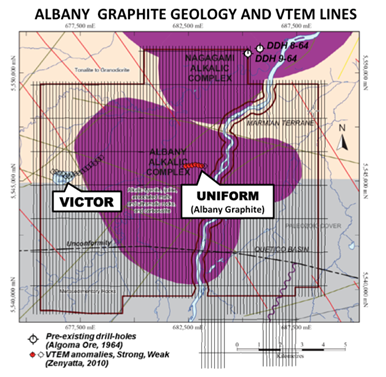

.. _albany_setup:

Setup
=====

Project Overview
----------------

.. figure:: images/figAlbanyLocationMap.png
    :align: right
    :figwidth: 50%
    :name: figAlbanyLocationMap_setup

    Location of the Albany graphite property, which lies roughly 400 km NE of Thunder Bay, Ontario.

While conducting an exploration program targeting nickel (Ni), copper (Cu), and platinum group metals (PGMs) Zenyatta made the discovery of a very rare type of hydrothermal graphite deposit in 2011 on their Albany Graphite Project located 30km north of the Trans-Canada Highway near Hearst Ontario (:numref:`figAlbanyLocationMap_setup`). The Albany Project area had been largely unexplored in the past as a result of swamp and the younger Phanerozoic (460-360 Ma) cover rocks, up to 200m thick, overlying the prospective Archean rocks. However, recent advances in airborne electromagnetic (EM) technology had allowed deeper penetration/resolution through the Fe-deficient shallow marine carbonate/clastic sediments to target favourable geological and structural settings within the underlying Archean (see `Zenyatta's website <http://www.zenyatta.ca/>`__ ).

This case study describes the airborne time-domain EM (TDEM) and magnetic geophysical survey results from 2010 that lead to the discovery and the subsequent ground follow up in 2013 using surface TDEM that better characterized the two graphite deposits (East Pipe and West Pipe) at Albany.

Geology
-------

    Basement geology of the Albany graphite property showing VTEM survey lines and EM anomalies (adapted from Ross and Masun, 2014).

The Albany graphite deposit is located in the Superior Province of the Canadian Shield, at the terrane boundary between the Quetico Subprovince to the north and the Marmion Subprovince to the south (:cite:`RossMasun2014`). The geology of the survey area consists of Precambrian paragneissic granitoids and migmatitic metasediments to the south and metamorphosed tonalite to granodiorite to the north.  These rocks have been intruded by a younger alkalic intrusive complex (:numref:`PlaneLines_setup`).
 
These basement rocks are covered with up to 15m of relatively thin flat-lying Paleozoic limestone sandstones, shales, dolostones, siltstones and up to 50m of thick overburden. The Albany graphite deposit is hosted within a younger gneissic to unfoliated alkalic syenite, granite, diorite, and monzonite intrusive suite (Albany Alkalic Complex; :numref:`PlaneLines_setup`) that are cross-cut by younger dykes, ranging from felsic to mafic in composition (:cite:`RossMasun2014`).

.. figure:: images/figDrillModel.png
    :align: right
    :figwidth: 50%
    :name: DrillModel_setup

    3D wireframe models of the East and West pipes forming the Albany graphite deposit, constrained by drilling (adapted from :cite:`RossMasun2014`).

Prior to 2010, the Albany project area had been explored by as many as eight companies, dating back to 1959, though not extensively, due to the Paleozoic limestone cover and thick glacial till (:cite:`RossMasun2014`). Aeromagnetic and ground EM surveys had defined REE rare earth occurrences in two drillholes in 1964 on the property (:numref:`PlaneLines_setup` and :numref:`DrillModel_setup`) and also graphitic breccia in one drill-hole in 1978. Regional aeromagnetic coverage and subsequent interpretation map by the Ontario Geological Survey (:cite:`Stott2008`) highlight both the Albany Alkalic Complex on the property and the Nagagami Alkalic Complex further north. Zenyatta became active in exploring for nickel, copper and PGMs in the region based on this evidence, which led to the 2010 VTEM survey and the discovery of extensive graphite mineralization on the Albany Graphite claim block in January, 2011 (:cite:`RossMasun2014`).

The Albany deposit is a unique example of an epigenetic graphite deposit in which a large volume of highly crystalline, fluid-deposited graphite occurs within an igneous host (Ross and Masun, 2014). The deposit is interpreted as a vent pipe breccia that formed from a CH4-CO2-rich fluid that evolved due to pressure-related degassing of syenites of the Albany Alkalic Complex. Graphite occurs both in the matrix, as disseminated crystals, clotted to radiating crystal aggregates and veins, and along crystal boundaries and as small veins within the breccia fragments.
 
Zenyatta has drilled 63 holes since 2011, totaling more than 26,000m in the deposit area, with up to 360m of graphite mineralization in a single hole and mineralized intersections down to 500m depth (:numref:`DrillModel_setup`). Graphite mineralization is related to two separate graphitic breccia pipes (West Pipe and East Pipe – :numref:`DrillModel_setup`) which are typically surrounded by a zone of graphite overprinted syenite. The deposit contains a total indicated resource of 25.1 Mt at 3.89% graphitic carbon (Cg) for a total of 977,000 tonnes (:cite:`RossMasun2014`).

