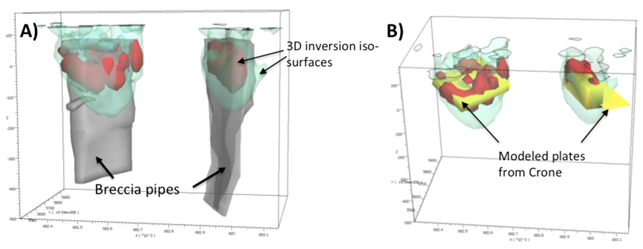

.. _albany_synthesis:

Synthesis
=========

Ground TDEM
-----------

The Loop 2 survey appears to have been most sensitive to the Northern edge of the sources, but difficulty arises when determining the southern limit of the source. The southern boundary is best determined from the Loop 1 models, although this is a crude approximation.

Overall, the modelled plates from Loop 1 and Loop 2 provided a robust model for targeting purposes. After drilling the first few holes, Zenyatta came to the conclusion that the channel 22 total field contours from Loop 1 provided a close correspondence to the actual outline of the breccia pipes and relied on this extensively for drill planning purposes (:numref:`ModelSynthesis`).

.. figure:: images/figModelSynthesis.png
    :align: center
    :figwidth: 60%
    :name: ModelSynthesis

    3D view of Loop 1 total field (channel 22) surface date with modelled plates and deposit.

3D Joint AEM and Ground EM Inversion
------------------------------------

3D AEM inversion modeling was performed on the VTEM and ground TEM results at Albany project using the UBC-GIF H3DTDinv suie of algorithms (Hickey, 2015). For six VTEM lines directly over the deposits, the vertical (Z) component was inverted from six off-time channels for delay times ranging from 145 µsec. to 580 µsec. The resulting models showed two large conductive and roughly circular bodies that displayed good correlation with the top upper 100 meters of the 3D wireframes of the deposits. The ground TEM data collected from both fixed loop transmitters were then inverted to attempt imaging of the breccia pipes at greater depth. The X and Z components of dB/dt field were used for the inversion of five off-time channels (time gates between 1.312 msec and 22.735 msec). A distance weighting was applied to the data using the transmitter loops and station locations to encourage the recovery of conductive material at depth. A starting background conductivity model was also used which contained a conductive cover layer estimated from the previous VTEM 3D model.

:numref:`JointInversion` A presents 3D views of the ground fixed loop 3D inversion model as conductive iso-surfaces along with the wire frames of the known deposit and shows how the breccia pipes are imaged a conductors to a depth of 200-250m. :numref:`JointInversion` B compares the 3D inversion conductivity iso-surfaces with the Crone modeled plates, showing good correlation between the two modeling approaches. The AEM and ground EM 3D inversions resulted in accurate and useful models of the targeted breccia pipes, as well as bettter understanding of the depth and areal extents of the bodies external geometry (Hickey, 2015).

    3D wirefram models. A) 3D view of conductivity iso-surfaces of 0.05 S/m (green) and 50 S/m (red) from the ground fixed loop inversion model with the modeled deposits (in grey with transparency); B) Perspective view comparing the conductivity iso-surfaces of 0.05 S/m (green) and 50 S/m (red) from the ground fixed loop inversion model with the modeled plates from Crone depicted in yellow.
