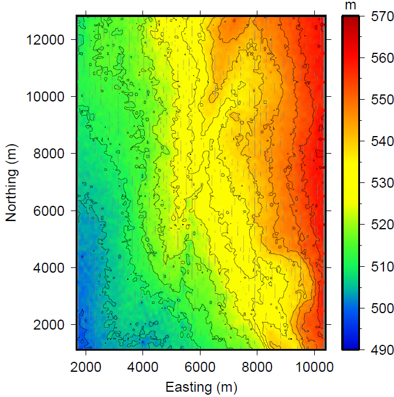
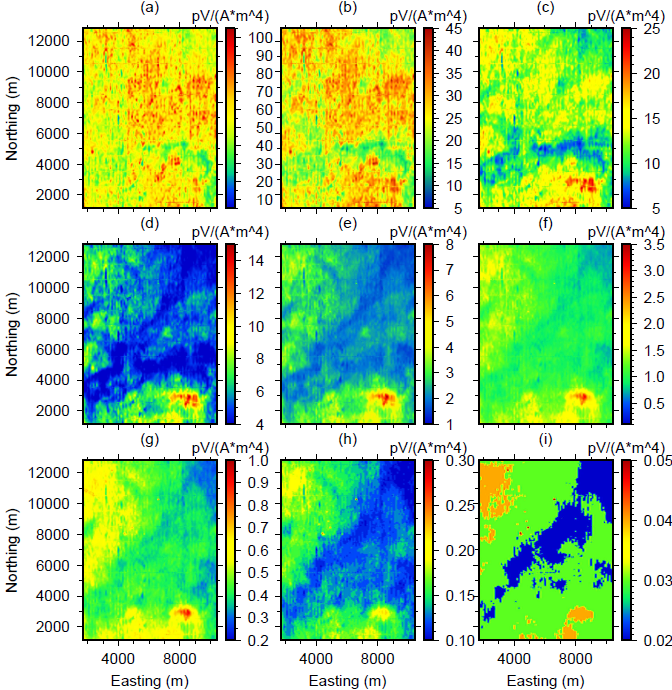
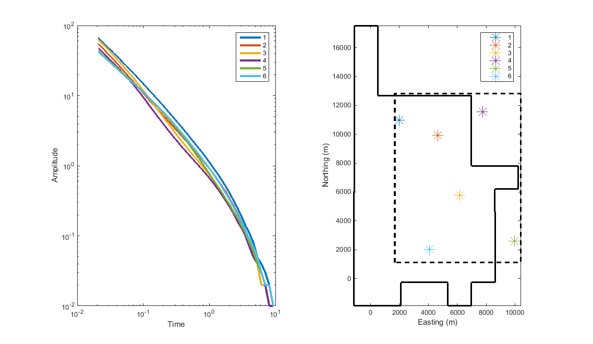

.. _aspen_data:

Data
====

        Topography for the Aspen survey region.

In preparation for processing and inversion of the time-domain EM data, we
first assess the data through visualization. The topography is shown in
:numref:`asp5a`, showing higher elevations in the eastern part of the survey
region. The elevation decreases towards the west.

The data consists of :math:`\partial \mathbf{B}/\partial t` measurements at 44
time channels. A selection of time channel maps are shown in :numref:`asp5`.
We can associate higher values (warm colours) with conductive regions and
lower values (cool colours) with resistive regions. The earliest times are
fairly uniform and appear to be quite conductive. Middle time channels show
more varying structures. The data decay as time goes on. This is much more
apparent when plotting the data as decay curves.

        Time channel maps showing :math:`\partial \mathbf{B}/\partial t` for
        (a) 0.02, (b) 0.05, (c) 0.1, (d)0.19, (e) 0.33, (f) 0.77, (g 1.53, (h)
        3.06, and (i) 9.29 milloseconds.

A selection of six decay curves are plotted in :numref:`asp5b`. Depending on
their location in space, the decay curves show different characteristics. This
gives us insight into the resistivity structures at those locations. Decay
over conductive features is slower than over resistive features. Thus, we can
deduce that the subsurface at Location 1 is more conductive than at the other
locations. At middle times, Location 4 becomes more resistive compared to the
other locations. When comparing to the time maps in :numref:`asp5`, that
region is more resistive than the surroundings. At later times, the decay
curves are much more similar, suggesting less variations in the resistivity at
depth. Both ways of plotting the data provides initial understanding of the
data and the resistivity structures in the region.

        The left panel shows 6 decay curves and the right panel shows their
        location with respect to the survey boundary (black, dashed) and the
        Aspen property boundary (black, solid).

We now turn our attention to :ref:`processing the data <aspen_processing>` to
better understand what kind of information we can glean and how best to invert
the data.
