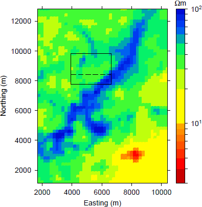
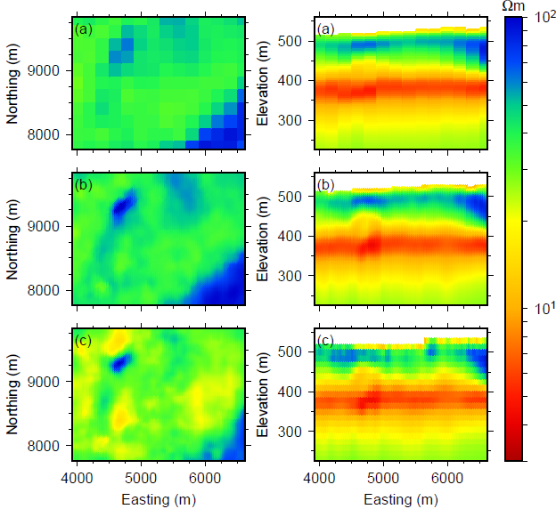
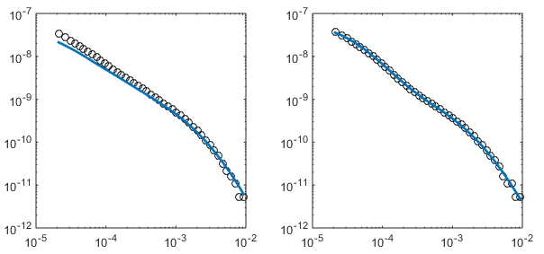
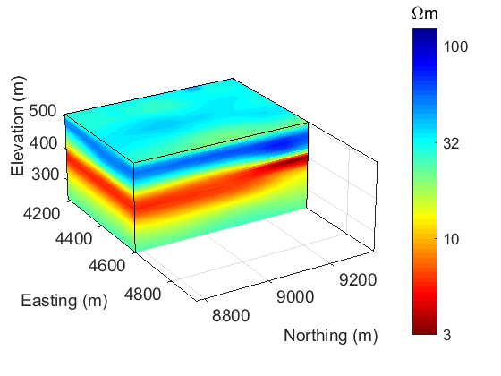

.. _aspen_interpretation:

Interpretation
==============

The recovered model from :ref:`pseudo-3D inversion <aspen_processing>` is interpreted using known geologic information about the area. :numref:`asp9` shows a plan-view section through the interpolated 3D model at an elevation of 470 m (or roughly 30-90 m below the surface). The thin resistive unit trending northeast-southwest is believed to be associated with a Quaternary paleo-channel cutting into the underlying Grand Rapids Formation, which is consistent with geologic and seismic data that has been collected in the area :cite:`Imperial2013`. In the northwestern and southeastern portions of the model, the shaley Grand Rapids Formation shows at lower elevation as a conductor. This plan-view image indicates the great spatial details and variations in the geologic structures above the Clearwater Formation that can be obtained using EM data.

        The figure shows a planview section from the interpolated 3D model at an elevation of 465 m (or roughly 100 m below the surface in the east and 40 m below the surface in the west). The model shows a channel-like resistive unit in the center, with more conductive regions to the northwest and southeast. Solid line shows location of focus for SAGD; dashed line shows location of cross-sections in :numref:`asp10`.

.. figure:: ./images/CrossSectionsAllThree.png
        :align: right
        :figwidth: 45%
        :name: asp10

        The figure shows cross-sections at a northing of 12.6, 8.4, and 3 km. The figures are vertically exaggerated to be able to show variations in the conductivity with depth. Solid black lines indicate the tops of the Grand Rapids, Clearwater, and McMurray Formation determined from the recovered model.

Cross-sectional views of the 3D interpolated model are shown in :numref:`asp10`. The recovered model shows that the topography changes from approximately 500 m to 560 m in elevation from west to east. Notably, the large conductor starting at an elevation of about 400 m does not follow the topography but instead is is very flat with a thickness between 30 and 100 m. This conductor is interpreted as the Clearwater Formation and its uniform conductivity of 7 :math:`\Omega m` and relatively uniform thickness is a first indicator that is may act well as a cap rock for SAGD operations. Above the Clearwater Formation, there are several layers, including a thin conductive unit at the surface. Below is a resistive unit that varies in thickness. It is at its thickest towards the west, with agrees with the end of the channel noted in :numref:`asp9`. Towards the east, this resistive unit things out and more conductive units underlie it. These two units are associated with the Quaternary glacial tills and the Grand Rapids Formation. 

Local pseudo-3D and 3D inversion of field data
----------------------------------------------

        Comparison of (left) plan-view and (right) cross sections for (a) the coarse, (b) the fine pseudo-3D recovered model, and (c) the 3D recovered model. The left-hand figures are at an elevation of 465 m. The right-hand figures, at a northing of 8.4 km, are vertically exaggerated to show variations in the conductivity with depth.

One of the goals is to use the airborne data to build a detailed background resistivity model that can be used when monitoring SAGD steam chamber growth using EM methods. The pseudo-3D model shows many details but the mesh is coarse, compared to the size of SAGD chambers (approximately 1 km long and separated by 100 m at the base). Thus, the focus becomes a smaller region that is of interest for SAGD development :cite:`Imperial2013` and increase the data density used in the pseudo-3D inversion. The region is approximately 2.7 by 2 km and lies roughly in the middle of the survey area. The mesh is now finer, using cells that are 30 m in the easting and northing directions. The pseudo-3D inversion is repeated to invert 2,284 soundings and recover a detailed resistivity model of this smaller region. :numref:`asp12` compares the fine pseudo-3D recovered model with the portion of the coarse model in the same area at the same elevation of the coarse model shown in :numref:`asp9`. The finer mesh and greater data density allowed for significantly more detail in the recovered model. This model can serve as an initial and background model in monitoring of SAGD chambers.

        Using the pseudo-3D recovered model, data was forward modeled in 3D (blue line) and compared to observed field data (black circles). The mismatch between the soundings in (a) suggests that the data contain 3D effects that cannot be explained by the pseudo-3D model while (b) shows that in some areas, the pseudo-3D model appears valid.

Although providing a 3D model, the above results are based on 1D inversions, which would not account for 3D effects. If 3D structures are predominant in this region, the pseudo-3D methodology may not accurately represent the geology. Therefore, it is important to test the pseudo-3D model against three-dimensional electromagnetic computations. To validate, data are forward modeled in 3D on an ocTree mesh with the same base cell size and the pseudo-3D model. This calculated data is compared to the observed field data to understand how well the pseudo-3D model represents the region. Our findings indicate that in some parts of the survey area, the calculated data fits the observed data well, meaning that the pseudo-3D model provides an accurate representation. However, in other regions, the data fitting is not as nice, suggesting there are 3D structures that cannot be recovered using the pseudo-3D methodology. :numref:`asp13` compares the soundings for two different locations, showing how 3D effects may not be captured in the pseudo-3D model. The calculated data fits the observed data well through most of the middle and late time channels, with variations largely present only in the early time channels. This suggests that the 3D structures exist closer to the surface, and likely in the Quaternary layer, whereas the Clearwater and McMurray Formations are more one-dimensional. These conclusions are supported by what is known about the local geology.

        3D resistivity model from inverting the VTEM airborne data in three dimensions.

Considering these findings, it is considered worthwhile to invert the airborne data in 3D. The pseudo-3D model serves as an initial and reference model, providing a warm start for the 3D inversion. A subset of 571 soundings are inverted in 3D using parallelization and local meshes :cite:`YangEtAl2014`. Plan-view and cross sections of the recovered model are compared to the course and fine pseudo-3D models in :numref:`asp11`, showing small differences in the top layers. The Clearwater Formation remains relatively unchanged, as was expected. The 3D model is shown in :numref:`asp14`.

.. todo:: create a movie scrolling through the 3D model rather than a single view

