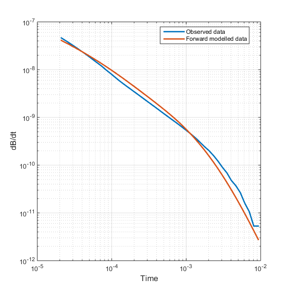
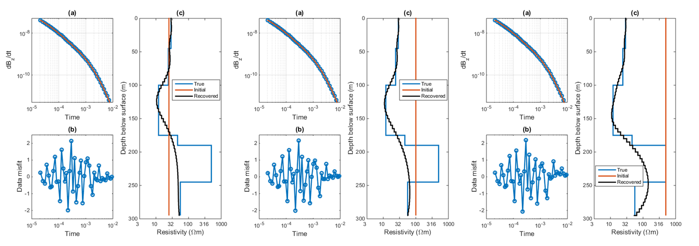
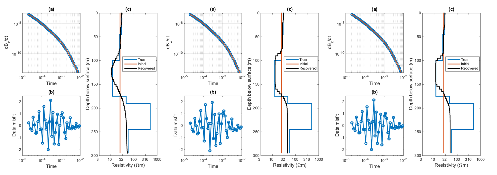

.. _aspen_processing:

Processing
==========

The field data were provided in units of pV/(Am^4), meaning the data are
normalized by the current (A) in the transmitter, the area (m^2) of the
transmitter, and the area (m^2) of the receiver. In order for us to work with
these data, we first change them so the units are V/(Am^2). This assumes that
the receiver is at a point location rather than being defined as a loop with a
certain area. For the VTEM system used in 2014, the transmitter had a radius
of 13 m. The transmitter area was multiplied by the data to get the data in
the desired units.

Our goal is to obtain a 3D model of the subsurface to understand how the
resistivity changes with depth and in the northing and easting directions.
Before actually working with the field time-domain data, we use a synthetic
model is to better understand the data and determine what parameters should be
used in the inversion.

1D inversion of synthetic data
------------------------------

        The blue line shows a randomly-chosen decay curve from the VTEM field
        data set. The orange line is the forward modeled data using the
        synthetic 1D model (shown in :numref:`asp2`) from borehole data
        :cite:`DevrieseOldenburg2016`. The two decay curves are fairly similar
        to each other, suggesting that the 1D synthetic model is a decent
        representation of the resistivity structures at the Aspen property.

A one-dimensional model is a fair start to recovering information about the
bavkground geology in the Athabasca oil sands as the different formations are
:ref:`generally flat-lying <aspen_properties>`. The synthetic model developed
from resistivity logging data thus provides a good starting point to forward
model and invert airborne time-domain data.

A random sounding location is chosen from the VTEM data set and the
transmitter and receiver parameters are used to forward model data using the
synthetic 1D model (:numref:`asp2`). The forward modeled data is compared to
the actual field data in :numref:`asp6` and shows that the data fitting is
good. This suggests that the synthetic model is a good representative of the
resistivity structure at Aspen.

Gaussian noise of 1.5\% is added to the forward modeled data and uncertainties
are assigned as a percentage of the data and a noise floor: 1.5\% and 1e-12 V.
The synthetic decay curve is inverted using L2 norms for both the :ref:`data misfit and the model objective function <inversion>` using UBC-GIF's EM1DTM code
:cite:`FarquharsonOldenburg1993`. Values for :math:`\alpha_s` and
:math:`\alpha_z` are set to 0.001 and 1, respectively. An initial and
reference model of 25 :math:`\Omega m` was used. The results are shown in
:numref:`asp7` (left). The predicted data fits the observed data very well and
the data misfit is randomly distributed. The model recovers the layers up to a
depth of approximately 175 m. Below 175 m, the data may have some sensitivity
to the resistive McMurray Formation but this layer is not well-recovered in
the inversion. To better understand the sensitivity of the data to layers at
depth, the inversion is repeated using an initial and reference model of 100
:math:`\Omega m`. The results are shown in :numref:`asp7` (centre). The data
are fitted just as well as in the previous inversion but the model slightly
changes below 175 m. It is pushed closer to the initial/reference model,
suggesting limited sensitivity to layers below the Clearwater Formation. This
is further supported by a third inversion where the initial and reference
model are set to 500 :math:`\Omega m`. The recovered model is shown in
:numref:`asp7` (right).

        Inversion of the forward modeled data (:numref:`asp6`) using an
        initial and reference model of (left) 25 :math:`\Omega m`, (centre)
        100 :math:`\Omega m`, and (right) 500 :math:`\Omega m`. Below the
        conductive layer, the model pushes towards the reference model,
        providing an idea of the depth of investigation using the VTEM system
        for the Athabasca oil sands region. In each panel, (a) compares the
        observed (blue) and predicted (orange) data while (b) shows the
        normalized data misfit for each time channel. The recovered model
        (black) is shown in sub-panel (c) along with the true model (blue) and
        the initial/reference model (orange).

The synthetic decay curve is also inverted using an L1 norm for the model
objective function (Equation \ref{intro:phim}) to recover blockier models
compared to the L2 norm. As the layers within the Athabasca oil sands tend to
be well-defined, distinct units, using an L1 norm may allow for improved
recovered models. The result is shown in :numref:`asp8` (centre) with the L2
results duplicated in :numref:`asp8` (left). The result is noticeably
blockier, with better recovery of the Clearwater Formation. To generate an
even blockier result, the value of :math:`\alpha_z` is decreased from 1 to 0.1
to lessen smoothing on changes in the model. This result is shown in
:numref:`asp8` (right). In all results, the observed data are reproduced well
by the model and the normalized data fitting misfit is random. By decreasing
:math:`\alpha_z`, the model is blockier compared to using the L1 norm alone.

        Inversion of the forward modeled data (:numref:`asp6`) using an (left)
        L2 norm and (centre) L1 norm for $\phi_m$. In (right), an L1 norm is
        used and :math:`\alpha_z` is reduced from 1 to 0.1. In each panel, (a)
        compares the observed (blue) and predicted (orange) data while (b)
        shows the normalized data misfit for each time channel. The recovered
        model (black) is shown in sub-panel (c) along with the true model
        (blue) and the initial/reference model (orange).

The 1D inversions of the forward modeled data provide initial information
about depth of investigation, the influence of inversion parameters, and what
to expect in the recovered model. These parameters can be carried over to the
inversion of field data using a pseudo-3D approach.

Regional pseudo-3D inversions of field data
-------------------------------------------

To obtain a pseudo-3D model, 5,772 soundings are cooperatively inverted in 1D
and interpolate the individual 1D models :cite:`FournierEtAl2014`. The 3D
model has cells that extend 200 m in the easting and northing directions and 5
m in the vertical direction, allowing detailed information about the
subsurface layers to be recovered. This method is appropriate for this region
as the 1D assumption holds fairly well, given the expected layered geology at
the Aspen property. An initial model of 25 :math:`\Omega m` was used. For each
inversion iteration, the reference model is updated to include the influence
of nearby soundings. This gives a large-scale regional resistivity model.

The recovered model is interpreted using known geologic information about the
area on the :ref:`following page <aspen_interpretation>`.

