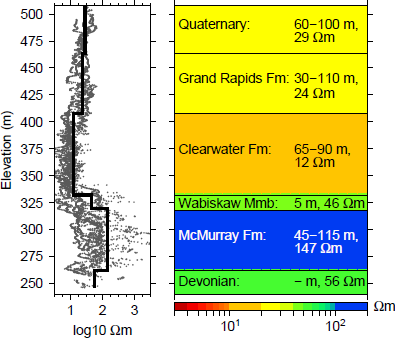

.. _aspen_properties:

Properties
==========

Using resistivity logs, an initial, simple resistivity model was constructed using publicly-available data from eight wells, shown in :numref:`asp2` :cite:`DevrieseOldenburg2016`. Averaged values from the logs are assigned to each geologic formation. 

        Resistivity logging data from 8 wells at the Aspen property are used to create a simple 1D resistivity model.
  
:numref:`asp2` shows that the different geologic formations can be distinguished using the resistivity data. Thus, EM data can be sensitive to these different units. Of particular interest is extracting information about the Clearwater Formation, such as its depth, thickness, and integrity. The Clearwater is essential for SAGD operations as it acts as a cap rock for the steam. The resistivity of the McMurray Formation can also provide information about the quality of the heavy oil, where a higher resistivity may indicate higher bitumen content compared to lower resistivities :cite:`Cristall2004`. A third region of interest to EM studies is the unconformity between the McMurray and Devonian units. Water samples within the Athabasca oil sands range in salinity due to salt dissolution, suggesting there are pathways between the aquifers in the Devonian and the McMurray Formation :cite:`Cowie2015`. This can significantly lower the resistivity of the McMurray Formation, leading to incorrect interpretations of the bitumen content. Finally, resistivity variations in the Quaternary can provide information about channels and incisions, especially when well data may not be available near the surface :cite:`Imperial2013`.

The :ref:`next page <aspen_survey>` describes the survey that was collected to address these geologic questions. However, remember the geologic and resistivity background provided here as this type of information will be used to validate our interpretation models in :ref:`Synthesis <aspen_synthesis>`.

