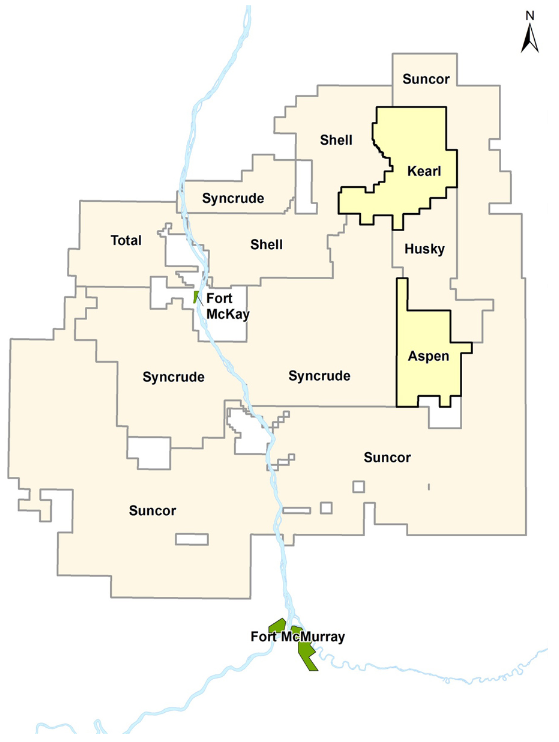

.. _aspen_setp:

Setup
=====

    Map showing property boundaries and their respective companies. The
    Aspen property, owned by Imperial Oil, is located roughtly 45 km NE of
    Fort McMurray and 25 km SE of Fort McKay in northeastern Alberta.
    Figure courtesy of Imperial Oil.

The Athabasca oil sands in Alberta, Canada are one of the largest oil reserves
in the world :cite:`Humphries2008`. However, 80% of the oil sands are too deep
for mining and require in-situ extraction methods, such as Steam Assisted
Gravity Drainage (SAGD) to bring the heavy oil, or bitumen, to the surface.
Much work is required before producing of the heavy oil can begin, including
identifying an exploration region, gaining approval for development, and
constructing the necessary infrastructure. This case study investigates how EM
can be used in the initial stages of exploration at a site in the oil sands.

The area of focus is the Aspen property, which is owned by Imperial Oil, and
is the future site of several SAGD well pads. The project area lies about 45
km northeast of Fort McMurray and 25 km southeast of Fort McKay in
northeastern Alberta, Canada. :numref:`asp1` shows the Aspen property in
relation to the two towns and the other properties in the area.

Geological Background
---------------------

The geology at the Aspen property contains the following flat-lying layers
:cite:`Imperial2013`:

- The Quaternary consists of paleo-channels and glacial tills. Its thickness
  varies between 60 and 100 m.

- The Grand Rapids Formation is a transgressional layer consisting of shales
  and sands, and can be incised by the overlying Quaternary channels. Its
  thickness varies between 30 and 110 m.

- The Clearwater Formation consists of shales and acts as a cap rock for SAGD
  operations. The Wabiskaw Member is a transgressional layer containing sands
  and shales at the base of the Clearwater. The Clearwater is 65-90 m thick
  while the Wabiskaw Member is approximately 5 m thick.

- The McMurray Formation is the main oil sands reservoir with a thickness of
  45-115 m.

- A Devonian limestone unit is separated from the McMurray Formation by an
  unconformity. Prairie Evaporites may exist along the unconformity, either as
  salt or salt dissolution :cite:`Broughton2013`.

As these units differ in composition, their electrical resistivity (or
conversely, conductivity) differ as well. The next page discusses the
:ref:`Properties <aspen_properties>` in detail.

