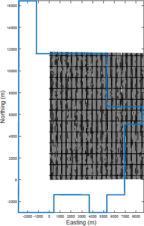
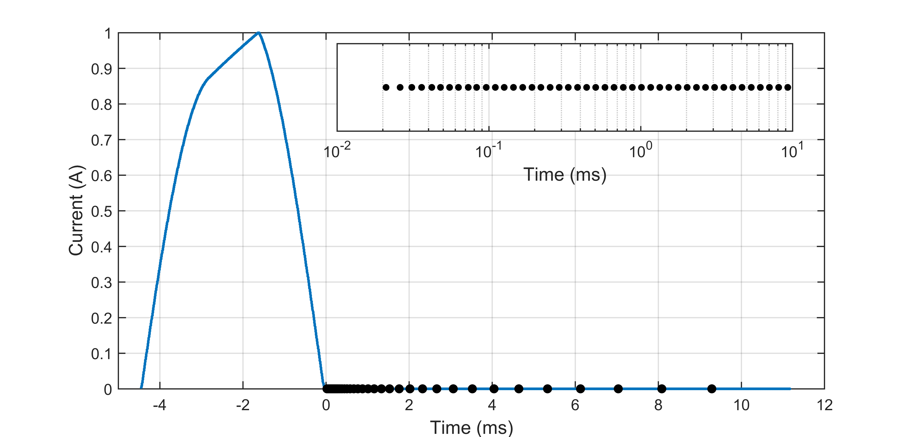

.. _aspen_survey:

Survey
======

    The VTEM survey contained 86 flight lines and 12 tie lines for a total
    of 428,340 data locations over a survey area of approximately 100
    square km in the Athabasca oil sands. The blue line indicates the
    boundary of the Aspen property.

    The waveform for the 2014 VTEM survey is shown in blue. Black dots
    indicate the 44 time channels. The inset shows a closer look at the
    time channels on a logarithmic scale from :math:`10^{-5}` to
    :math:`10^{-3}` seconds.

The data at the Aspen property are collected using an airborne electromagnetic
system call Versatile Time-Domain Electromagnetic (VTEM) which uses a
helicopter-towed transmitter and receiver loop. The data were collected in
February 2014 and a total of 1,095 line-kilometers were flown. Flight lines
were oriented north-south with a spacing of 100 m for a total of 86 flight
lines over a region that extends 8.7 km in the easting direction and 11.7 km
in the northing direction. Twelve tie lines spaced 1,000 m apart were flown in
the east-west direction. :numref:`asp3` shows the flight lines in relation to
the property boundary. The data set contains a total of 428,340 data
locations. More information about airborne TEM system can be found :ref:`here <airborne_tdem_index>`.

For this data set, the data consist of the z-component of the time-derivative
of the magnetic field (:math:`\partial \mathbf{B}_z/\partial t`) and are
measured at 44 off-time time channels. :numref:`asp4` shows the waveform and
the different time channels ranging from 2e-5 to 9e-3 seconds after
transmitter shut-off.

We now turn to looking at the data in detail on the :ref:`next page
<aspen_data>`.
