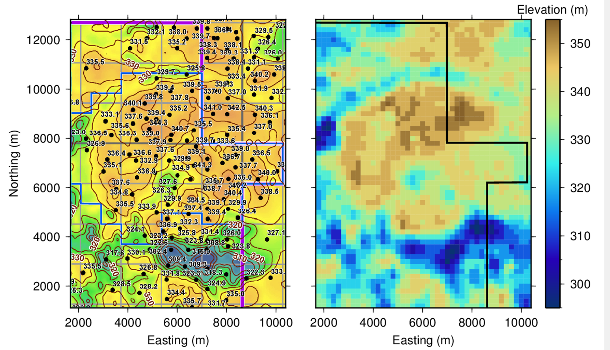

.. _aspen_synthesis:

Synthesis
=========

        Comparison between the top of the McMurray from (a) borehole core logging and (b) the recovered model from inversion. Panel (a) is courtesy of Imperial Oil :cite:`Imperial2013`.

Isosurfaces for the tops of the Grand Rapids, Clearwater, and McMurray Formation were calculated by choosing transitional resistivity values. These boundaries are shown in :numref:`asp10`. While it was originally thought that only minimal information could be extracted about the McMurray Formation from the EM data, the calculated isosurface shows very similar structures and characteristics to the structure map by :cite:`Imperial2013`, as shown in :numref:`asp11`. In addition, the elevations recovered from the model for the McMurray Formation are very comparable to those from borehole core logging. This suggests that airborne EM can be a great exploration and first-hand interpretation tool for oil sands deposits in Alberta. The recovered model also shows that the McMurray Formation is more resistive than the other layers but it is unlikely that the airborne EM system has enough sensitivity to detect the bottom of the formation, the unconformity at the Devonian limestone, and any salts or salt dissolution that may be present. In addition, without more information, it would be difficult to interpret the thickness of the Wabiskaw Member, which is expected to be a 5 m transitional layer between the Clearwater and McMurray Formations.

The recovered layers and resistivity values in the interpolated 3D model are similar to those from an airborne time-domain survey using the AeroTEM system over a Husky property, directly north of the Aspen property (:numref:`asp1`) :cite:`ZhdanovEtAl2013`. This indicates that by using the VTEM system and the pseudo-3D inversion method, similar information can be extracted.
