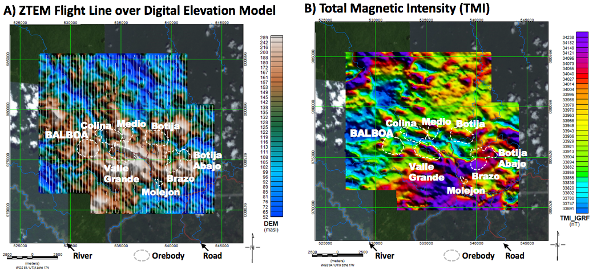

.. _balboa_data:

Data
====

:numref:`ztem_elevmag` presents the ZTEM survey flight lines over the DEM (digital elevation model) and the aeromagnetic signature of the Cobre Panama region, as well as known porphyry deposit outlines and drill hole locations prior to the discovery of Balboa in 2010. The figure shows a correlation between relatively higher elevations and magnetic high anomalies over deposit area. The magnetic RTP (reduced-to-pole) image in Figure 4b shows a recognizable pattern of magnetic highs from volcanic andesites due to primary magnetite :cite:`burge2014`. However, all the known porphyry deposits are noticeably centred on magnetic lows, possibly representing demagnetized areas due to phyllic alteration :cite:`burge2014`. Exceptionally, Balboa coincides with a positive magnetic anomaly, which, along with the lack of geochemical anomaly due to thick leach- cap (G. Wells, pers. comm., 01-2016), masked it in previous exploration phases :cite:`fiscor2014`.

    ZTEM survey results over Cobre Panama deposit area: a) Digital Elevation
    Model (DEM), and b) Total magnetic intensity (reduced to pole), showing
    porphyry deposit locations and drill-hole coverage prior to Balboa
    discovery (after :cite:`burge2014`).

.. figure:: images/bboa_tipper_raw.png
    :align: center
    :figwidth: 100%
    :name: bboa_tipper_raw

    Plan maps of Tipper data from a ZTEM survey over Cobre Panama deposit area at 90 Hz: a) ZTEM X-Component In-Phase Tipper, b) ZTEM Y-Component In-Phase Tipper, c) ZTEM X-Component Quadrature Tipper, and d) ZTEM Y-Component Quadrature Tipper.

