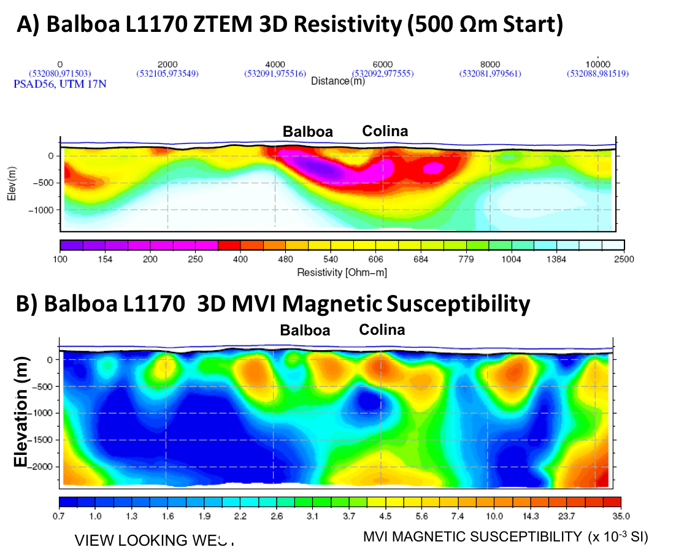

.. _balboa_interpretation:

Interpretation
==============

    Balboa deposit cross-sections. (a) 3D ZTEM inversion for L1170
    over Balboa. (b) 3D MVI magnetic susceptibility inversion for L1170.
    Black contour indicates outline of Balboa deposit.
