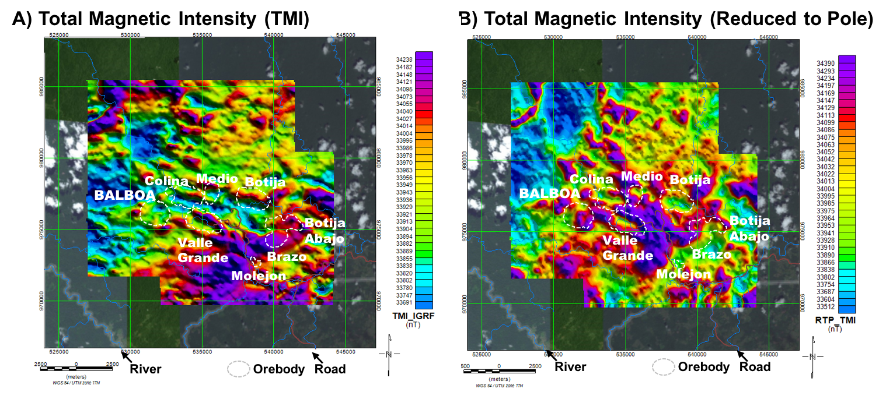
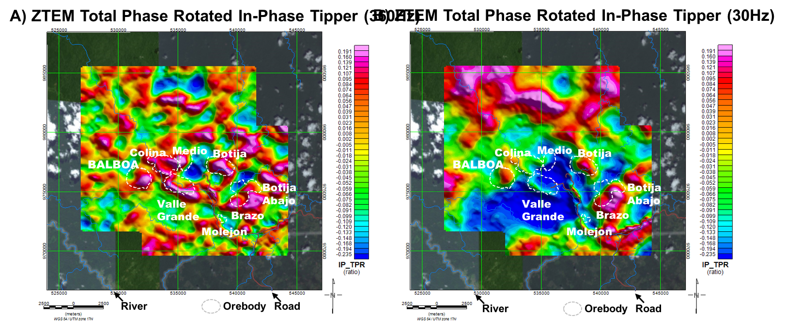
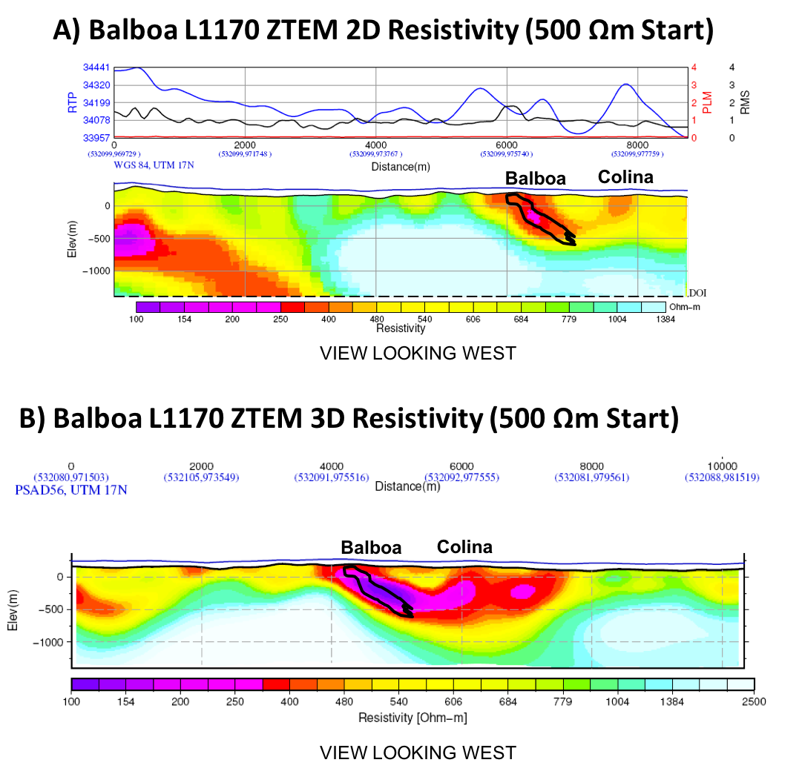

.. _balboa_processing:

Processing and Interpretation
=============================

:numref:`ztem_mag` a and b present the mag data before reduced-to-pole (RTP) and after RTP, respectively. Although large scale magnetic high anomalies aligned with higher elevations do not change; however, close to the known porphyry deposits there are significant differences. For instance, close to Botijia magnetic anomaly was high before RTP, however this changed to low anomaly after RTP. Overall all the known porphyry deposits are noticeably centered on magnetic lows, possibly representing demagnetized areas due to phyllic alteration :cite:`burge2014`. Exceptionally, Balboa coincides with a positive magnetic anomaly, which, along with the lack of geochemical anomaly due to thick leach- cap (G. Wells, pers. comm., 01-2016), masked it in previous exploration phases :cite:`fiscor2014`.

    Magnetic data from a ZTEM survey over Cobre Panama deposit area:
    a) Raw total magnetic intensity (TMI), and b) TMI data after reduced to pole.

:numref:`bboa_tipper_tpr` presents the ZTEM tipper data, displayed as the Total Phase Rotation (TPR; :cite:`izarra2011`, :cite:`legault2012a`), at both high and low frequencies, giving a sense of relative depth of investigation.  In spite of possible topographic artefacts :cite:`sattel2012`, the differences in the two TPR signatures are noticeable and, as noted by :cite:`burge2014`, the higher frequency (shallow depth) ZTEM results ( :numref:`bboa_tipper_tpr` a) appear to map elevated conductivity closely associated with all the known porphyry orebodies; whereas the anomalies that persist at low frequencies (:numref:`bboa_tipper_tpr` b) also coincide with known deep sulphides zones at Botija and Brazo-Botija Abajo, as well as the untested anomaly Balboa northwest of Cuatra Crestas prospect :cite:`burge2014`. The low frequency ZTEM image in :numref:`bboa_tipper_tpr` b also displays a large/long wavelength negative tipper response in the Cobre Panama deposit region that suggests anomalously higher resistivities at depth.

    ZTEM survey results over Cobre Panama deposit area: a) Total phase rotated
    (TPR) In-phase tipper at 360Hz, and b) In-phase TPR at 30Hz, highlighting
    EM anomalies that extend to lower frequencies over the Botija, Brazo and
    Botija Abajo porphyry deposits, as well as the Balboa discovery.

The ZTEM data have been converted to equivalent resistivity-depth
distributions using from 2D and 3D ZTEM inversions using the Geotech Av2dtopo
code :cite:`legault2012b` and UBC MT3dinv code :cite:`holtham2008`,
respectively. The ZTEM 2D inversions were performed on the :math:`T_{zx}` (in-line) component data, using an avg. 30mX by 40mZ cell mesh. The 3D ZTEM inversion used both the :math:`T_{zx}` and :math:`T_{zy}` data, and a 150m x 300m x 40m cell mesh.  Both inversions accounted for topography and used a 500 ohm-m half-space apriori start model. :numref:`zteminv2d3d` a presents the 2D resistivity depth slice at 0m and :numref:`zteminv2d3d` b presents the 3D inversion result at -500m depth as an overlay on the 2D depth slice, for comparison. The images in :numref:`zteminv2d3d` a and b resemble quite closely the high and low frequency TPR images shown in :numref:`bboa_tipper_tpr` a and b; in particular the shallow conductivity anomalies observed over all the known porphyries, as well as higher conductivities associated with the higher grade deposits, including Balboa, that are highlighted in the deeper inversion images and were predicted by the known geology. Below 500-1000m, the ZTEM 2D and 3D inversion results also indicate increasing resistivities extending to depth, as shown in :numref:`zteminv2d3d` b.

.. figure:: images/zteminv2d3d.png
    :align: center
    :figwidth: 100%
    :name: zteminv2d3d

    ZTEM 2D-3D inversion results over Cobre Panama deposit area: a) 2D
    resistivity depth slice at 0m depth, showing 3D inversion region (red
    polygon) and b) Close-up of 2D & 3D resistivity (red polygon) at -500m
    depth and location of L1170 profile presented in :numref:`bboa_interp` b and c.

Northing section (looking west) of both 2D and 3D inversions at L1170 are respectively shown in :numref:`zteminv2d3d_section` a and b. In addition in :numref:`zteminv2d3d_section` c, a section of susceptibility model obtained from 3D MVI inversion is presented. From resistivity sections from both 2D and 3D inversions, we can clearly recognize a strong dipping conductor near Balboa deposit. Although, main resistivity structures from 2D and 3D inversions are similar, there are some detailed difference. For instance, dip of the recovered conductors are significantly different between 2D and 3D, and also recovered conductivity in 3D inversion is higher than 2D. Considering 3D effects ignored in 2D inversion these are reasonable results because 2D assumes infinite length of conductor in strike direction. Low susceptibility anomaly, which is similarly dipping, is imaged close to Balboa deposit. Recalling physical properties of the mineralized zone are high conductivity and low susceptibility recovered region where having high conductivity and low susceptibility can be considered as a good prospect.

    ZTEM 2D-3D inversion results over Cobre Panama deposit area: resistivity section at line L1170 from a) 2D and  b) 3D inversions are presented. In (a) both magnetic profile after RTP and RMS error of the 2D ZTEM inversion at L1170 is provided. (c) 3D MVI magnetic susceptibility inversion result at L1170.
