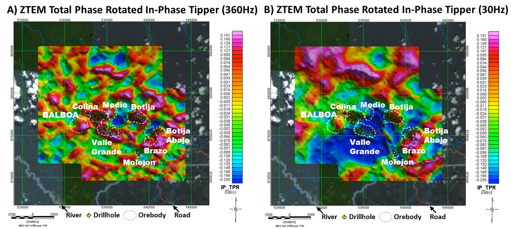
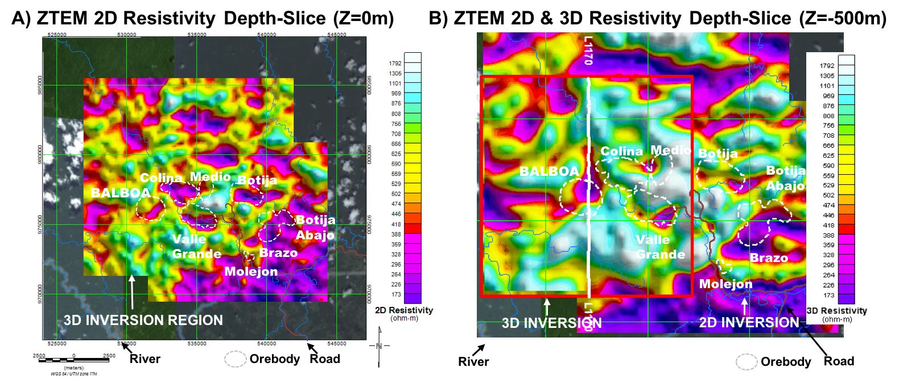

.. _balboa_processing:

Processing
==========

:numref:`ztemtpr` presents the ZTEM tipper data, displayed as the Total Phase Rotation (TPR;
:cite:`izarra2011`, :cite:`legault2012a`), at both high and low frequencies,
giving a sense of relative depth of investigation, according to :eq:`eq2`.  In
spite of possible topographic artefacts :cite:`sattel2012`, the differences in
the two TPR signatures are noticeable and, as noted by :cite:`burge2014`, the
higher frequency (shallow depth) ZTEM results (:numref:`ztemtpr` a) appear to
map elevated conductivity closely associated with all the known porphyry
orebodies; whereas the anomalies that persist at low frequencies
(:numref:`ztemtpr` b) also coincide with known deep sulphides zones at Botija
and Brazo-Botija Abajo, as well as the untested anomaly Balboa northwest of
Cuatra Crestas prospect :cite:`burge2014`. The low frequency ZTEM image in
:numref:`ztemtpr` b also displays a large/long wavelength negative tipper
response in the Cobre Panama deposit region that suggests anomalously higher
resistivities at depth.

    ZTEM survey results over Cobre Panama deposit area: a) Total phase rotated
    (TPR) In-phase tipper at 360Hz, and b) In-phase TPR at 30Hz, highlighting
    EM anomalies that extend to lower frequencies over the Botija, Brazo and
    Botija Abajo porphyry deposits, as well as the Balboa discovery.

The ZTEM data have been converted to equivalent resistivity-depth
distributions using from 2D and 3D ZTEM inversions using the Geotech Av2dtopo
code :cite:`legault2012b` and UBC MT3dinv code :cite:`holtham2008`,
respectively. The ZTEM 2D inversions were performed on the TZX (in-line)
component data, using an avg. 30mX by 40mZ cell mesh. The 3D ZTEM inversion
used both the TZX and TZY data, and a 150mX by 300mY by 40mZ cell mesh.  Both
inversions accounted for topography and used a 500 ohm-m half-space apriori
start model. :numref:`zteminv2d3d` a presents the 2D resistivity depth slice
at 0m and :numref:`zteminv2d3d` b presents the 3D inversion result at -500m
depth as an overlay on the 2D depth slice, for comparison.

The images in :numref:`zteminv2d3d` a and b resemble quite closely the high
and low frequency TPR images shown in :numref:`ztemtpr` a and b; in particular
the shallow conductivity anomalies observed over all the known porphyries, as
well as higher conductivities associated with the higher grade deposits,
including Balboa, that are highlighted in the deeper inversion images and were
predicted by the known geology. Below 500-1000m, the ZTEM 2D and 3D inversion
results also indicate increasing resistivities extending to depth, as shown in
:numref:`zteminv2d3d` b.

    ZTEM 2D-3D inversion results over Cobre Panama deposit area: a) 2D
    resistivity depth slice at 0m depth, showing 3D inversion region (red
    polygon) and b) Close-up of 2D & 3D resistivity (red polygon) at -500m
    depth, showing  Balboa (red symbols) and pre-2011 (yellow)  drillholes,
    and location of L1170 profile presented in :numref:`bboa_interp` b and c.
