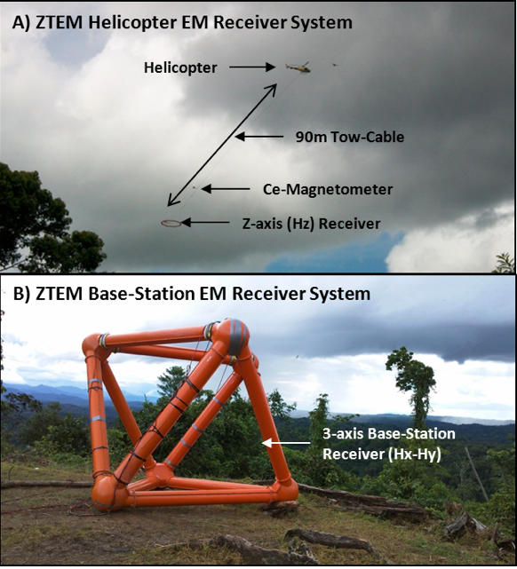

.. _balboa_survey:

Survey
======

Helicopter-borne geophysical surveys were carried out over the Cobre Panama
Project from August 26th to September 8th, 2010, on behalf of Minera Panama SA
and Inmet Mining Ltd., now owned by First Quantum Minerals since 2013.
Principal geophysical sensors included a Z-Axis Tipper electromagnetic (ZTEM)
system, and a caesium magnetometer (:numref:`ztemequip`). A total of 831 line-
kilometers were flown along 300m spaced, north-south oriented flight lines,
with nominal EM bird terrain clearance of 85 meters and a magnetic sensor
clearance of 102 meters. The 246 km :math:`^2` survey block features moderate
relief, with elevations ranging from 42 to 415 meters above sea level
(:numref:`ztemequip` a). Flown early in the Cobre Panama mine development, the
survey area had minimal culture, such as roads, trails and few buildings.

    ZTEM EM system during survey at Cobre Panama project, showing: a) Mobile
    Z-axis receiver measuring HZ, and b) Fixed base-station receiver,
    measuring :math:`H_x` and :math:`H_y` (after Burge, 2014).

The ZTEM airborne AFMAG (Ward, 1959) electromagnetic system measures the
anomalous vertical secondary magnetic fields that are created by the
interaction between naturally occurring, plane wave audio frequency EM fields,
caused by distant electrical sferic/lightning storm activity, and electrical
heterogeneities in the earth. In ZTEM surveys, a single vertical-dipole air-
core receiver coil measuring the vertical magnetic field :math:`H_z`
(:numref:`ztemequip` a) is flown over the survey area in a grid pattern,
similar to regional airborne EM surveys. Orthogonal, air-core horizontal axis
coils (:numref:`ztemequip` b) are placed close to the survey site to measure
the horizontal EM magnetic reference fields (:math:`H_x` and :math:`H_y`).
Data from the three coils are used to obtain the Tzx and Tzy Tipper (Labson et
al., 1985) components at six frequencies in the 30 to 720 Hz (or 25 to 600Hz)
band, according to the following equation by Holtham and Oldenburg (2008):

.. math::
	H_z(r) = T_{zx}(r,r_0) H_{x}(r_0) + T_{zy}(r,r_0) H_{y}(r_0)
	:label: eq1

where :math:`H_z(r)` is the magnetic field measured at the mobile receiver (r)
and :math:`H_x(r_0)` and :math:`H_y(r_0)` are the magnetic fields at a fixed
base station reference site (:math:`r_0`).

The EM primary fields used in AFMAG have the unique characteristic of being
uniform, planar and horizontal, and also propagate vertically into the earth,
to great depth, up to several km, as determined by the magnetotelluric (MT)
skin depth (δS) according to the following by Vozoff (1972):

.. math::
	\delta  = 503 \sqrt{\frac{\rho}{f}} \text{meters}
	:label: eq2

where :math:`\rho` is the bedrock resistivity (:math:`\Omega m`), :math:`f` is
the frequency of measurement (hertz).
