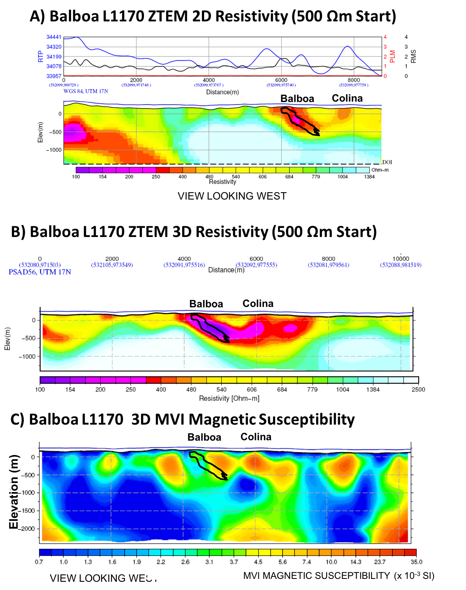

.. _balboa_synthesis:

Synthesis
=========

:numref:`bboa_interp` a presents the Balboa deposit cross-section from diamond drilling (after :cite:`burge2014`), showing the 0.4% copper ore shell and the sulphide shells
that define the porphyry deposit, which dips northward, and the surrounding
porphyry system alteration halos. :numref:`bboa_interp` b shows the
corresponding ZTEM resistivity cross-section, obtained by 3D inversion,
directly over Balboa. As shown, the ZTEM conductive anomaly correlates
directly with the higher grade zone, both spatially and at depth, based on the
3D inversion results. The Balboa anomaly also appears to extend further
northward, subcropping below the western edge of the Colina deposit,
suggesting that the two porphyry systems are potentially joined at depth.
:numref:`bboa_interp` c presents the corresponding 3D magnetic susceptibility
section for L1170. The section shows that Balboa occurs in
a relative magnetic susceptibility low, reflecting magnetite depletion due to
hydrothermal alteration.

    Balboa deposit cross-section (a), showing :math:`> 0.4 \%` Cu grade shell
    (green) and drill-holes (after Burge, 2014), 3D ZTEM inversion for L1170
    over Balboa (b), and 3D MVI magnetic susceptibility inversion for L1170
    (c), both showing outline of ore grade shells (after :cite:`burge2014`).

The Balboa discovery is a geophysical success story, where a significant porphyry copper deposit was discovered beneath cover at Cobre Panama even though after many exploration and drilling campaigns motivated by conventional soil sampling had failed to clearly identify it. Balboa and aeromagnetics providing an unexpected signature. The ZTEM appears to map all the porphyry deposits in the tropical environment at Cobre Panama, including Balboa, making it the first documented case of a porphyry copper discovery using ZTEM airborne EM. Our 2D-3D inversion analyses appear to confirm the bedrock source of conductivity that extend from surface to >500-750m depths. The exact source of conductivity is undetermined, with mainly disseminated mineralization and a lack of visible supergene enrichment, although it is assumed to be related to clay-phyllic alteration. Subsequent HTEM surveys also do not appear to detect any of the porphyry bodies below the conductive saprolitic weathering blanket. However, ZTEM data are insensitive the layered conductivity :cite:`sattel2012`, and this feature allowed ZTEM to detect Baloba deposit below conductive saprolite layer.
