.. _barents_sea_processinginterpretation:

.. |lo| unicode:: 0xF8
   :ltrim:
.. |O| unicode:: U+03A9
   :rtrim:

Processing and Interpretation
=============================

CSEM Data
---------

In order to resolve the interpretation ambiguity inherent when only seismic
data are considered, we used resistivity information derived from controlled
source electromagnetic (CSEM) data. CSEM has been used successfully as an
offshore hydrocarbon exploration tool for over a decade
(:cite:`Constable2010`). The data for this study has been collected in a
relatively new way; using a towed source and array of electric field receivers
(:cite:`Englemark2014,Key2014`). MacGregor and Tomlinson
(:cite:`MacGregor2014`) provides an overview to the offshore CSEM method and
the various acquisition methods that can be applied.

The CSEM analysis was focused on line 5001. A 2.5D inversion approach, in
which the earth structure is 2D and the source is a 3D point dipole,  was
therefore applied.  Although this does not take into account the full 3D
structure of the earth, in many circumstances it provides a good approximation
to the resistivity structure along the line inverted.  The effect of this
approximation on the results is discussed in more detail below.
:numref:`fig_CSEM_amplitude_phase` shows an example of the CSEM acquired along
line 5001, in the form of source gathers at 1Hz. A significant response to the
accumulation encountered at Wisting Central can be clearly seen in the CSEM
data, particularly in the phase response (lower panel of
:numref:`fig_CSEM_amplitude_phase` around 611km Easting). This is observed
across a wide band of frequencies. It should be noted that it is somewhat
unusual to see such a large reservoir response in the data directly. In this
case the oil accumulation at Wisting is both extremely resistive (several
thousand |O| m) and at a relatively shallow depth below mudline (about 300m)
leading to the large response observed.

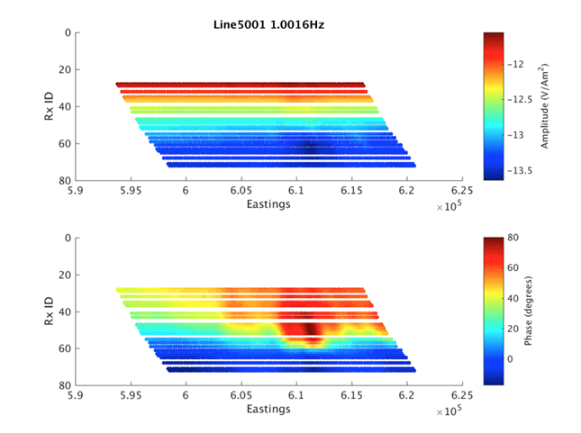

    CSEM Amplitude (top) and phase (bottom) data collected at 1Hz along line
    5001. The effect of the oil accumulation at Wisting Central (around 611km
    Eastings) is clear, especially in the phase data.

The CSEM data for six frequencies (0.2Hz, 0.8Hz, 1Hz, 1.4Hz, 2.2Hz, 2.6Hz)
were inverted using an Occam approach (:cite:`Constable1987,Key2014`) to
derive anisotropic resistivity models that are smooth in a first derivative
sense, and therefore as close to a uniform halfspace as possible, while
honoring the data. A layered seawater conductivity structure based on
measurements throughout the water column and 1D modeling was used. Nineteen to
twenty-three source-receiver pairs per frequency were included in inversion.

The inversion was performed in stages. Firstly, an unconstrained inversion was
run in order to examine the resistivity structure obtained in the absence of
any a priori information. However unconstrained inversions in general have
poor resolution. Resolution can be improved by including structural
information from the seismic data. This also ensures consistency between
seismic and CSEM derived results, which is important for subsequent integrated
interpretation.  Following unconstrained 2.5D inversion therefore, seismic
data were used to condition the inversion of the CSEM data by adding
structural constraint in the form of breaks in the smoothness requirement at
selected seismic horizons, thereby improving the resolution of the CSEM
result. Two versions of constrained inversion were run, one with a
regularization break at reservoir level (top St |lo| ) only, and one with
regularization breaks at both top St |lo| and the Intra-Snadd horizon. After
initial constrained inversion testing, the resistivity was limited between 0.1
to 40 |O| m from seafloor to top Stø for both horizontal and vertical
resistivity.

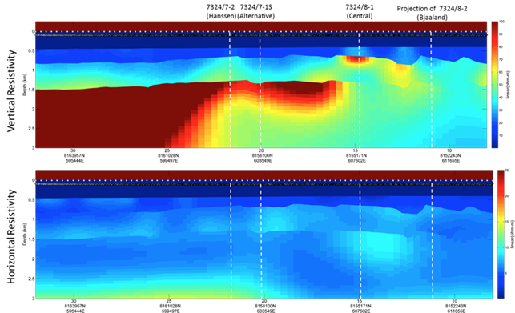

    Vertical resistivity (top) and horizontal resistivity (bottom) models
    recovered by 2.5D inversion for line 5001P1009 CSEM data. The inversion
    was constrained with regularization breaks at Top St |lo| and Intra Snadd.
    The Hanssen, Alternative, and Central well locations are marked by the
    white lines.

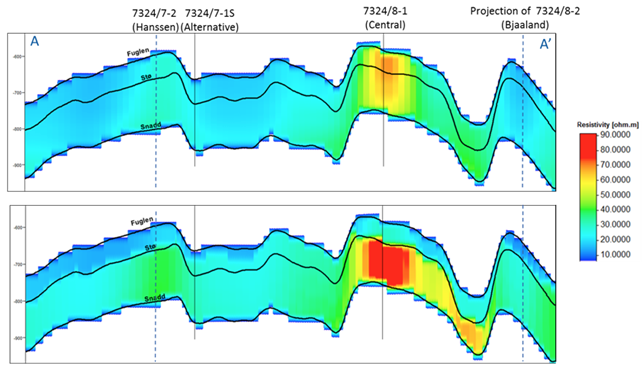

    Cross-sections along A-A’ (Figure 5) of CSEM-derived vertical resistivity
    for (top) unconstrained inversion, and (bottom) inversion constrained by
    the top St |lo| horizon and Intra-Snadd horizon. The Intra-Snadd horizon
    (a deeper horizon that is outside the area of interest for the remainder
    of the analysis not shown in the Figure) is about 500 m. deeper than the
    Snadd horizon.

:numref:`fig_inversion_vertical_resistivity` shows the vertical (upper panel) and horizontal (lower panel) resistivity
resulting from the final constrained inversion that were carried using depth-
converted seismic horizons top St |lo| horizon and Intra-Snadd horizon.

Background resistivity is extremely high in the area with vertical resistivity
of 25-30 |O| m. Background anisotropy is also extremely high with factors of
five or more observed. This high overburden resistivity and anisotropy is the
result of the significant uplift in the area. A significant increase in
vertical resistivity was recovered in the lower Snadd, with localized
variations contained within a regional feature. This regional feature also
exhibits extremely high electrical anisotropy.

A localized resistive feature coincident with the structure penetrated at
Wisting Central is clearly recovered in the vertical resistivity. A more
subtle increase in resistivity is observed at the Hanssen well location. No
localized resistive feature is recovered in the St |lo| at the location of the
Wisting Alternative or Bjaaland wells.

:numref:`fig_hydrocarbon_saturation` shows the CSEM-derived vertical resistivity in the same windows of analysis
used in the seismic quantitative interpretation, for the unconstrained and
constrained inversions run: The top one corresponding to the unconstrained
inversion, and the bottom image shows the results of the constrained inversion
previously shown in the :numref:`fig_inversion_vertical_resistivity`.

A qualitative interpretation of the CSEM inversion results supports the
outcome of the Alternative, Central and Bjaaland wells. A prominent
resistivity anomaly is recovered at Central, in which there was a significant
oil discovery, which is in agreement with the high resistivity values measured
at the reservoir location. On the other hand, the Realgrunnen structures
penetrated at Alternative and Bjaaland, two dry wells, are related to low
resistivity values that support the petrophysical outcome. At the location of
the Hanssen discovery well, a subtle high resistivity anomaly is observed. The
relatively small magnitude of this feature is the product of a 3D effect in
the CSEM data, a consequence of the location of the CSEM line with respect to
the location and the size of the reservoir (see
:numref:`fig_geology_region_map_setup` b).   Although in many circumstances
the 2.5D approximation is a good one, if the resistive reservoir is relatively
small, or the 2D line being inverted is close to the edge of the reservoir,
then the effect of the of the reservoir on the CSEM data is diminished, and
consequently the resistivity recovered by a 2.5D inversion is reduced from its
true value.  Loseth et al. illustrate this with a synthetic modelling study in
which they demonstrate the reduction in inverted resistivity with width of the
target reservoir and proximity of the CSEM line to the reservoir edge. In the
case of Hanssen, the reservoir is both relatively small and the line is close
to the edge of the body, leading to the lower resistivity at this location.
The effect of this on the quantitative interpretation is discussed in later
sections.

Seismic Data
------------

The ultimate quality of any inversion depends on the quality of the input
data, and to ensure a robust result, data must be optimally conditioned for
the workflow to be applied. In this example, the input seismic offset gathers
were pre-conditioned prior to inversion to increase the overall signal-to-
noise ratio and avoid any remaining noise having a high impact on the
inversion results. The pre-conditioning also corrected for offset dependent
frequency loss and ensured that the gathers were aligned. Since data pre-
conditioning, if not applied carefully, could significantly affect AVO
behavior of target reflectors, the sensitivity of inversion results to the
pre-conditioning approaches applied has been thoroughly tested and analyzed.
It is important to note that all conditioning steps were parameterized keeping
in mind the need to preserve amplitude behavior, and the minimum possible pre-
conditioning was undertaken. The processes applied are summarized in
:cite:`Singleton2009`.

During the pre-stack seismic inversion, a global objective function is
minimized in order to compute an optimal model for P- and S-impedance, which
best explains the input angle stacks and is consistent with the geological
knowledge introduced through a priori information (:cite:`Tonellot2001`).
Initial low frequency, models of P- and S-impedance were created based on
seismic velocity and well data. These models exclude any reservoir signature
and mix the lateral variations from the velocity field and vertical resolution
from wells logs filtered at 5Hz. Wavelets were extracted per angle stack per
well and later combined to obtain the most representative wavelet for each
angle stack. Additional parameters such as scale factor between wavelets and
actual amplitude sections, confidence in seismic amplitude angle stack data,
number of iterations and allowed low frequency model standard deviations were
also customized based on iterative tests performed per set of lines. Final
results were then extracted along well trajectories and compared to actual
well log data in order to ensure a good representation of the earth model.
Also, percentage of differences between input and synthetic angle stacks were
calculated to ensure that they were less than 20% of the original seismic
amplitude. In this case, where the P- and S-impedance models were allowed to
change 2000 [m/s gr/cc] from the initial model, after 25 iterations, the
seismic inversion results represent very well both the earth model from the
well log data and the actual partial angle stacks.
(:numref:`fig_inversion_initial_pwave_poisson`)

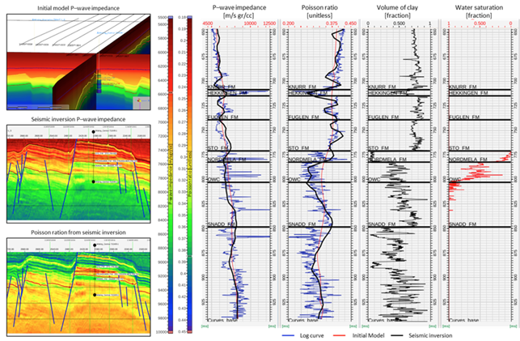

    Initial model, P-wave impedance and Poisson ratio from seismic inversion
    (left), tracks of P-wave impedance, Poisson ratio, volume of clay and
    water saturation extracted along the projection of the well 7324/8-1
    (right).

The multi-attribute rotation scheme (MARS) (:cite:`Alvarez2015`), was used to
estimate rock properties and facies volumes from well log and seismic
inversion attributes. This workflow uses a numerical solution to estimate a
transform to predict petrophysical properties from elastic attributes. The
transform is computed from well log-derived elastic attributes and
petrophysical properties, and posteriorly applied to seismically-derived
elastic attributes. MARS estimates a new attribute, t, in the direction of
maximum change of a target property in an n-dimensional Euclidean space formed
by n attributes. The method sequentially searches for the maximum correlation
between the target property and all of the possible attributes that can be
estimated via an axis rotation of the basis that forms the aforementioned
space.

Multiple elastic attributes such as P-wave impedance :math:`Ip`, S-wave
impedance :math:`Is`, P-to-S velocity ratio (:math:`Vp ∕ Vs`), the product of
density and Lamé’s parameters :math:`\lambda \rho` and :math:`\mu \rho`
(Goodway et al., 1997), Poisson’s ratio :math:`\sigma`, the product of density
by bulk modulus :math:`\kappa \rho`, the product of density and dynamic
Young’s modulus :math:`E \rho`, Poisson dampening factor (:math:`PDF`)
(:cite:`Mazumdar2007`), etc., can be used in the MARS assessment. For this
case study, for each target petrophysical property, MARS was run for a 2D
combination of the 64 elastic attributes shown in
:numref:`fig_table_seismic_attributes` , which can be derived from :math:`Ip`
and :math:`Is`, resulting in the evaluation of 2016 independent bi-dimensional
spaces. In this table, each number represents a single attribute, which is
obtained after applying the mathematical operation shown in the leftmost
column to the elastic attribute shown in the uppermost row. For example, the
number 21 represents the attribute. The purpose of applying a mathematical
operation (such as square root, power, inverse, logarithm, etc.) to attributes
is to be able to model physical phenomena that exhibit nonlinear behavior.
This is a mathematical strategy to linearize potential nonlinear relationship
between the elastic attributes and the petrophysical properties, used with the
goal of improving the correlation between the attribute t and the target
petrophysical property.

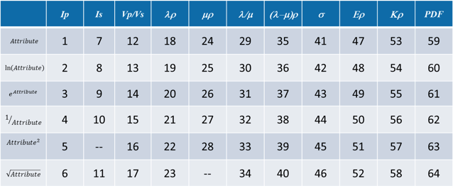

    Matrix of attributes used in MARS. Each number represents a single
    attribute, which is obtained after applying the mathematical operation
    show in the leftmost column to the uppermost row. For example, the number
    21 represents the attribute.

The MARS approach was applied in two different depth windows, given the
different rock physics relationships between the elastic attributes and the
petrophysical properties in the Stø and Nordmela Fms. (see
:numref:`fig_poisson_acoustic_impedance`). The first window comprises the
Fuglen and St |lo| Formations and the second window the Nordmela Formation.
The rock properties that were estimated using the MARS approach were total
porosity (:math:`\phi_T`), volume of clay (:math:`Vclay`) and the hybrid
petrophysical property water saturation plus volume of clay
(:math:`Sw+Vclay`).

This last property, which can take values between zero and two, was used as
input to build a litho-fluid facies volume based on the cut-off values shows
in :numref:`fig_lithofluid_facies`. Three litho-fluid facies were defined. The
green facies denotes zones where clean hydrocarbon bearing sands with
thickness above seismic resolution are expected to be found, including both
commercial and residual saturation given the inability of the elastic
measurements to distinguish between these two. The blue facies represents
clean wet sand or shaly hydrocarbon bearing sand or thin hydrocarbon bearing
sand that cannot be resolved at seismic resolution. These three configurations
of rock and fluid present a high degree of overlap in the elastic domain, in
consequence cannot be separated using seismic data. The last litho-fluid
facies (brown) represents the background trend that are composed of shales or
thin wet sand.

.. figure:: images/lithofluid_facies.png
    :align: center
    :figwidth: 100%
    :name: fig_lithofluid_facies

    Litho-fluid facies definition based on the hybrid petrophysical property
    :math:`Sw+Vclay`.

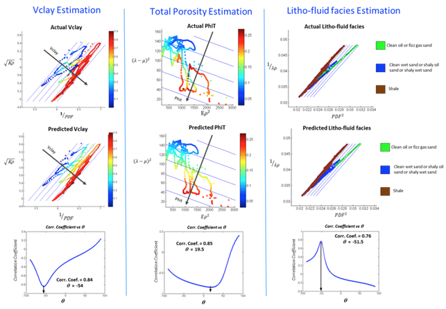

    Comparison of the actual (upper) and predicted (middle) target property
    log upscaled to seismic resolution for the Central and Alternative wells
    in the optimal cross-plot space estimated from the MARS analysis for the
    Fuglen and St |lo| Formation. Gray arrows, orthogonal to the blue lines,
    indicate the direction of maximum change of target petrophysical property
    in the optimal attribute space. The lower plots show a crossplot of the
    correlation coefficients between the target property log and the set of
    attributes estimated via axis rotation, versus the rotation angle
    (:math:`q`). The black arrow highlights the angle where the maximum cross
    correlation was found.

The results obtained after applying MARS to well log information from the
Central and Alternative wells is shown in
:numref:`fig_seismic_target_property_compare` for the Fuglen and St |lo|
Formations and :numref:`fig_seismic_target_property_compare_2` for the
Nordmela Formation. These plots show a comparison between the actual and
predicted target petrophysical property using MARS in the optimal elastic
attribute space determined by a global search algorithm. The lower plots show
a crossplot of the correlation coefficient between the derived set of
attributes (estimated via axis rotation) and the target petrophysical log,
versus the angle of rotation (:math:`\theta`). These plots show for all the
cases a fair to good maximum cross correlation that supports the application
of the MARS-derived transform to seismically-derived elastic attributes to
estimate sections of the target petrophysical properties along the 2D seismic
lines analyzed.

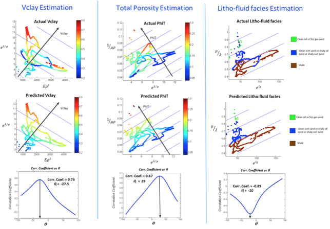

    Comparison of the actual (upper) and predicted (middle) target property
    log upscaled to seismic resolution for the Central and Alternative wells
    in the optimal cross-plot space estimated from the MARS analysis for the
    Nordmela Formation. Gray arrows, orthogonal to the blue lines, indicate
    the direction of maximum change of target petrophysical property in the
    optimal attribute space. The lower plots show a crossplot of the
    correlation coefficients  between target property log and the set of
    attributes estimated via axis rotation, versus the rotation angle
    (:math:`q`). The black arrow highlights the angle where the maximum cross
    correlation was found.

Once the transform to predict petrophysical properties from elastic attributes
was found for each window using well log data, the resulting relationships
were applied over the seismically-derived elastic attributes per window using
the seismic horizons (upper window: from top Fuglen to base St |lo|, and
bottom window: from base St |lo| to top Snadd), with the goal of estimating a
single 2D section of total porosity, clay content and litho-fluid facies per
2D seismic line. The litho-fluid facies section was estimated after applying
the cut-off presented in Table 3 to the seismically-derived section of
:math:`Sw+Vclay`. The resultant litho-fluid facies, clay content and total
porosity sections for the line 5001P1009, along with the corresponding well
log information for the Central and Alternative wells is shown in
:numref:`fig_inversion_seismic_properties_model`. Notice the good match
between the seismic and well log-derived petrophysical property in the
calibration wells demonstrating that both were correctly predicted. In
addition, the well trajectory of the Hanssen and Bjaaland wells are also shown
(no log information is available for these wells). The former was catalogued
as a discovery well and the latter as a dry well. The litho-fluid facies
section suggests that hydrocarbon fluid is present in both locations, and
highlights the fact that seismic data alone cannot distinguish between
commercial and non-commercial hydrocarbon saturations, leaving a significant
ambiguity in prospect de-risking.

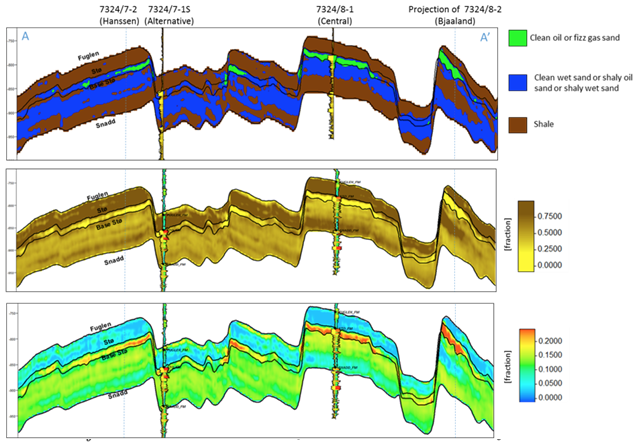

    For line 5001P1009, sections along A-A’
    (:numref:`fig_geology_region_map_setup`) of litho-fluid facies (top), clay
    content (middle) and total porosity (bottom) along wells Central and
    Alternative derived from MARS analysis of elastic attributes. The curves
    overlaid in the top panel are :math:`Vclay` (left) and :math:`Sw` (right)
    and in the middle and bottom panels are volume of clay (left) and total
    porosity (right).

Interpretation
--------------

The final stage of the workflow is to combine the seismically derived
properties, with the electrical information derived from the CSEM data. The
goal of this stage is to reduce the uncertainty in fluid saturation that is
observed in the seismic-only results. In order to do this, electric and
elastic properties must be combined in a common domain and at a common scale
so that direct comparison, and ultimately quantitative integration is
possible.

Seismically-derived resistivity estimation and transverse resistance (TR) calibration
^^^^^^^^^^^^^^^^^^^^^^^^^^^^^^^^^^^^^^^^^^^^^^^^^^^^^^^^^^^^^^^^^^^^^^^^^^^^^^^^^^^^^

In order to allow direct comparison between seismic and CSEM results, the next
step in the methodology (:numref:`fig_inversion_workflow_title`) is the
estimation of resistivity models from seismically derived properties for
different fluid saturation scenarios. With this goal in mind, we used the
seismically-derived litho-fluid facies, clay content and total porosity
sections with a calibrated rock physics model to transform these petrophysical
properties into the electrical domain. The calibrated rock physics model used
was the Simandoux equation (:cite:`Simandoux1963`):

.. math::
    \frac{1}{R_t} = \frac{\phi_e^m \times Sw^n}{a \times Rw} + \frac{Vsh \times Sw}{Rsh}
    :name: eq_Simandoux

where

.. math::
    \phi_e = \phi_T \times (1 - Vsh)
    :name: eq_Simandoux_phi

Parameters within the Simandoux equation were defined in the :ref:`properties
<barents_sea_properties>` section. This rock physics model represents
the same one used in the petrophysical evaluation of the Central and
Alternative wells to estimate water saturation (:math:`Sw`) from the
horizontal resistivity log and was calibrated in the early stage of the study.
The procedure used to estimate the seismically-derived resistivity sections at
different fluid scenarios consisted of applying directly Eqs.
:eq:`eq_Simandoux` and :eq:`eq_Simandoux_phi` to the total porosity and volume
of clay sections (:numref:`fig_inversion_seismic_properties_model`) for
different values of :math:`Sw` that were modified only in those areas were the
seismic indicates the presence of clean hydrocarbon bearing sand, i.e. green
facies in the litho-fluid facies section
(:numref:`fig_inversion_seismic_properties_model`). The results are shown in
:numref:`fig_transverse_resistivity_compare` b, c, and d, for values of
:math:`Sw` equal to 0.1, 0.5 and 1 respectively. As a quality control of the
results for the case of :math:`Sw` = 0.1 (90% hydrocarbon saturation, which is
a saturation close to that obtained from the petrophysical evaluation at the
Central well), the measured resistivity curve was overlaid. An excellent match
with the modeled resistivity is obtained. One important observation that can
be made from the comparison of the three seismically-derived results is the
low resistivity contrasts between the reservoir and non-reservoir facies for
the case of :math:`Sw` = 0.5. This demonstrates that this level of water
saturation (or higher) cannot be identified using CSEM data in this particular
geological setting due to the high values of the background resistivity.

At this stage in the workflow, results have all been transformed to the
electrical domain. However, there is one further step required before a direct
comparison can be made. It is noticeable that the seismic results in
:numref:`fig_transverse_resistivity_compare` are significantly higher
resolution than the CSEM results in
:numref:`fig_transverse_resistivity_compare`, even when the CSEM inversion is
constrained. This difference must be resolved before the results can be
compared or combined in a quantitative fashion.

The simplest approach to achieving this is to upscale both seismic and CSEM
results. The reservoir parameter that is best constrained by the CSEM method
is the transverse resistance (vertically integrated resistivity). By
calculating the transverse resistance from the seismically and CSEM derive
resistivity, the difference in vertical resolution between the two methods can
be overcome, albeit at the expense of the higher resolution of the seismic
result. Transverse resistances based on CSEM and seismic results are compared
in :numref:`fig_transverse_resistivity_compare` a. Note that when the
resistivity is calculated from the seismic data using the Simandoux
relationship, which is calibrated to horizontal resistivity at the well, the
result is most closely related to the horizontal resistivity of the sub-
surface. The CSEM measurements, in contrast, provide a measure of both
horizontal and vertical resistivity however reservoir related structure
manifests in the vertical resistivity. To address this difference, an
empirical calibration factor of three, based on CSEM analysis of background
anisotropy, was applied to the seismically derived transverse resistance to
compensate for the electrical anisotropy observed.

An analysis of :numref:`fig_transverse_resistivity_compare` a offers important
information about the hydrocarbon saturation levels of the reservoirs and
potential reservoirs along the section. A good agreement is seen between the
CSEM and seismic transverse resistance curves at the end member positions
represented by the Central well location (:math:`Sw` = 0.1 - magenta curve)
and for the Alternative well location (:math:`Sw` = 1 - blue curve) that
corroborate the validity of the rock physics model used and the calibration
factor applied to the data. For the case of the Bjaaland well, the CSEM
derived transverse resistance most closely agrees with the lower saturation
seismically derived curves, indicating, in a semi-quantitative way, the
absence of a commercial hydrocarbon saturation at this location. Finally, for
the Hanssen well, the separation between the CSEM transverse resistance curve
and that for the wet case seismically-derived curve (blue curve) indicates the
presence of hydrocarbon saturation at least higher than 50%. However, it is
important to have in mind that a diminished CSEM-derived resistivity value is
expected to be found in this area due to the 3D effects discussed previously.
As a consequence of this the hydrocarbon saturation will be underestimated in
this case.

.. figure:: images/transverse_resistivity_compare.png
    :align: center
    :figwidth: 100%
    :name: fig_transverse_resistivity_compare

    (a) Comparison between the seismically- and CSEM-derived transverse
    resistance estimates. (b) Cross-section along A-A'
    (:numref:`fig_geology_region_map_setup`) of seismically-derived
    resistivity for :math:`Sw` = 0.1. (c) Same cross-section along A-A' for
    :math:`Sw` = 0.5. (d) Same cross-section along A-A' for :math:`Sw` = 1.
    Note the good match between the measured and modeled resistivity in the
    Central well at the (b) section.

Water Saturation Prediction
^^^^^^^^^^^^^^^^^^^^^^^^^^^

Although the semi-quantitative comparison of transverse resistance presented
above provides valuable information on reservoir properties, it is often
desirable to derive a quantitative estimate of rock and fluid properties. The
last step in the workflow (:numref:`fig_inversion_workflow_title`), is
therefore the quantitative prediction of the :math:`Sw`. The input data for
this analysis was the seismically-derived porosity, clay content and litho-
fluid facies section shown in
:numref:`fig_inversion_seismic_properties_model`, and CSEM-derived transverse
resistance along the CSEM line (:numref:`fig_transverse_resistivity_compare`
a). These datasets were inverted using the Simandoux equation calibrated at
the Central and Alternative wells, and a global search inversion method. This
method seeks the value of :math:`Sw` that provides the minimum misfit between
seismically and CSEM derived transverse resistance, using a grid search
algorithm (see :numref:`fig_Sw_methodology`). It is important to mention that
only potential reservoir rocks as indicated by the seismic litho-fluid facies
(green facies in :numref:`fig_inversion_seismic_properties_model` to the top),
were considered to have variable :math:`Sw` during the inversion process. In
this way the quantitative seismic interpretation result not only provides
information about the clay content and total porosity of the rocks, necessary
for the Simandoux equation, but also about the location and thickness of the
potential pay sand, thus maintaining seismic resolution in the final result.
However, note that since only :math:`Sw` varies during the inversion, it is
implicitly assumed that the porosity and :math:`Vclay` as defined by the
seismic data are correct.

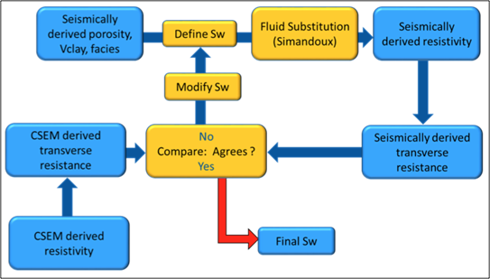

    Methodology used to estimate :math:`Sw` from seismically-derived rock
    properties volumes and CSEM derived resistivity.

The result of this inversion is shown in :numref:`fig_Sw_misfit`. The top
panel shows the profile of the misfit obtained as a function of the
:math:`Sw`. This information can be interpreted as a measurement of the
robustness of the :math:`Sw` estimation. The middle panel shows how the
optimal :math:`Sw` is linked to the lowest misfit value. Note that in areas
where no hydrocarbons are indicated by the seismic litho-fluid classification
shown in the bottom panel for reference (i.e. outside the green facies),
:math:`Sw` is set to 1. Around Wisting Central, the inversion result shows a
well constrained low :math:`Sw` value, with a narrow inversion minimum. This
is as expected since at low water saturations, a small change in :math:`Sw`
results in a relatively large change in resistivity. Around the Hanssen well,
the inversion minimum is wider, a result of the lower predicted saturation. At
Bjaaland, the results predict a minimum water saturation of about 50%,
consistent with the sensitivity limit suggested by well log analysis.

Finally, the resulting :math:`Sw` profile was mapped back in its correct
position using the seismically-derived litho-fluid facies volume to generate a
hydrocarbon saturation section along the line
(:numref:`fig_hydrocarbon_saturation`). Excellent correlation with known well
results was achieved. The integration of seismic, CSEM, and well data predicts
very high hydrocarbon saturations at Wisting Central, consistent with the
findings of the well. The slightly lower saturation at Hanssen is related to
3D effects in the CSEM data, but the outcome of the well is predicted
correctly. There is no significant saturation at Wisting Alternative, again
consistent with the findings of the well. At Bjaaland, although the seismic
indicate the presence of hydrocarbon bearing sands, the integrated
interpretation result again predicts correctly that this well was
unsuccessful.

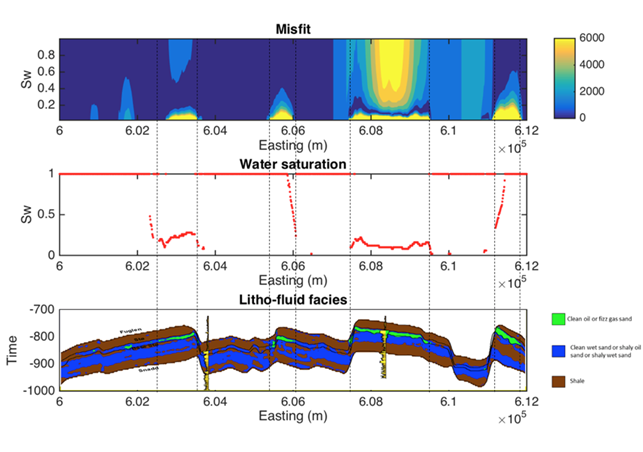

    Misfit as a function of :math:`Sw` between the CSEM-derived transverse
    resistance and the set of seismically-derived transverse resistance
    computed for different :math:`Sw` values (top). Optimal :math:`Sw`
    estimation linked to the minimum misfit value (middle). Cross-sections
    along A-A’ (:numref:`fig_geology_region_map_setup`) of seismically-derived
    litho-fluid facies (bottom)

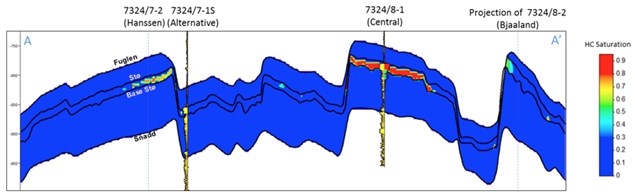

    Cross-sections along A-A’ (:numref:`fig_geology_region_map_setup`) of
    hydrocarbon saturation obtained from a joint interpretation of CSEM,
    seismic and well log data, with hydrocarbon saturation curves overlaid.
    Notice that the seismic data alone cannot distinguish between commercial
    and non-commercial hydrocarbon saturation. The inclusion of the CSEM
    resistivity information within the inversion approach allows for the
    separation of these two possible scenarios.

