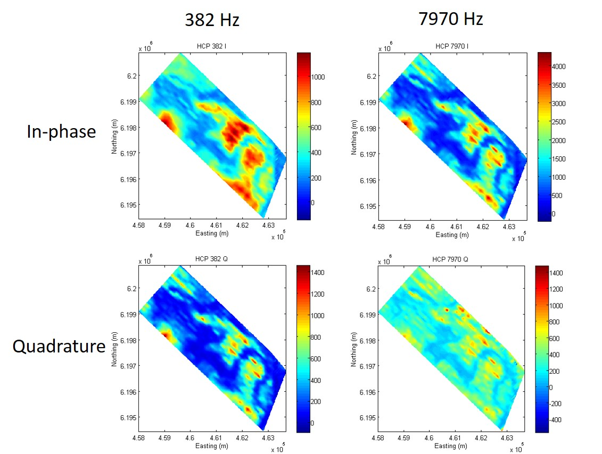
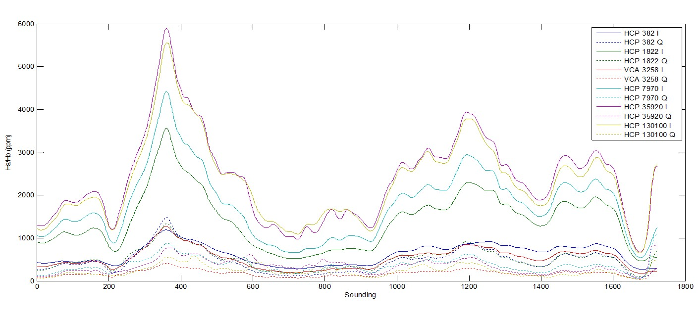
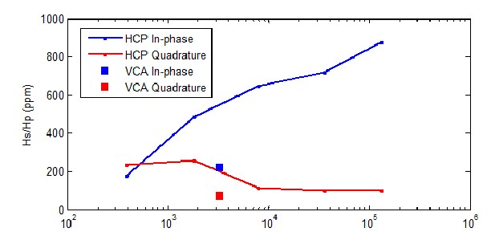
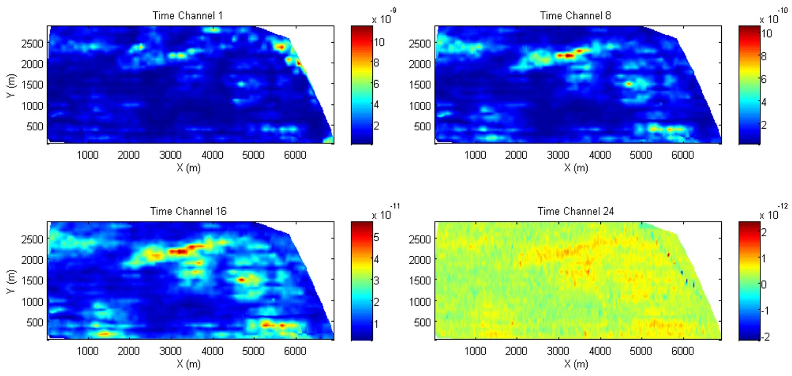
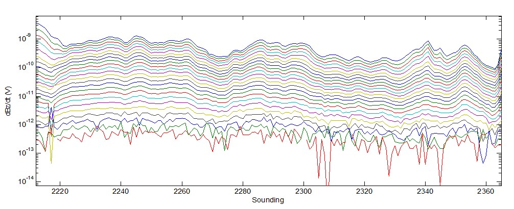
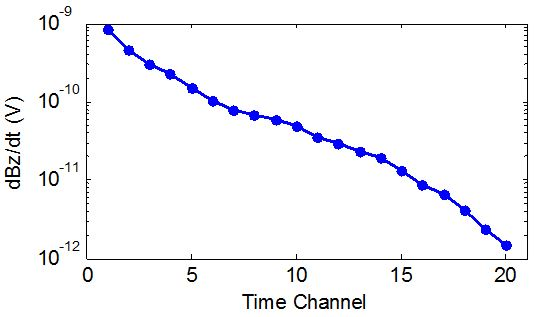

.. _bookpurnong_data:

Data
====

Here we make distinction bewteen "raw data" and "delivered data". Raw data are usually direct dump from the instruments, and may contain repeated measurements at the same location. For EM, the raw data are generally in the form of time series at a certain sampling rate. Then the raw data are processed by stacking, averaging, transforming, filtering, etc. The delivered data are usually in a reduced format of smaller size and higher signal noise ratio. In our framework, we consider "data" as "delivered data".

An important task in this particular step is to visualize the data. Data visualization serves several purposes:

(1) Understanding the underlying physics.

(2) Data quality control.

(3) Quanlitative interpretation.

(4) Quality control for advanced interpretation, e.g. predicted data in inversion.

Every datum point in an airborne EM survey can be specified using three parameters: the horizontal sounding location (easting and northing) and the time(t)/frequency(f). Using easting and northing as x and y respectively and time/frequency as z, a 3D data volume can be formed. So there are three ways of plotting data for airbrone EM survey:

(1) Map: contouring a particular time/freq as a function of the horizontal location. Slice the data volume horizontally. Spotting interesting area.

(2) Profile: plotting all or select time/freq along a flight line as a function of one horizontal dimension. Slice the data volume vertically. Compare time/freq along a transverse.

(3) Sounding: plotting data at a particular location as a function of time/freq. Drill the data volume vertically. 

The RESOLVE and SkyTEM data are presented in those three formats below.

RESOLVE
-------

SkyTEM
------

    
    
    
