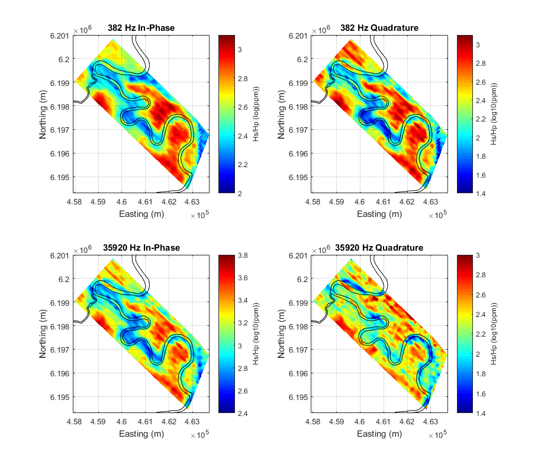
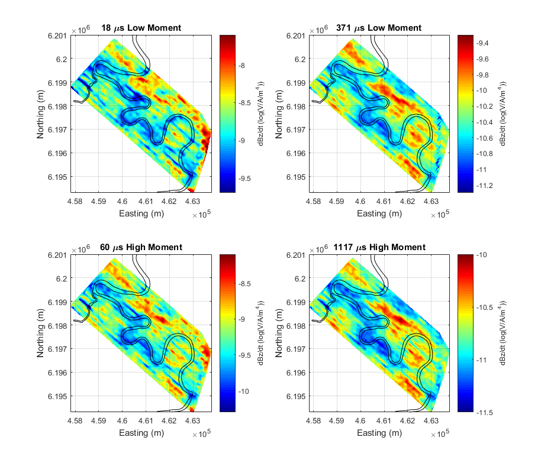

.. _bookpurnong_data:

Data
====

Airborne EM data are acquired as full time series during the flight. Then the
raw data are processed (e.g. filtering, stacking, lagging, leveling, etc.) by
the contractors. The final deliverable is a collection of discrete soundings,
each of which has some measurements associated with the operating frequencies
or time channels (gates), along with other necessary information (e.g. flight
height, orientation, powerline monitoring, etc.). The data are viewed prior to
quality control measures and interpretation.

.. _bookpurnong_data_frequency_domain:

Frequency Domain Data
---------------------

    RESOLVE 2008 data at Bookpurnong. Two frequencies are shown.

The measured :ref:`Airborne FDEM Data <airborne_fdem_data>` at two frequencies
are shown in map view in :numref:`booky-resolvedata`. Note the colors are in
log-scale and different frequencies/components have different dynamic ranges.
At low frequencies, the in-phase and quadrature are close in amplitude; but at
high frequencies, the in-phase is greater than the quadrature, implying an
appproach to the inductive limit. Although high frequencies have higher
resolving power, they are more sensitive to the noise from other sources. The
shortwavelength variation at 35920 Hz on the data map confirms this.

By viewing the data maps, we can roughly identify the area with relatively
high responses (warm color) that are potentially associated with the saline
water and low responses (cold color) for the fresher water. The stripping
pattern on the maps are mostly from the inconsistency of flight height, which
adds difficulties to interpretation using data only. As a result, we need to
invert the observed EM data to a conductivity model that, first unifies the
field data at multiple frequencies/components, and second provides a physical
connection to the groundwater salinity.

.. _bookpurnong_data_time_domain:

Time Domain Data
----------------

    SkyTEM 2006 data at Bookpurnong. Two time channels of dBz/dt for the low
    and high moments are shown.

The measured :ref:`Airborne FDEM Data <airborne_tdem_data>` at two time
channels for the low moment (LM) and the high moment (HM) are shown in map
view in :numref:`booky-skytemdata`. Note the colors are in log-scale and
different time channels have different dynamic ranges. During the off-time of
a time-domain EM survey, the dB/dt response decays exponentially, so late time
data are much smaller than the early time data.

Like the FDEM, the high responses in TDEM are likely to be associated with the
salinization, compatible with the FDEM data map in :numref:`booky-resolvedata`.
But this inference is only qualitative. And again, the
consistency of data across lines is heavily affected by the flight height. We
will also invert the TDEM data to a conductivity model in the next step.

