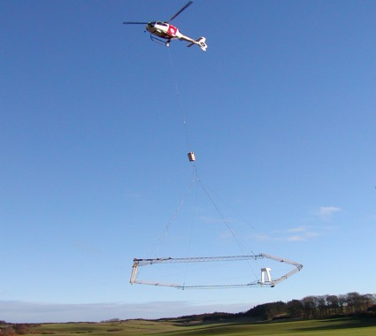

.. _bookpurnong_index:

Bookpurnong
===========

..topic :: Purpose

    Airborne EM is an important type of survey in geophysical that can be found useful in solving different geological questions, especially the ones that require quick data coverage over a large area. Hydrological and environmental studies can be good subject of airborne EM. In this case history, :ref:`airborne FDEM surveys <airborne_fdem_index>`, and
    :ref:`airborne TDEM surveys <airborne_tdem_index>` are used to assess the
    ground salinization at a groundwater management trial site in South Australia.
    The readers can anticipate to learn the following:

    (1) How the airborne EM can be applied in hydrogeological and environmental studies.

    (2) Airborne EM acquisition system and airborne data.

    (3) Interpretation of airborne EM data using a 1D layered model.

**Background reference**

We use the following two publications as the major references for this case
history. A hydrological overview at the site is included, along with the
airborne data at Bookpurnong, their 1D layered earth inversion, and
interpretations.

    References:

    :cite:`viezzoli2009`, `Viezzoli 2009 paper <http://library.seg.org/doi/abs/10.1071/EG08027>`_

    :cite:`Viezzoli2010`, `Viezzoli 2010 <http://www.hgg.geo.au.dk/ref_manager/VIEZZOLI2010C.pdf>`_

.. todo::

    show pictures of airborne systems, geologic cross section.

An airborne EM system in operation (Source: COWI).

.. todo::

    Request permission of photo:
    http://www.cowi.dk/menu/nyhederogmedier/nyheder/vandogmiljoe/lavtflyvende-helikopter-kortlaegger-grundvandet-slagelse-hilleroed

.. .. figure:: images/booky-hydro.jpg
..     :align: left
..     :scale: 50%
..     :name: booky-hydro

Hydrological model at Bookpurnong (Source: Viezzoli et al. 2009).

.. todo::

    Request permission of figure: CSIRO publishing and Viezzoli.

.. toctree::
    :maxdepth: 1

    setup
    properties
    survey
    data
    processing
    interpretation
    synthesis

