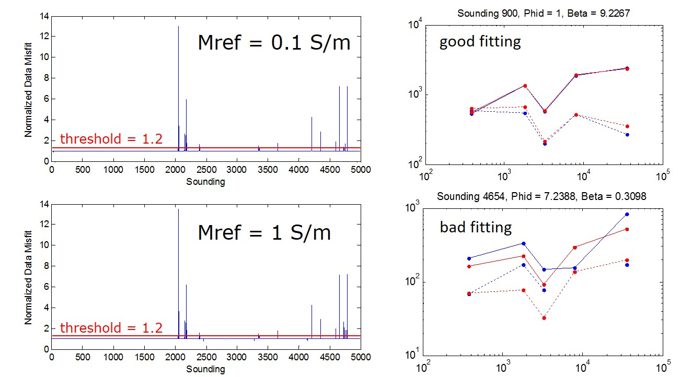
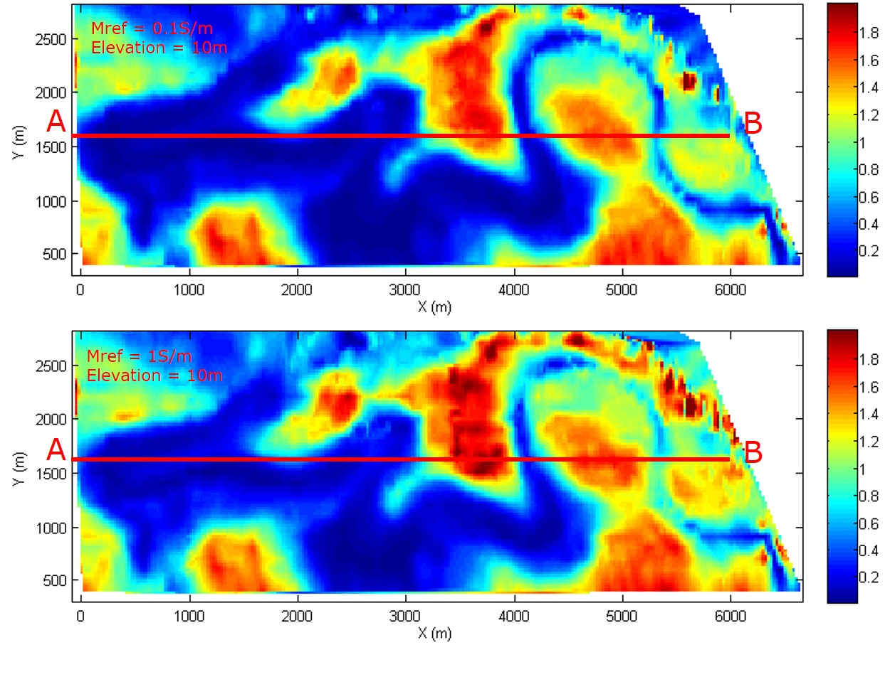
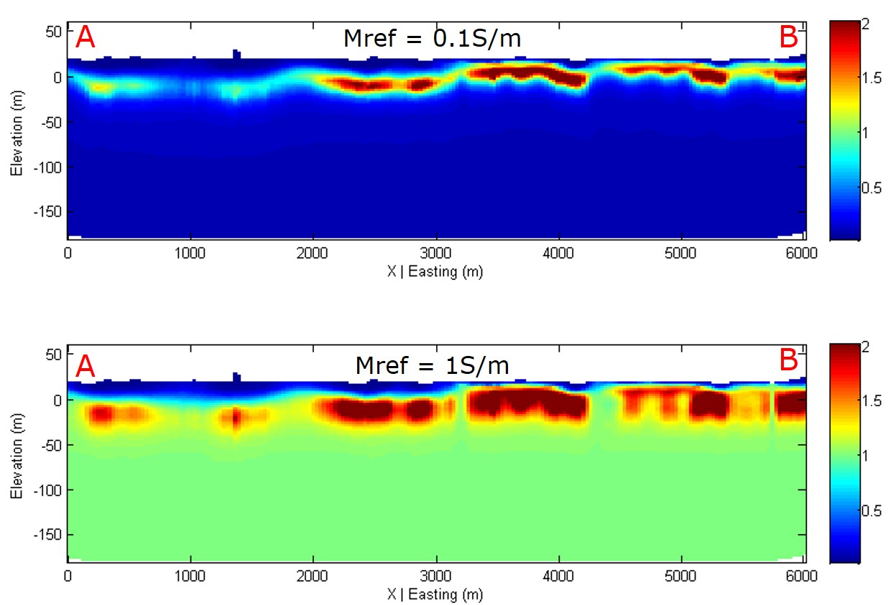
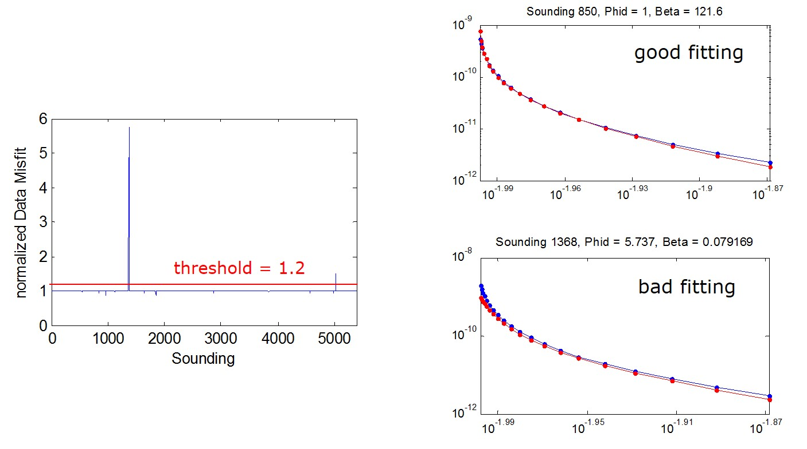
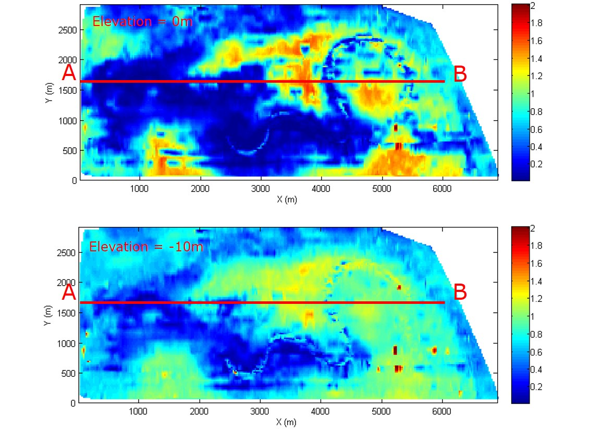
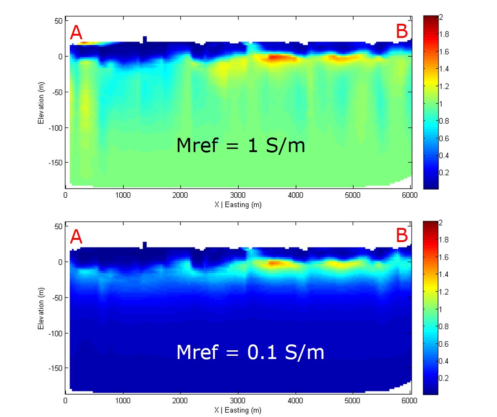

.. _bookpurnong_interpretation:

Interpretation
==============

The geology at Bookpurnong is mostly flat strata of floodplain. Therefore, an
1D inversion would be the most cost-effective solution for the data
interpretation. In the following, we will go through the 1D inversion of the
three data sets.

1D inversion of frequency domain data
-------------------------------------

For :ref:`resolve` data, the earth is discretized into 21 layers over the basement;
the layers' thickness logarithmically increases from 0.5 to 43 m. Two
different values, 1 and 0.1 S/m, are used as the conductivity of the uniform
background model for two independent inversion trials.

Most of the soundings are able to converge to the prescribed uncertainty,
except some produced really high misfit. We used a threshold of 1.2 to screen
out the soundings that could not fit the data. Examples of good fit and bad
fit are also provided.

The depth slices of the two inversions at an elevation of 10 m are very
similar. The overall conductivity in the upstream part is lower than that in
the downstream part. These models are consistent with the preliminary
interpretation made based on looking at the data maps. However, the inversion
made difference by rendering conductivity values that can be directly
connected to the water samples with explicit hydrological implication.

The cross section view of the models show how the conductivity varies at depth
and laterally. The basic structure of conductivity is a more conductive layer
overlain by a resistive layer on the top. The depth to the conductive layer,
potentially the saline water lenses, is consistently estimated regardless of
the background conductivity value. However, the thickness of the saline water
and the conductivity beneath it are not well delineated. This is because the
relatively high frequency band of RESOLVE cannot penetrate the conductive
layer, so the conductivity below a certain depth is mostly determined by the
prescribed background model.

1D inversion of time domain data
--------------------------------

The SkyTEM inversion follows the same procedures in RESOLVE inversion. The
earth is discretized in the same way. Two background conductivity values, 0.1
and 1 S/m are used.

The figure above shows there were only a few soundings that could not converge
to the desired misfit. Their models are excluded from the final result.

The overall conductivity distribution recovered from SkyTEM is similar to that
from RESOLVE. Due to its larger transmitter moment and later time channels,
SkyTEM is able to penetrate deeper than RESOLVE, resolving the bottom
interface of the saline water.

