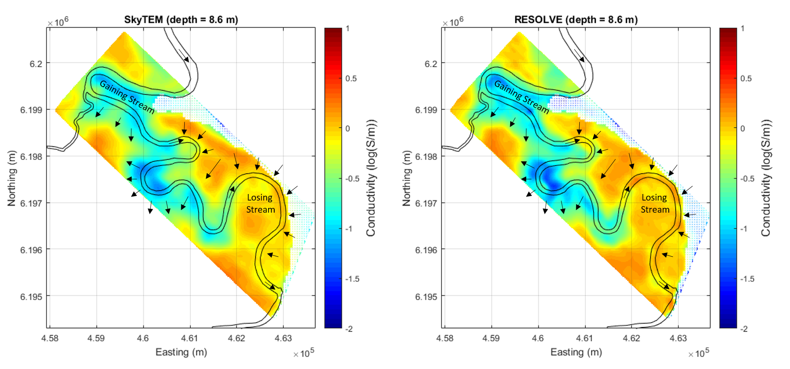

.. _bookpurnong_interpretation:

Interpretation
==============

The previous step of processing produces two conductivity models for the FDEM and TDEM data sets. In this step, we make impact of those models in hydrologically interpetation. 

General validation
------------------

At most places in the models, the conductivity varies between 0.1 and 1 S/m. Considering the overall salinity of the groundwater samples is about a few S/m, that range seems reasonbale for the bulk conductivity of the mix of sediments and water. The first-order distribution of conductivity indicates that the upstream section of Murray River is more resistive and the downstream section more conductive. This general trend is also consistent with the highs and lows on the data maps. So we conclude that the salinization is severer in the downstream section, which is closer to the irrigated highland.

Hydrological implication
------------------------

We are also able to extract information about the dynamics of the water flow :numref:`booky-interp`. Because the riverwater is fresh and resistive, the low conductivity at the upstream section suggests the river loses water, and the fresh riverwater flushes the floodplain, forming a "losing stream". In contrast, at the downstream section, the hydraulic gradient from the highland drives saline water into the river and the floodplain, forming a "gaining stream" of the river. The complete swamping by the intrusive saline water shows that the river is not able to effectively recharge the floodplain with fresh water for the health of vegetation. If looking closely, we can also see that some locations have higher salinity in the RESOLVE (2008) model than in the SkyTEM (2006) model, possibly an evidence of severer salinization over two years.

    
    Interpretation of the conductivity models from the TDEM and FDEM inversions at Bookpurnong. Black arrows indicate the direction of water flow in the river and its floodplain.

