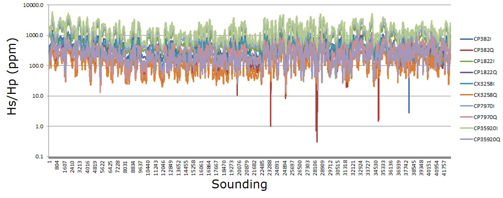
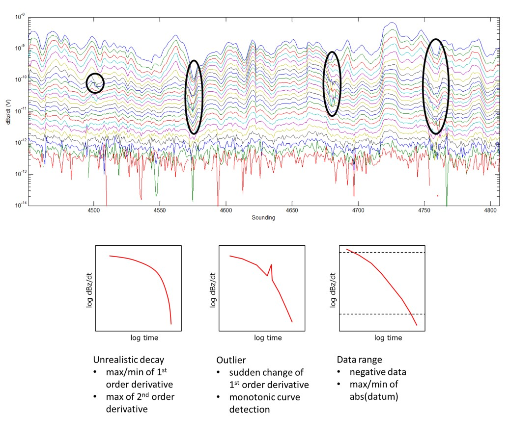
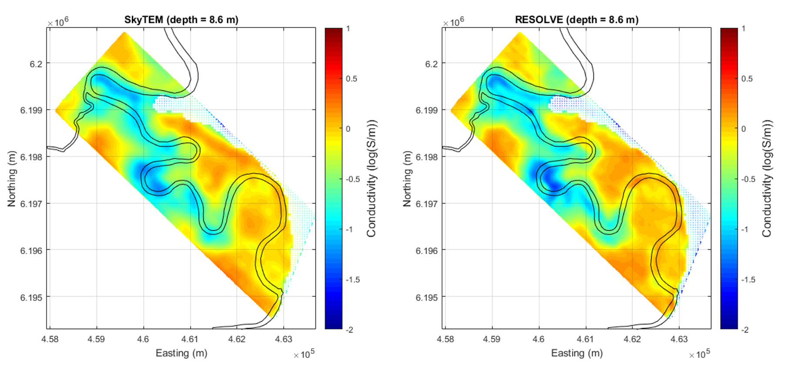

.. _bookpurnong_processing:

Processing
==========

In this step, we process the field data for the preparation of interpretation. Many different processing methods exist for airborne EM, but the-state-of-art is quantiative inversion that converts the measurements of EM fields to a conductivity model. In hydrological studies where the strata are almost horizontal, 1D layered earth modeling is usually the standard practice. In the following, we describe our processing in two steps: (1) data quality control and (2) 1D inversion.

Quality control of frequency domain data
----------------------------------------

Although the contractors have preliminarily processed the raw data to suppress the noise, there is still unwanted interference in the deliverables that can potentially harm the inversion. So our quality control precedure is supposed to prepare the data for inversion. 

    
    Quality control of the FDEM data.

Viewing the plot of data for each frequqncy :numref:`booky-resolveqc`, we identify some unrealistically small outlies, and we decide to remove them from the data set. The uncertainty assigned to this data set is 5% plus 10 ppm as a floor.

Quality control of time domain data
-----------------------------------

For quality control, the SkyTEM data are also viewed for individual time channels along the flight lines :numref:`booky-skytemqc`. There are noticeable irregular data called "channel jumping", and noise that contaminates the late time channels. The unrealistic decays and outlies can be automatically detected by the analysis of first or second derivative, and be removed. The noise present in the late times provides an estimate of a noise floor. The assigned uncertainty to the data is 10% plus 1E-13.

    
    Quality control of the TDEM data.

1D layered earth inversion
==========================

Layered model
-------------

A layered model treats the earth below the surface as a stack of horizontally infinite layers, each of which has a constant conductivity value. In our precedure, every sounding is given a layered model, and the conductivity values of the layers are sought by the inversion with the observed data at that sounding. The output of each sounding inversion is a series of conductivity values as a function of depth. Finally, all the 1D functions of conductivity at different locations are stitched together to form a 3D volume. 

For consistency, both the FDEM and TDEM inversion share the same layer thicknesses. Because the smallest skin depth or diffusion distance is about a couple of meters, we design the top layer to be 1 m thick. The thickness increases geometrically from the surface to the depth of 225 m. There are 21 layers in total.

Data selection
--------------

Inversion result
----------------

    
    Inversion models of the TDEM and FDEM data sets at Bookpurnong.

