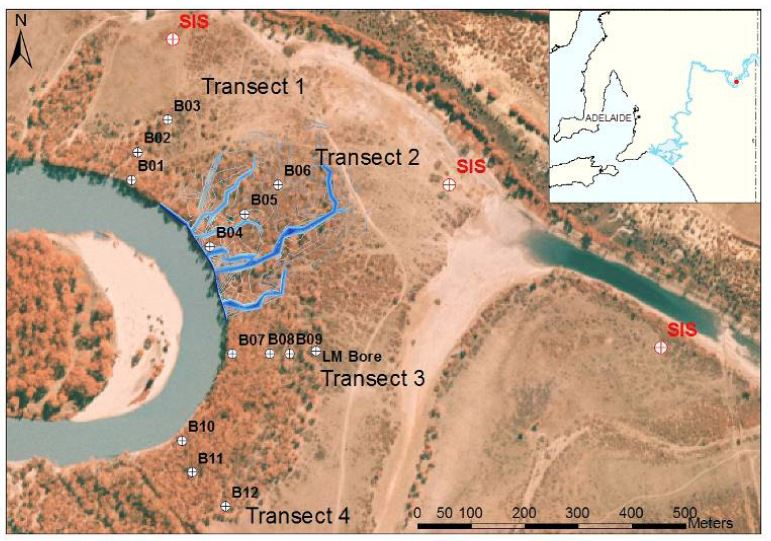

.. _bookpurnong_properties:

Properties
==========

The sandy topsoil at Bookpurnong is mostly saturated by water from the river, irrigation, and other source of recharge. The ground conductivity is therefore dominated by the salinity of groundwater. High salinity in water means more ions acting as free charge carriers, so high electrical conductivity is expected at the place suffers from high salinization (see more information under Physical Properties > Electrical Conductivity). At Bookpurnong, the fresh water is from the river and irrigation, and the saline water is from the natural acquifer under the highland. Therefore, the conductivity can be a direct indicator of the source of groundwater, from the river or the intrusion. 

For the purpose of studying the effect of SIS, hydrogeologists have sampled and measured the electrical conductivity of the groundwater along several transects across the river floodplain (Figure :numref:`booky-drills`). The measured conductivity from several wells along Transect 3 is plotted as cross sections from the river bed to the bank both before and after SIS (Figure :numref:`booky-salinity`). 

Those field physical property measurements confirmed that the water conductivity at Bookpurnong is at the order of 1 S/m. The actual conductivity of the ground may be lower if taking into account the porosity, but it is still much higher than the usual earth media. Also, the overall conductivity is higher towards the bank than in the flush zone; and higher near the surface than at depth. Please remember those information, as we will need this type of geological information to validate our interpretation models in Synthesis.

Reference:

- K.L. Holland, I.D. Jolly, K.L. McEwan1, T.M. Doody, M. White, V. Berens, N. Souter, 2008, The ‘Bookpurnong Experiment’: will groundwater management and flooding improve the health of the floodplain vegetation? 2nd International Salinity Forum: Salinity, Water and Society – Global issues, local action. Adelaide, Australia.

