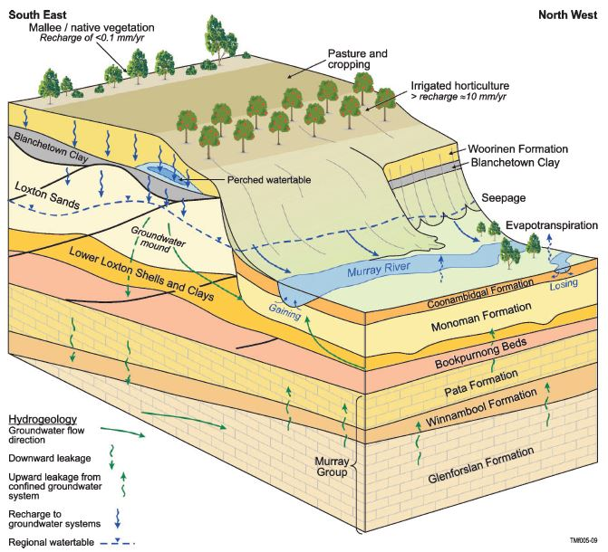
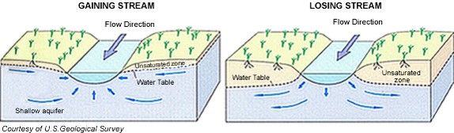

.. _bookpurnong_setp:

Setup
=====

The survey area under investigation is along Murray River in the Bookpurnong Irrigation District of the Riverland region of South Australia (Figure :numref:`booky-location`). The irrigation on the river bank (high land) has recharged the groundwater and formed a hydraulic gradient towards the floodplain (Figure :numref:`booky-hydro`). The groundwater flow from the high land to the the floodplain brings in substantial amount of natural saline water, causing tree health problems (Figure :numref:`deadtree`). In order to preserve the ecosystem, Bookpurnong Salt Interception Scheme (SIS) is implemented to experiment the water management methods that use pumping and flooding, with a hope of replacing the saline water with fresh water. 

.. figure:: images/booky-location.png
    :align: left
    :scale: 80% 
    :figwidth: 40%
    :name: booky-location

    

In hydrology, the interaction between the river water and ground water can be in two modes. If the groundwater table is lower, the river water recharges the groundwater aquifer, cansuing the river to "lose" water. If the groundwater table is higher, the groundwater recharges the river, casuing the river to "gain" water (Figure :numref:`lose-gain`). At Bookpurnong, the Murray River floodplain salinization is asscoiated with "gaining" saline water from the irrigated highland. So the geological question here is where Murray River loses or gains water, and whether the SIS improves the salinization. These questions can be partially answered by hydrological drilling and sampling, but those data are spacitally confined. Fortunately, geophysical remote sensing is able to provide an overall understanding of salinization over the entire area, because their is direct correlation between the salinity and electrical conductivity (see next page on Property). 

