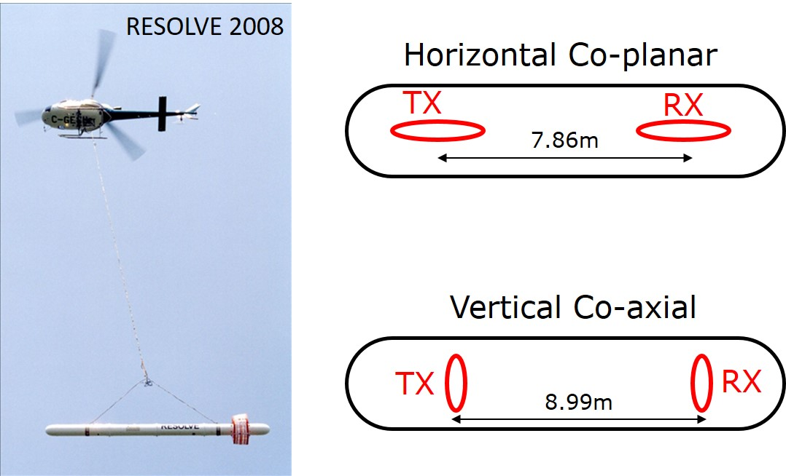
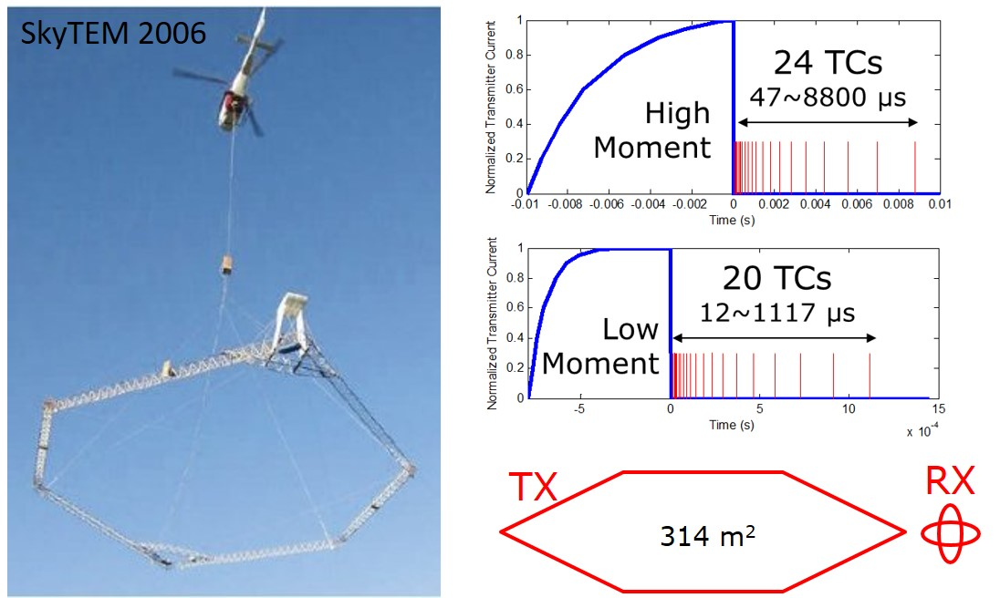
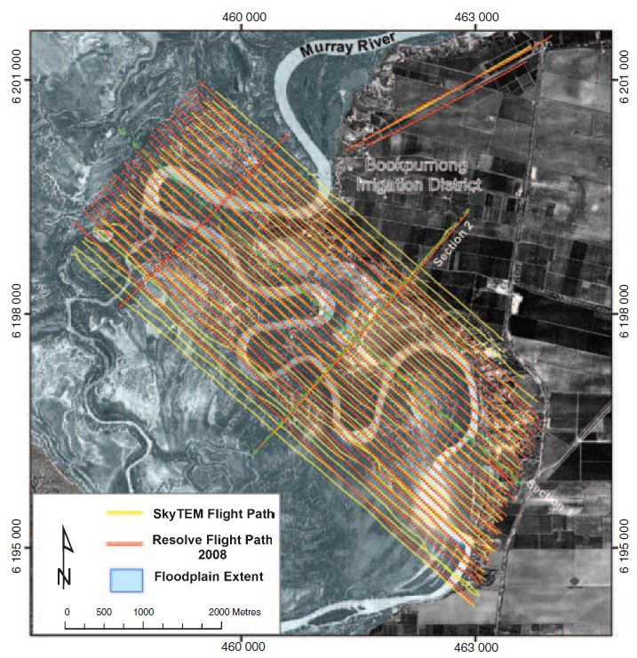

.. _bookpurnong_survey:

Survey
======

Both :ref:`airborne frequency domain <airborne_fdem_index>` and
:ref:`airborne time domain <airborne_tdem_index>` were conducted.

Frequency domain system
-----------------------

.. todo::

    - link to :ref:`RESOLVE System <resolve>`

The figure above shows the frequency-domain loop-loop system used at
Bookpurnong. The commercial name of the system is RESOLVE, operated by Fugro
Airborne (now CGG). It operates five pairs of horizontal co-planar (HCP) loop-
loop configurations at 382, 1822, 7970, 35920 and 130100 Hz, and one pair of
vertical co-axial loop-loop configuration at 3258 Hz. The measured secondary
magnetic field (Hs) is represented as the ratio to the primary field (Hp) in
part per million.

Survey design
*************

At Bookpurnong, the background conductivity is about 1 S/m, and we
are interested in the subsurface from 0 to about 50 m depth. The skin depths
of the :ref:`resolve` frequencies range from about 1 to 25 m.

Another consideration is the sounding spacing. For a towed system, the in-line
spacing is adjustable by the flight speed and sampling rates, and can easily
achieve high density soundings. The cross-line spacing is usually a trade-off
between the cost and resolution. At Bookpurnong, :ref:`resolve` fly in a
100 m cross-line spacing. This may not be dense enough to avoid gaps, but could still be reasonable if taking into account the geology is mostly horizontal or sub-horizontal. 

Time domain system
------------------

The figure above shows the time-domain loop-loop system used at Bookpurnong.
The commercial name of the system is SkyTEM, operated by SkyTEM Surveys ApS,
Danmark. Its transmitter is a large loop and its two receiver loops are
mounted at the rear of the frame, in orthogonal orientations measuring dB/dt
in z (vertical) and x (in-line horizontal) directions. The final data are
normalized as if the dipole moments of the transmitter and the receiver are
both unity. One special feature of SkyTEM is its capability of operating in
dual-mode - transmitting a high moment pulse and a low moment pulse
sequentially. A high moment pulse has greater penetrating depth, but is
difficult to cut off clearly in electronics, causing unaccepted bias in the
early times. A low moment does not see very deep, but has cleaner early time
channels. The high moment is 113000 NIA at 25 Hz and the low moment is 12560
NIA at 222.22 Hz at Bookpurnong.

Survey Design
*************
The diffusion distances of the SkyTEM time channels range 4 to 120 m. Using the same designing concept in RESOLVE, the SkyTEM was flown at a 100 m line spacing, so any single location can be at least sensed by two lines.

 
RESOLVE and SkyTEM flight lines at Bookpurnong
