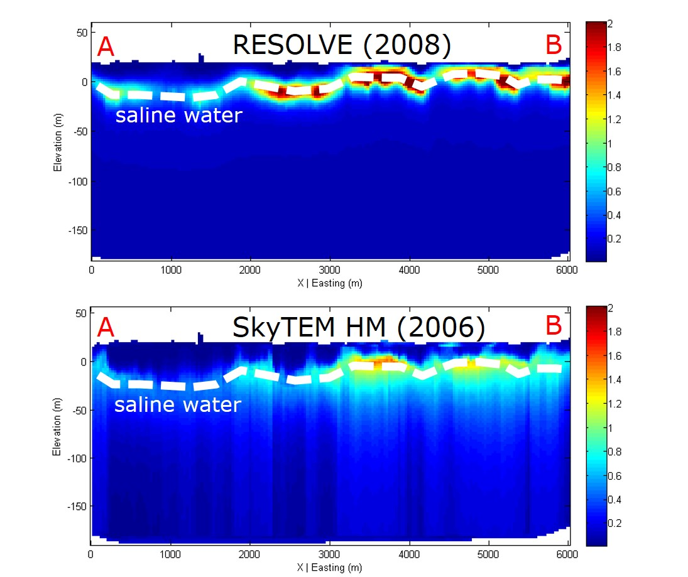
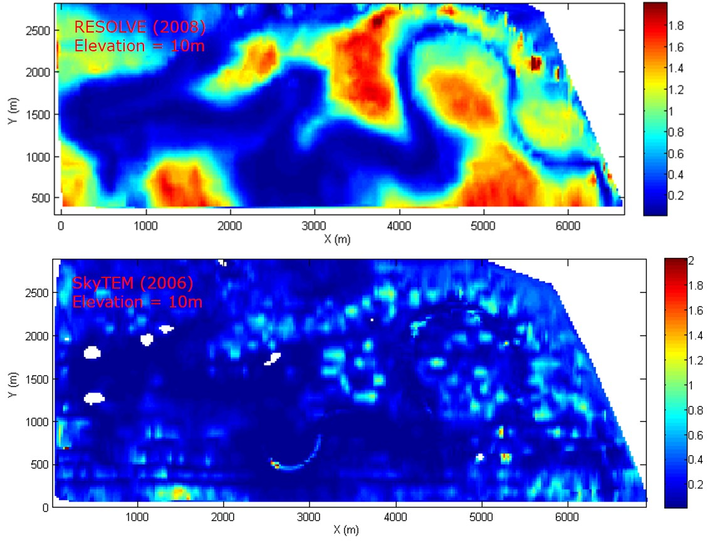
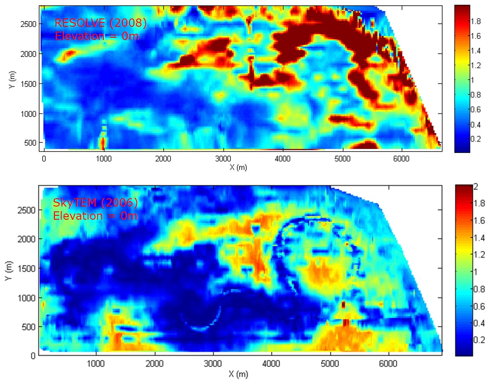

.. _bookpurnong_synthesis:

Synthesis
=========

At the step of synthesis, geophysicists need to connect the interpretation
results to the geologic questions asked at set-up, and also determine whether
iterations of the previous steps are necessary. At Bookpurnong, the
hydrologists are primarily concerned about the salinity of the groundwater
that indicates the recharge (gaining) or discharge (losing) status of the
river. Using the inversion models shown in Interpretation, both models
consistently indicate that the upstream part of the river is fresher (less
conductive) and thus losing water; the downstream part of the river is more saline
(more conductive) and thus gaining water.

In order to achieve a more robust interpretation, we compare the models
obtained from RESOLVE and SkyTEM.

On the A-B cross section, both systems show similar relative distribution of
conductivity for a wavy conductive layer that is likely to be associated with
the saline water. However, we notice that there are some difference:

(1) The overall conductivity in RESOLVE is higher than in SkyTEM.

(2) The depth of the saline water layer is shallower in RESOLVE than in SkyTEM.

The discrepancy is more clearly evidenced on the depth slice maps at elevation
10 m and 0 m. The conductivity of RESOLVE at 10 m is actually similar to that
of SkyTEM at 0 m.

Possibilities are:

(1) Systematic errors in the data. For example, the flight height could be incorrect.

(2) Naturally occurring variation of the conductivity or due to SIS.

(3) The weaker conductivity in SkyTEM may be compensated by the thickness.

So further investigation may be needed to reconcile the models.

