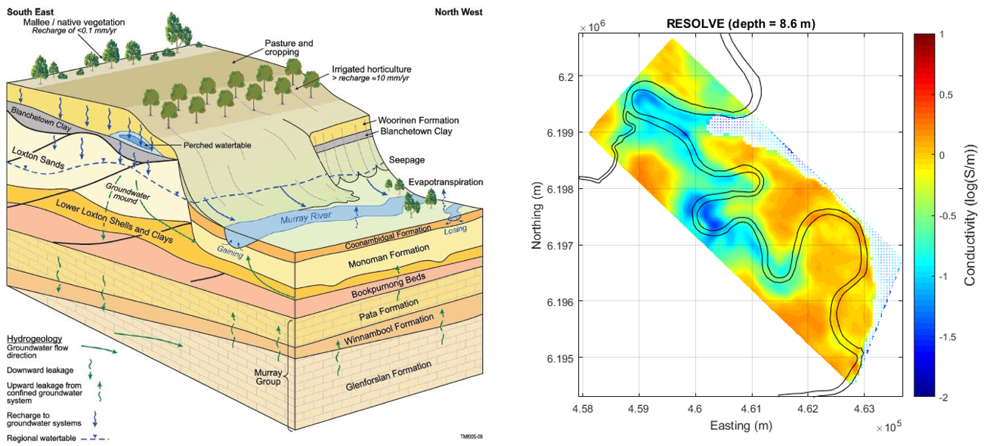

.. _bookpurnong_synthesis:

Synthesis
=========

At the step of synthesis, geophysicists need to connect the interpretation
results to the geologic questions asked at set-up, and also determine whether
iterations of the previous steps are necessary. At Bookpurnong, the
hydrologists are primarily concerned about the salinity of the groundwater
that indicates the recharge (gaining) or discharge (losing) status of the
river. Both models consistently indicate that the upstream part of the river is fresher (less
conductive) and thus losing water; the downstream part of the river is more saline
(more conductive) and thus gaining water.

Back to the motivating questions in Setup:

How EM can be used to reconstruct an electrical conductivity model for the
entire region?

Frequency-domain and time-domain EM systems were flown over the area to
collect FDEM and TDEM data that are related to the codnuctivity through
Maxwell's equations. Then the measured field data were inverted to
conductivities at depth using the 1D layered earth modeling. The two data sets
provide consistent information about the conductivity.

Can the conductivity model, a proxy of the severity of salinization, reveal
the dynamics of groundwater flow?

Yes. By examing the inverted models, we concludes that the upstream section of
the river loses water, flushing the surrounding floodplain; the downstream
section gains saline water rfom the highland, casuing the increase of
conductivity and salinity.

   Hydrological model and electrical conductivity model at Bookpurnong.

Follow up
---------

We have notied a temporal variation in the conductivity models from SkyTEM
2006 and RESOLVE 2008. Given the importance of the temporal analysis in the
water management, this is something worth further investigation and
confirmation. Two approaches amy be pursued:

(1) Iterate back to processing and do advanced analysis of hypothesis test. The
    idea is to test if alternative models that do not show such temporal change
    exist.

(2) Incorporating additional information. There are other data available,
    including another RESOLVE data set in 2005 and another SkyTEM data sets in
    2015, as well as some EM-31 at some locations and NanoTEM data in the river.
    The salinity data of water samples can also be used to help constrain the
    inversion.

