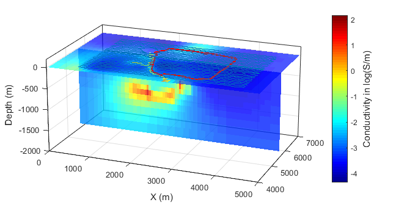
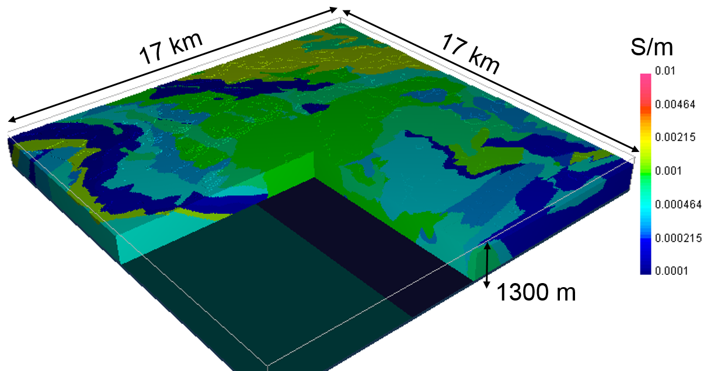

.. --------------------------------- ..
..                                   ..
..    THIS FILE IS AUTO GENEREATED   ..
..                                   ..
..    autodoc.py                     ..
..                                   ..
.. --------------------------------- ..

.. toctree::
    :maxdepth: 1
    :hidden:

    mt_isa/index
    wadi_sahba/index
    bookpurnong/index
    aspen/index
    lalor/index
    emc/index
    albany/index
    westplains/index
    furggwanghorn/index
    sagd/index
    norsminde/index
    barents_sea/index
    saurashtra/index
    kasted/index
    balboa/index
    noranda/index
    

Gallery
-------
    

Mt. Isa
^^^^^^^

.. image:: ./mt_isa/images/MtIsa_Cover.png
    :alt: mt_isa
    :width: 260
    :align: right

- :ref:`2-D and 3-D IP/resistivity for the interpretation of Isa-style targets <mt_isa_index>`

- Contributors
    - author: :ref:`fourndo`

- Tags
    - geophysical survey: DC, IP
    - application: Mining
    - location: Australia

|
|
|

        

Wadi Sahba
^^^^^^^^^^

.. image:: ./wadi_sahba/images/thumbnail.png
    :alt: wadi_sahba
    :width: 260
    :align: right

- :ref:`High-resolution velocity modeling by seismic-airborne TEM joint inversion: A new perspective for near-surface characterization <wadi_sahba_index>`

- Contributors
    - author: :ref:`dcolombo`
    - reviewer: :ref:`dccowan`, :ref:`doldenburg`, :ref:`skang`, :ref:`lheagy`

- Tags
    - geophysical survey: Seismic, ATEM
    - application: Hydrocarbon
    - location: Arabian Gulf, Qatar
    - keyword: Wadi Sahba, Multi-physics, Joint Inversion

|
|
|

        

Bookpurnong
^^^^^^^^^^^

.. image:: ./bookpurnong/images/booky-hydro.jpg
    :alt: bookpurnong
    :width: 260
    :align: right

- :ref:`Spatially constrained inversion for quasi 3D modelling of airborne electromagnetic data - an application for environmental assessment in the Lower Murray Region of South Australia <bookpurnong_index>`

- Contributors
    - author: :ref:`dyang`

- Tags
    - geophysical survey: Airborne FDEM, Airborne TDEM
    - application: Groundwater
    - location: Australia

|
|
|

        

Aspen
^^^^^

.. image:: ./aspen/images/FormationMM.png
    :alt: aspen
    :width: 260
    :align: right

- :ref:`From exploration to reclamation: using EM methods at SAGD sites in the Athabasca oil sands <aspen_index>`

- Contributors
    - author: :ref:`sdevriese`

- Tags
    - geophysical survey: Airborne TDEM
    - application: Hydrocarbons
    - location: Canada
    - keyword: Oil Sands

|
|
|

        

Lalor
^^^^^

- :ref:`3D inversion of total magnetic intensity data for time-domain EM at the Lalor massive sulphide deposit <lalor_index>`

- Contributors
    - author: :ref:`doldenburg`, :ref:`dyang`
    - reviewer: :ref:`dccowan`

- Tags
    - Keywords: Airborne TDEM, massive sulphide
    - Applications: Mineral exploration
    - Location: Lalor Lake, Manitoba, Canada
    - Geophysical Surveys: Airborne TDEM

|
|
|

        

Elevenmile Canyon
^^^^^^^^^^^^^^^^^

.. image:: ./emc/images/geothermal.png
    :alt: emc
    :width: 260
    :align: right

- :ref:`Three-Dimensional Inversion of ZTEM Data at the Elevenmile Canyon Geothermal System, Nevada <emc_index>`

- Contributors
    - author: :ref:`sdevriese`

- Tags
    - geophysical survey: Airborne NSEM
    - application: Geothermal
    - location: United States of America
    - keyword: ZTEM

|
|
|

        

Albany
^^^^^^

.. image:: ./albany/images/figDrillModel.png
    :alt: albany
    :width: 260
    :align: right

- :ref:`Airborne and Ground Time-Domain EM results from the Albany Graphite Discovery <albany_index>`

- Contributors
    - author: :ref:`jlegault`, :ref:`jlymburner`, :ref:`kralph`, :ref:`pwood`, :ref:`morta`, :ref:`aprikhodko`, :ref:`nbournas`, :ref:`shickey`
    - reviewer: :ref:`dccowan`

- Tags
    - Keywords: Mineral exploration, airborne, ground-based, TDEM, porphyry
    - Applications: Mineral exploration, hydrothermal graphite porphyry
    - Location: Albany graphite deposit, Ontario, Canada
    - Geophysical Surveys: Airborne TDEM, ground-based TDEM, aeromagnetic

|
|
|

        

West Plains
^^^^^^^^^^^

.. image:: ./westplains/images/thumbnail_westplains.png
    :alt: westplains
    :width: 260
    :align: right

- :ref:`A review of time and frequency domain airborne electromagnetic data sets over the West Plains orogenic gold region of the Committee Bay Greenstone Belt <westplains_index>`

- Contributors
    - author: :ref:`doldenburg`, :ref:`dyang`
    - reviewer: :ref:`dccowan`

- Tags
    - Keywords: Airborne EM, orogenic gold, greenstone belt
    - Applications: Mineral exploration
    - Location: Nunavut, Canada
    - Geophysical Surveys: VTEM, RESOLVE

|
|
|

        

Furggwanghorn
^^^^^^^^^^^^^

.. image:: ./furggwanghorn/images/furggwanghorn_heligpr.png
    :alt: furggwanghorn
    :width: 260
    :align: right

- :ref:`3D Helicopter GPR surveying a rock glacier <furggwanghorn_index>`

- Contributors
    - author: :ref:`agreen`, :ref:`kmerz`, :ref:`hmaurer`
    - reviewer: :ref:`skang`, :ref:`doldenburg`

- Tags
    - geophysical survey: GPR
    - application: Geotechnical
    - location: Switzerland

|
|
|

        

SAGD
^^^^

.. image:: ./sagd/images/ChamberIrregular.png
    :alt: sagd
    :width: 260
    :align: right

- :ref:`Detecting and imaging time-lapse conductive changes using electromagnetic methods <sagd_index>`

- Contributors
    - author: :ref:`sdevriese`

- Tags
    - geophysical survey: Borehole EM
    - application: Hydrocarbons
    - location: Canada
    - keyword: Oil Sands

|
|
|

        

Norsminde
^^^^^^^^^

.. image:: ./norsminde/images/fig_thumbnail.png
    :alt: norsminde
    :width: 260
    :align: right

- :ref:`Assessment of near-surface mapping capabilities by airborne transient electromagnetic data - an extensive comparison to conventional borehole data <norsminde_index>`

- Contributors
    - author: :ref:`eauken`, :ref:`avchristiansen`, :ref:`cschamper`, :ref:`fjorgensen`, :ref:`fefferso`
    - reviewer: :ref:`dccowan`

- Tags
    - Keywords: Airborne TDEM, Groundwater
    - Applications: Groundwater Mapping
    - Location: Norsminde, Denmark
    - Geophysical Surveys: Airborne TDEM

|
|
|

        

Barents Sea
^^^^^^^^^^^

.. image:: ./barents_sea/images/inversion_workflow.png
    :alt: barents_sea
    :width: 260
    :align: right

- :ref:`Reservoir properties prediction using CSEM, pre-stack seismic and well log data: Case Study in the Hoop Area, Barents Sea, Norway <barents_sea_index>`

- Contributors
    - author: :ref:`palvarez`, :ref:`aalvarez`, :ref:`lmacgregor`, :ref:`fbolivar`, :ref:`rkeirstead`, :ref:`tmartin`
    - reviewer: :ref:`dccowan`

- Tags
    - Keywords: Hydrocarbon, CSEM, reservoir, oil and gas
    - Applications: Reservoir characterization, marine EM
    - Location: Hoop Fault Complex, Barents Sea, Norway
    - Geophysical Surveys: CSEM, 2D seismic

|
|
|

        

Saurashtra
^^^^^^^^^^

.. image:: ./saurashtra/images/thumbnail.png
    :alt: saurashtra
    :width: 260
    :align: right

- :ref:`Exploration with Controlled Source Electromagnetics Under Basalt Cover in India <saurashtra_index>`

- Contributors
    - reviewer: :ref:`dccowan`, :ref:`doldenburg`

- Tags
    - geophysical survey: LOTEM
    - application: Hydrocarbon
    - location: Saurashtra Peninsula, India
    - keyword: LOTEM, Hydrocarbon

|
|
|

        

Kasted
^^^^^^

.. image:: ./kasted/images/fig_thumbnail.png
    :alt: kasted
    :width: 260
    :align: right

- :ref:`3D geological modelling of a complex buried-valley network delineated from borehole and AEM data <kasted_index>`

- Contributors
    - author: :ref:`ashoyer`, :ref:`tvilhelmsen`, :ref:`eauken`, :ref:`avchristiansen`, :ref:`fjorgensen`, :ref:`psandersen`, :ref:`aviezzoli`, :ref:`imoller`
    - reviewer: :ref:`dccowan`

- Tags
    - Keywords: Airborne TDEM, Groundwater
    - Applications: Groundwater Mapping
    - Location: Aarhus, Denmark
    - Geophysical Surveys: Airborne TDEM

|
|
|

        

Balboa
^^^^^^

.. image:: ./balboa/images/bboa_thumbnail.png
    :alt: balboa
    :width: 260
    :align: right

- :ref:`The Balboa ZTEM Cu-Mo-Au porphyry discovery at Cobre Panama <balboa_index>`

- Contributors
    - author: :ref:`jlegault`, :ref:`cwijns`, :ref:`cizarra`, :ref:`gplastow`
    - reviewer: :ref:`skang`, :ref:`doldenburg`, :ref:`lheagy`

- Tags
    - geophysical survey: Airborne NSEM
    - application: Mining
    - location: Panama
    - keyword: ZTEM, porphyry, copper, gold

|
|
|

        

Noranda
^^^^^^^

- :ref:`3D inversion of natural source electromagnetic data <noranda_index>`

- Contributors
    - author: :ref:`eholtham`
    - reviewer: :ref:`sdevriese`

- Tags
    - geophysical survey: ZTEM
    - application: Mineral deposits
    - location: Canada
    - keyword: Noranda

|
|
|

        