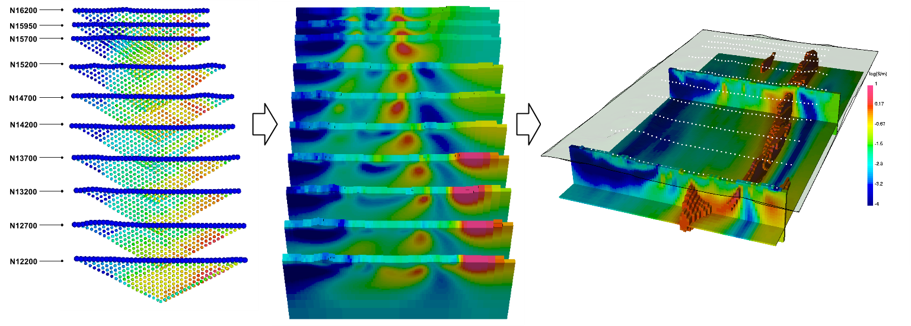
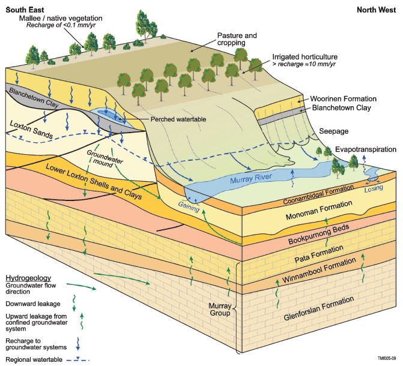
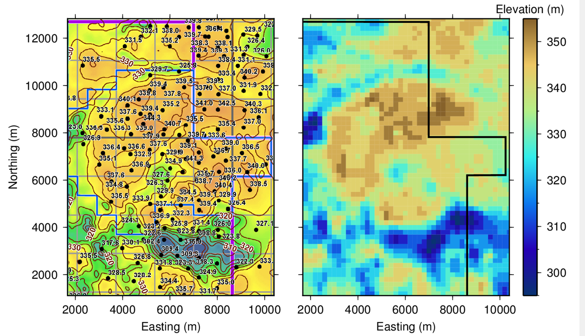
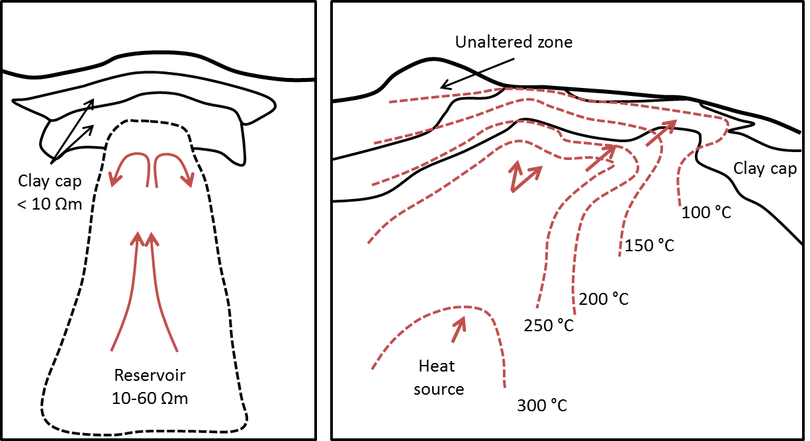
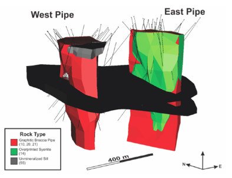
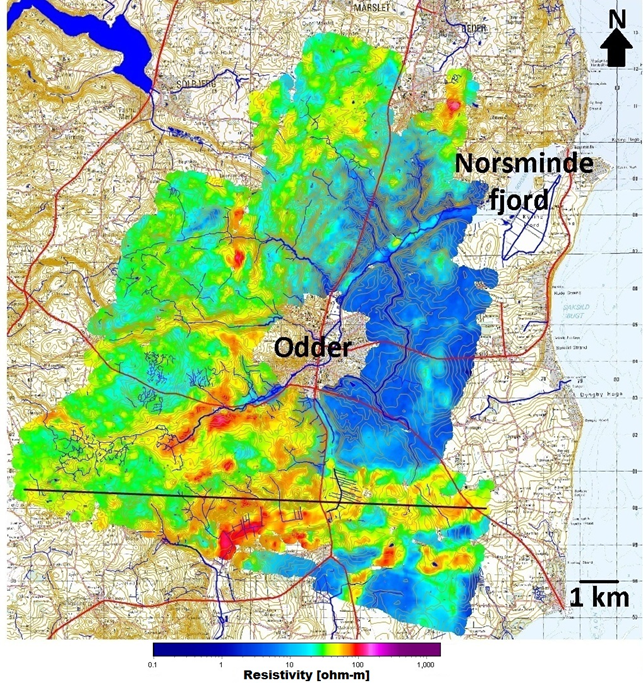
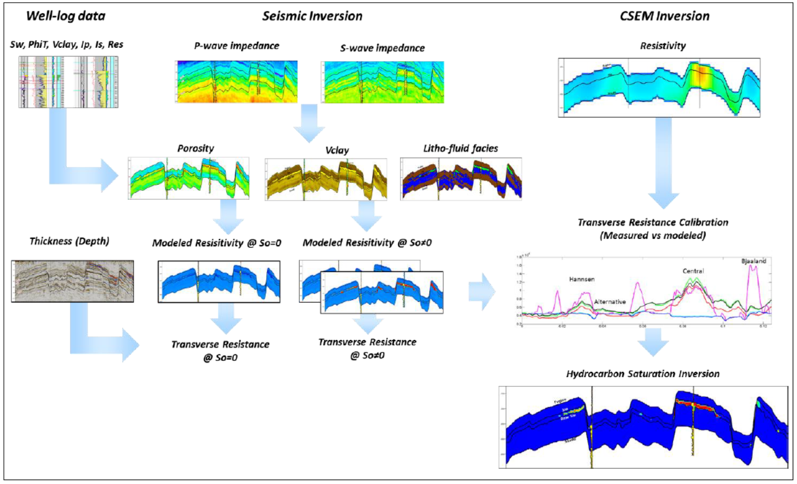
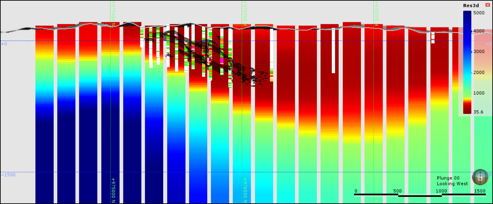

.. --------------------------------- ..
..                                   ..
..    THIS FILE IS AUTO GENEREATED   ..
..                                   ..
..    autodoc.py                     ..
..                                   ..
.. --------------------------------- ..

.. toctree::
    :maxdepth: 1
    :hidden:

    mt_isa/index
    bookpurnong/index
    aspen/index
    emc/index
    albany/index
    furggwanghorn/index
    norsminde/index
    barents_sea/index
    kasted/index
    balboa/index
    

Gallery
-------
    

Mt. Isa
^^^^^^^

- :ref:`Mt. Isa <mt_isa_index>`

- Contributors
    - author: :ref:`fourndo`

- Tags
    - geophysical survey: DC, IP
    - application: Mining
    - location: Australia

|
|
|

        

Bookpurnong
^^^^^^^^^^^

- :ref:`Bookpurnong <bookpurnong_index>`

- Contributors
    - author: :ref:`dyang`

- Tags
    - geophysical survey: Airborne FDEM, Airborne TDEM
    - application: Groundwater
    - location: Australia

|
|
|

        

Aspen
^^^^^

- :ref:`Aspen <aspen_index>`

- Contributors
    - author: :ref:`sdevriese`

- Tags
    - geophysical survey: Airborne TDEM
    - application: Hydrocarbons
    - location: Canada
    - keyword: Oil Sands

|
|
|

        

Elevenmile Canyon
^^^^^^^^^^^^^^^^^

- :ref:`Elevenmile Canyon <emc_index>`

- Contributors
    - author: :ref:`sdevriese`

- Tags
    - geophysical survey: Airborne NSEM
    - application: Geothermal
    - location: United States of America
    - keyword: ZTEM

|
|
|

        

Albany
^^^^^^

- :ref:`Airborne and Ground Time-Domain EM results from the Albany Graphite Discovery <albany_index>`

- Contributors
    - author: :ref:`jlegault`, :ref:`jlymburner`, :ref:`kralph`, :ref:`pwood`, :ref:`morta`, :ref:`aprikhodko`, :ref:`nbournas`, :ref:`shickey`
    - reviewer: :ref:`dccowan`

- Tags
    - Keywords: Mineral exploration, airborne, ground-based, TDEM, porphyry
    - Applications: Mineral exploration, hydrothermal graphite porphyry
    - Location: Albany graphite deposit, Ontario, Canada
    - Geophysical Surveys: Airborne TDEM, ground-based TDEM, aeromagnetic

|
|
|

        

Furggwanghorn
^^^^^^^^^^^^^

.. image:: ./furggwanghorn/images/furggwanghorn_heligpr.png
    :alt: furggwanghorn
    :width: 260
    :align: right

- :ref:`3D Helicopter GPR surveying a rock glacier <furggwanghorn_index>`

- Contributors
    - author: :ref:`agreen`, :ref:`kmerz`, :ref:`hmaurer`
    - reviewer: :ref:`skang`, :ref:`doldenburg`

- Tags
    - geophysical survey: GPR
    - application: Geotechnical
    - location: Switzerland

|
|
|

        

Norsminde
^^^^^^^^^

- :ref:`Assessment of near-surface mapping capabilities by airborne transient electromagnetic data - an extensive comparison to conventional borehole data <norsminde_index>`

- Contributors
    - author: :ref:`eauken`, :ref:`avchristiansen`, :ref:`cschamper`, :ref:`fjorgensen`, :ref:`fefferso`
    - reviewer: :ref:`dccowan`

- Tags
    - Keywords: Airborne TDEM, Groundwater
    - Applications: Groundwater Mapping
    - Location: Norsminde, Denmark
    - Geophysical Surveys: Airborne TDEM

|
|
|

        

Barents Sea
^^^^^^^^^^^

- :ref:`Reservoir properties prediction using CSEM, pre-stack seismic and well log data: Case Study in the Hoop Area, Barents Sea, Norway <barents_sea_index>`

- Contributors
    - author: :ref:`palvarez`, :ref:`aalvarez`, :ref:`lmacgregor`, :ref:`fbolivar`, :ref:`rkeirstead`, :ref:`tmartin`
    - reviewer: :ref:`dccowan`

- Tags
    - Keywords: Hydrocarbon, CSEM, reservoir, oil and gas
    - Applications: Reservoir characterization, marine EM
    - Location: Hoop Fault Complex, Barents Sea, Norway
    - Geophysical Surveys: CSEM, 2D seismic

|
|
|

        

Kasted
^^^^^^

.. image:: ./kasted/images/fig_thumbnail.png
    :alt: kasted
    :width: 260
    :align: right

- :ref:`3D geological modelling of a complex buried-valley network delineated from borehole and AEM data <kasted_index>`

- Contributors
    - author: :ref:`jpedersen`, :ref:`fefferso`, :ref:`fjorgensen`, :ref:`jcrefsgaard`, :ref:`eauken`, :ref:`cschamper`, :ref:`avchristiansen`
    - reviewer: :ref:`dccowan`

- Tags
    - Keywords: Airborne TDEM, Groundwater
    - Applications: Groundwater Mapping
    - Location: Aarhus, Denmark
    - Geophysical Surveys: Airborne TDEM

|
|
|

        

Balboa
^^^^^^

- :ref:`The Balboa ZTEM Cu-Mo-Au porphyry discovery at Cobre Panama <balboa_index>`

- Contributors
    - author: :ref:`jlegault`, :ref:`cwijns`, :ref:`cizarra`, :ref:`gplastow`
    - reviewer: :ref:`skang`, :ref:`doldenburg`, :ref:`lheagy`

- Tags
    - geophysical survey: Airborne NSEM
    - application: Mining
    - location: Panama
    - keyword: ZTEM, porphyry, copper, gold

|
|
|

        