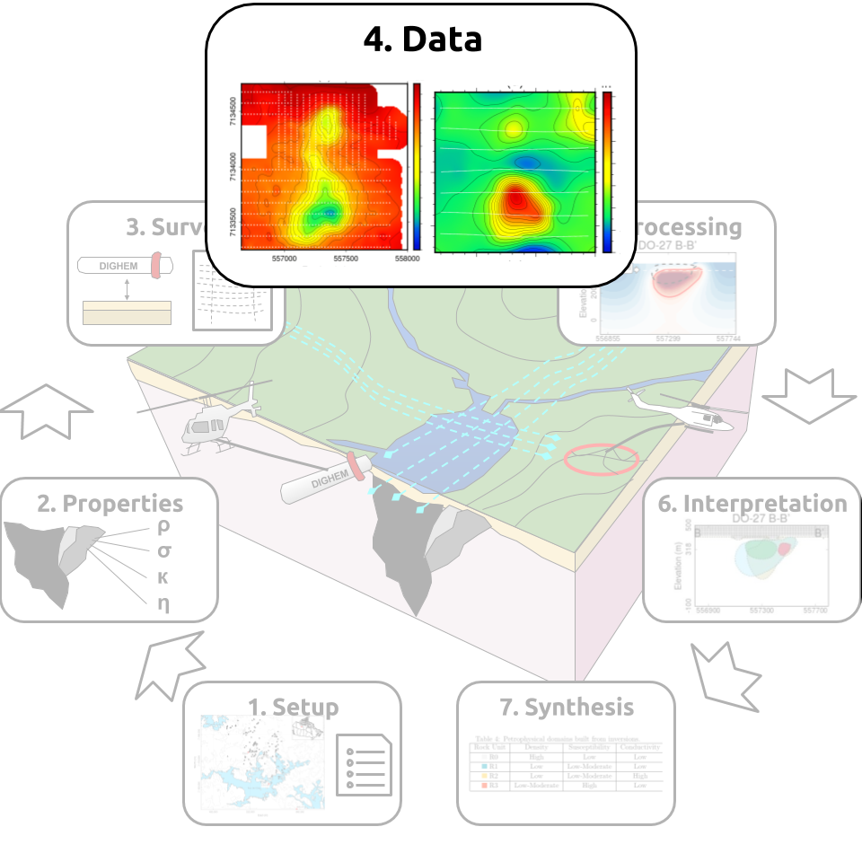
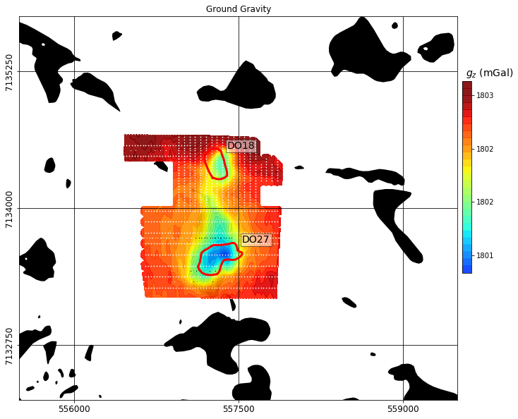
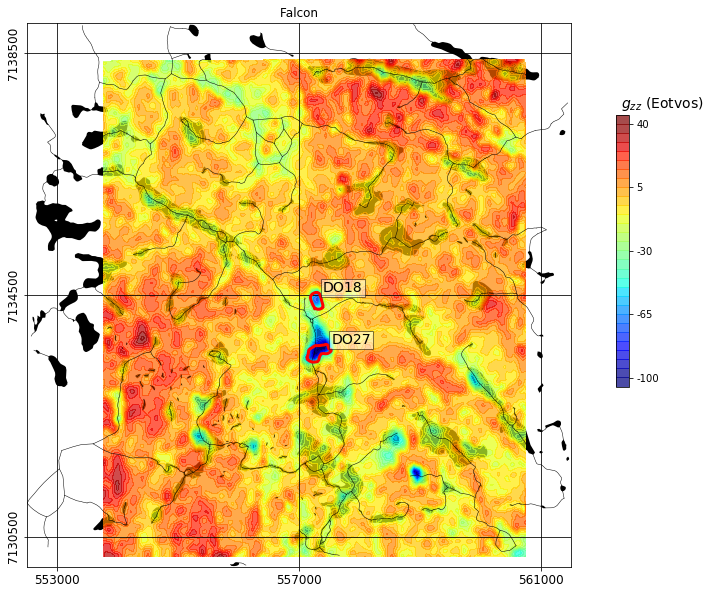
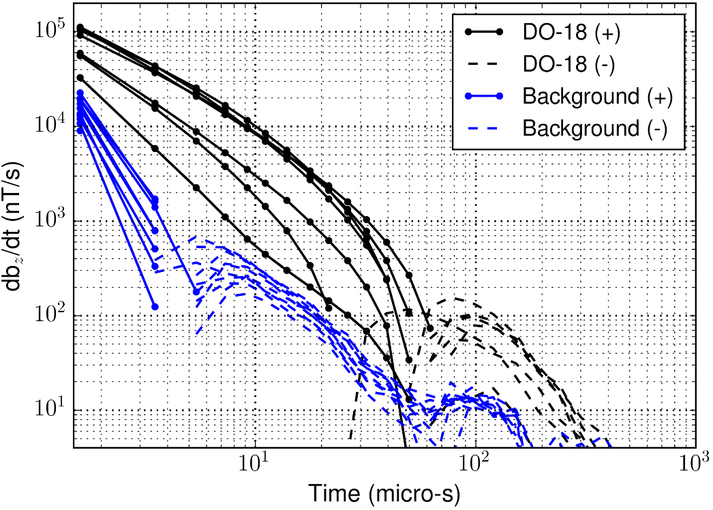
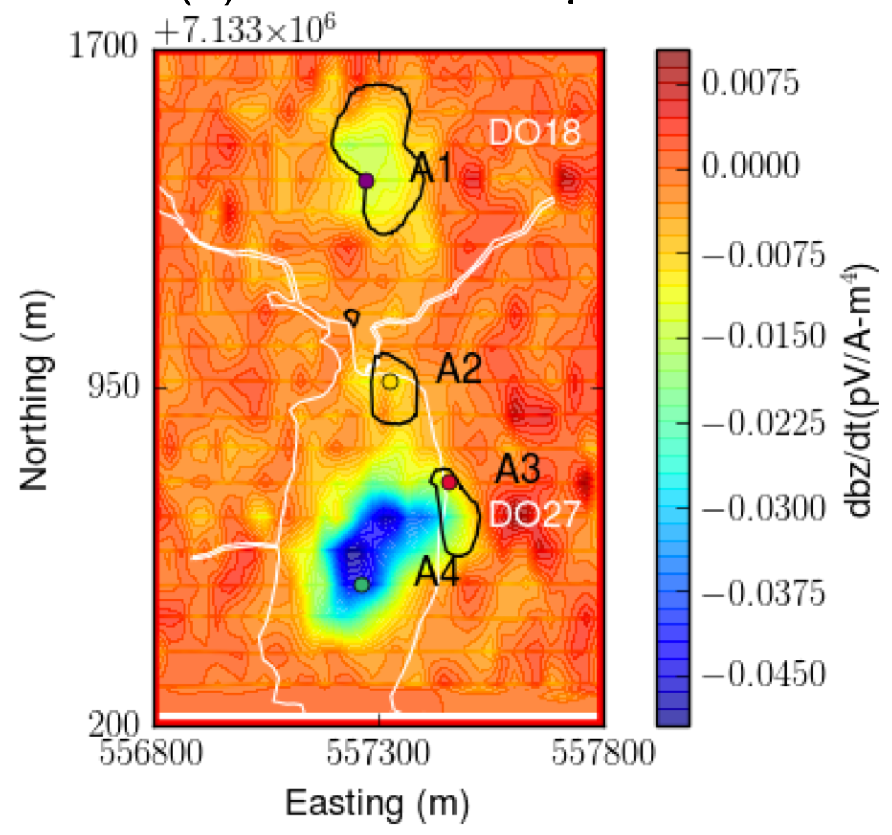
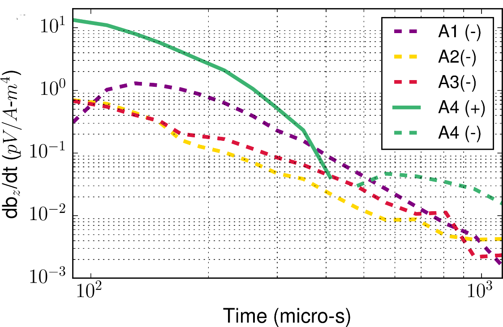

.. _tkc_data:

Data
====

This section reviews the data that was graciously provided by Peregrine
Diamonds Ltd. We review the units and normalizations, as well as observations that can
be made by simple visual inspection of the data. It is important to note that
*survey reports* were missing for a few data sets. As a result, some of the technical
information had to be inferred from surveys acquired during the same time
period.

.. .. _Peregrine Diamonds Ltd: http://canada.debeersgroup.com/operations/projects/chidliak-project

.. _tkc_data_grav:

Gravity
-------

    Observed ground gravity data. Observation locations are denoted by white
    dots.

Two ground gravity surveys were provided, which measured the vertical gravity field
(:math:`g_z`) in mGal. The surveys were initially not referenced to the same
coordinate system and no correction had been done by the contractor to
compensate for the different instrumental level.  Leveling was done in post-processing by :cite:`Jansen2004`, and supplied to us as *Bouguer corrected*
(2.67 g/cc) data.

Three main features are observed in the gravity data:

- Low gravity anomalies over DO-27 and DO-18,
- Low gravity anomaly connecting the two kimberlite pipes.

Initial interpretation of the gravity data supported the idea of both pipes
being connected at depth.

.. _tkc_data_gg:

Gravity Gradiometry
-------------------

    Observed airborne gravity gradiometry data.

Airborne gravity gradiometry data were collected in 2001 using the Falcon
system with the final product being the vertical component :math:`g_{zz}` in
*Eotvos* (:math:`10^{-9}\; s^{-2}`). The survey line spacing was approximately
50 m. A terrain correction density of 2.67 g/cc and a 100-m wavelength cutoff
filter were applied to the data by the contractor.

The main features observed in the gravity data are:

- Negative anomalies over DO-27 and DO-18,
- Negative anomaly connecting the two kimberlite pipes,
- Positive high along the Mackenzie dyke,
- Low to negative gravity gradients associated with the hydrography.

.. _tkc_data_mag:

Magnetics
---------

.. .. figure:: images/Data_Mag.png

..     :align: right
..     :figwidth: 50%
..     :name: fig_Data_Mag

..     The subsets of the observed magnetic data from the (a) DIGHEM, (b)
..     AeroTEM, and (c) VTEM surveys over the TKC kimberlite complex.

.. raw:: html
	:file: ./images/Data_Mag.html

We reviewed the magnetic data acquired along side the :ref:`DIGHEM<survey_DIGHEM>`, :ref:`AeroTEM II<survey_AeroTEM>` and
:ref:`VTEM<survey_VTEM>` surveys. All three systems were equipped with a cesium vapour magnetometer, which
recorded Total Field Intensity (TMI) magnetic data in *nT* as shown below. Differences in TMI levels
can be attributed to changes in the inducing field and variable flight heights.

Two main features are observed in all three datasets:

- A positive anomaly over DO-27 and DO-18,
- A negative anomaly on the north-eastern flank of DO-27.

From the larger footprint of the DIGHEM survey, we can also identify two
larger magnetic trends. The narrow magnetic anomaly strikes :math:`315^\circ`
N, found throughout the Lac de Gras region, corresponds to the Mackenzie dyke
swarm  :cite:`Buchan2009`. A weaker but still distinguishable narrow anomaly
appears to be striking at :math:`45^\circ` N. This feature may be part of the
MacKey dyke swarm.

+------------------------------+-----------+--------+-----------+
| **System**                   | **DIGHEM**|**VTEM**|**AeroTEM**|
+------------------------------+-----------+--------+-----------+
| Number of data               | 6274      | 26334  |  22561    |
+------------------------------+-----------+--------+-----------+
| Field strength (nT)          | 59500     | 59580  | 59500     |
+------------------------------+-----------+--------+-----------+
| Inclination (:math:`^\circ`) | 83.0      | 83.3   |  83.0     |
+------------------------------+-----------+--------+-----------+
| Declination (:math:`^\circ`) | 21.0      | 19.5   | 20.0      |
+------------------------------+-----------+--------+-----------+

.. _tkc_data_FEM:

Frequency-Domain EM
-------------------

The DIGHEM system coil configuration allows for the collection of the vertical (:math:`B_z`) and
in-line (:math:`B_{xy}`) components of the magnetic field in the frequency domain. A
bucking coil was used to cancel the primary signal from the transmitter loop.
The receiver records the in-phase and quadrature components of the secondary field in
*parts-per-million* (ppm) of the primary field :math:`B_{P}` such that:

:math:`B_{ppm} = B / B_{P} * 10^6`

FEM data are often interpreted by simple visual inspection of each
frequency. From the :ref:`skin
depth<harmonic_planewaves_homogeneous_skindepth_formula_quasi>` approximation,
the highest frequencies can be used to delineate near-surface conductors
whereas deeper structures can potentially be detected by the lower
frequencies.
From the data provided, the quadrature data of the in-line data
(:math:`B_{xy}`) were missing. Hence only the vertical co-planar data were
used in this study.

.. raw:: html
	:file: ./images/Data_DIGHEM_InPhase.html

.. raw:: html
	:file: ./images/Data_DIGHEM_Quadrature.html

We highlight the following features:

- As observed on the quadrature component of the 900, 7200 and 56 kHz, a large EM signal is observed at the location of both DO-18 and DO-27.

- The 56 kHz quadrature data displays EM highs correlated with the hydrography, agreeing with a shallow response from the lake
  bottom sediments and glacial till layer.

- Two elongated and narrow negative anomalies appears in the in-phase maps of
  the 900 Hz and 7,200 Hz. These features are associated with intrusive dyke
  swarms known to be strong magnetic susceptibility anomalies.

.. _tkc_data_TEM:

Time-Domain EM
--------------

.. raw:: html
    :file: ./images/Data_NanoTEM.html

.. raw:: html
    :file: ./images/Data_AeroTEM.html

.. raw:: html
    :file: ./images/Data_VTEM.html

We present the time channels collected by the NanoTEM (1993), AeroTEM (2003)
and VTEM (2004) systems. All three systems record the time-varying vertical
component of the magnetic field :math:`\frac{\partial B_z}{\partial t}` in
(nT/s). Data quality, and the time range for which data are sampled vary
across EM systems, hence the EM data sets should show some differences.
Morevoer, the NanoTEM is a ground loop survey, whereas both the AeroTEM and
VTEM are airborne surveys. In general, we observe the following features:

- Both systems record a positive anomaly over the southern lobe of DO-27, which later goes negative.

- Negative data are observed on all time channels over DO-18.

- Relative noise level gets progressively larger at later times.

From the :ref:`skin depth<transient_planewaves_homogeneous_peakdistance>`
approximation, we would expect that the later time data could be used to
illuminate deep conductors. In this case however, the late time channels
recorded over the pipes are all negative, which may indicate the presence of :ref:`chargeable <electrical_conductivity_index_chargeability>` materials :cite:`Weidelt1982`. Chargeable materials are frequently responsible for generating induced polarization (IP) responses in time-domain EM data.

Induced Polarization Signature
------------------------------

The negative :math:`\frac{\partial B_z}{\partial t}` data recorded by both
time-domain systems may be indicative of IP responses resulting from :ref:`chargeable <electrical_conductivity_index_chargeability>` material. However, from a kimberlite exploration perspective, the existence of an IP signal is
not necessarily significant. Ice and near surface clays are known to be
chargeable and are often considered to be *EM noise*. The challenge here is to
differentiate between noise and any usable IP signal. If successful, we could characterize the kimberlites based on their chargeability.

    IP soundings

:numref:`Data_IP_Background` compares multiple soundings from the NanoTEM data
set at locations directly above DO-18 and away from the pipe, which we refer
to as *background*. Every sounding shows negative values at later time channels, but
the decay rate of background stations is faster than those over DO-18. The IP
signal in the background soundings is likely due to surface glacial sediments
(including ice and clays).

    IP data map

The strong spatial correlation between the negative data and the location of
the pipes suggests however that some IP signal may originate from the
kimberlites themselves. We focus on the VTEM data set as it includes most of
the important IP features observed at TKC, while showing less noise at later
time channels than other TEM data. From the coherent negative
:math:`\frac{\partial B_z}{\partial t}` data, we identify four anomalies of
interest:

- A1: Near DO-18,

- A2: Between DO-18 and DO-27,

- A3: On the north eastern edge of DO-27,

- A4: On the southern portion of DO-27. The A4 anomaly appears to be different
  as the data goes from positive to negative.
