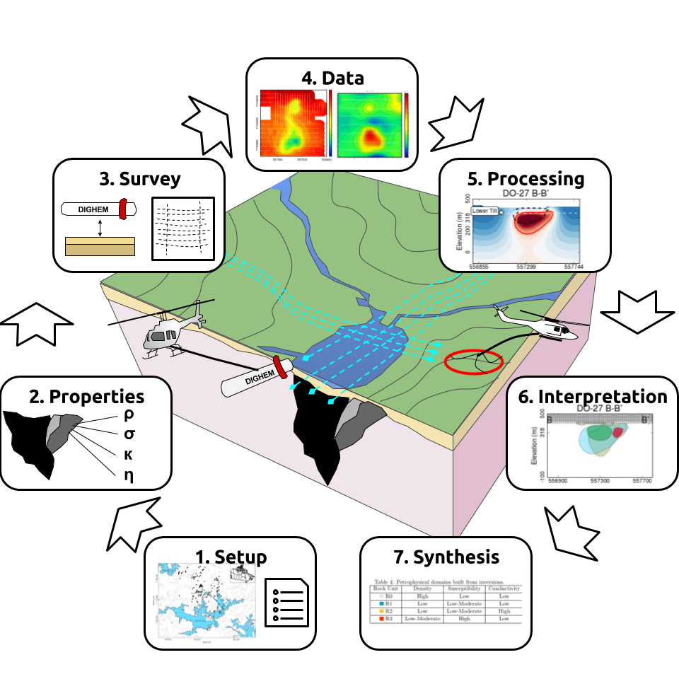

.. _do27do18tkc_index:

DO-27/DO-18 (TKC)
=================

- **Authors**: :ref:`fourndo`, :ref:`sdevriese`,  :ref:`skang`
- **Editor**: :ref:`doldenburg`

.. topic :: Prelude

    This case history focuses on the use of airborne geophysics in diamond
    exploration. Following the `7 Steps Framework`_, this study provides a strategy
    for the integration of multiple physical properties to characterize a
    kimberlite deposit. This is demonstrated on the DO-18/DO-27 kimberlites,
    formally known as the Tli Kwi Cho (TKC) deposit.

.. _7 Steps Framework: http://gpg.geosci.xyz/content/foundations/foundations_sevensteps.html?highlight=steps

**Special Thanks**

Thanks to the `Society of Exploration Geophysicists <http://seg.org>`__ for permission to reproduce figures and adapt text from:

    - Sarah G. R. Devriese, Kristofer Davis, and Douglas W. Oldenburg (2017). ”Inversion of airborne geophysics over the DO-27/DO-18 kimberlites — Part 1: Potential fields.” Interpretation, 5(3), T299-T311. `https://doi.org/10.1190/INT-2016-0142.1 <https://doi.org/10.1190/INT-2016-0142.1>`__
    - Dominique Fournier, Seogi Kang, Michael S. McMillan, and Douglas W. Oldenburg (2017). ”Inversion of airborne geophysics over the DO-27/DO-18 kimberlites — Part 2: Electromagnetics.” Interpretation, 5(3), T313-T325. `https://doi.org/10.1190/INT-2016-0140.1 <https://doi.org/10.1190/INT-2016-0140.1>`__
    - Seogi Kang, Dominique Fournier, and Douglas W. Oldenburg (2017). ”Inversion of airborne geophysics over the DO-27/DO-18 kimberlites — Part 3: Induced polarization.” Interpretation, 5(3), T327-T340. `https://doi.org/10.1190/INT-2016-0141.1 <https://doi.org/10.1190/INT-2016-0141.1>`__

The material presented here has been modified from the SEG-published version and is subject to the `SEG terms of use and conditions <https://seg.org/Publications/Policies-and-Permissions/Permissions>`__. This case history was presented as a part of the `SEG 2017 Distinguished Instructor Short Course <https://seg.org/Education/Courses/DISC/2017-DISC-Doug-Oldenburg>`__.

**Abstract**

The DO-27 and DO-18 kimberlites, often known as the Tli Kwi Cho (TKC) deposit,
have been used as a testbed for airborne geophysical methods applied to
kimberlite exploration. This case history attempts to characterize the
DO-27/DO-18 kimberlite pipes based on four physical properties: :ref:`density <tkc_density>`,
:ref:`susceptibility <tkc_susceptibility>`, :ref:`conductivity <tkc_conductivity>` and :ref:`chargeability <tkc_chargeability>`. Physical properties derived
from 3D inversions are used to build a petrophysical model of the deposit. At
least four rock types are identified and imaged at depth, which are compared
to drilling results for validation. This study promotes the use of multiple
geophysical methods for efficient diamond exploration programs.

The work presented is based upon the collaborative efforts of the UBC-GIF
members. It summaries the results published in a three-part series on TKC:

- `Inversion of airborne geophysics over the DO-27/DO-18 kimberlites - Part 1: Potential fields <https://gif.eos.ubc.ca/sites/default/files/sdevriese/files/int-2016-0142_1.pdf>`_ by Devriese, Davis and Oldenburg :cite:`DevrieseTKC2017`.

- `Inversion of airborne geophysics over the DO-27/DO-18 kimberlites - Part 2: Electromagnetics <https://gif.eos.ubc.ca/sites/default/files/sdevriese/files/int-2016-0140_1.pdf>`_ by Fournier, Kang, McMillan and Oldenburg :cite:`FournierTKC2017`.

- `Inversion of airborne geophysics over the DO-27/DO-18 kimberlites - Part 3: Induced polarization <https://gif.eos.ubc.ca/sites/default/files/sdevriese/files/int-2016-0141_1.pdf>`_ by Kang, Fournier and Oldenburg :cite:`KangTKC2017`.

.. toctree::
    :maxdepth: 1

    setup
    properties
    survey
    data
    processing
    interpretation
    synthesis
    lessons

