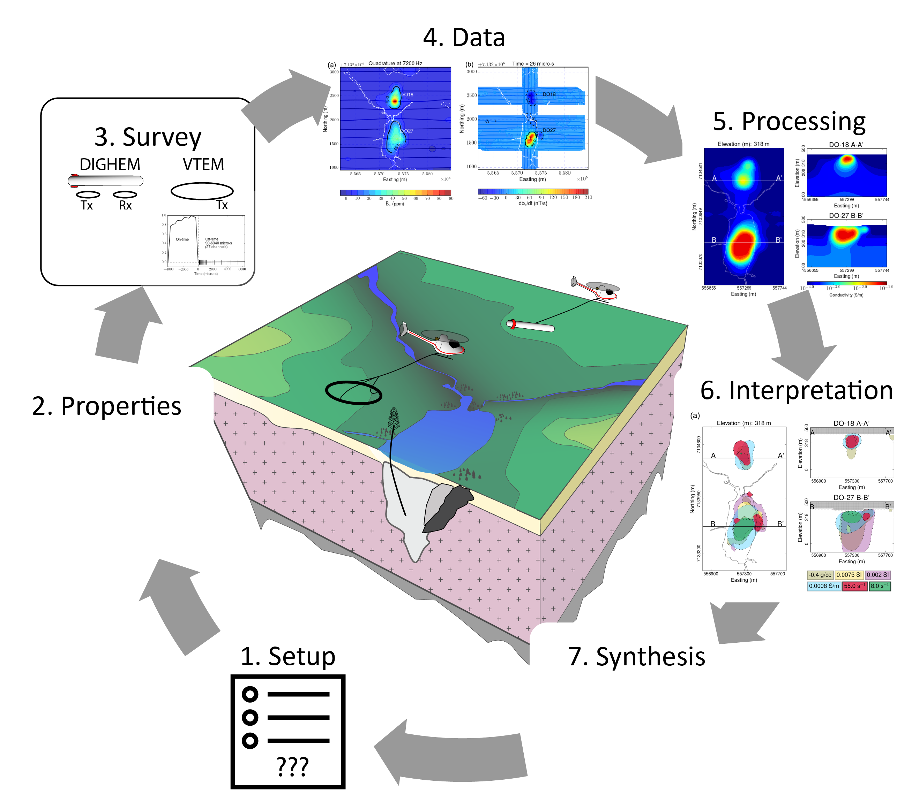

.. _do27do18tkc_index:

DO-27/DO-18 (TKC)
=================

- **Authors**: :ref:`sdevriese`, :ref:`fourndo`,  :ref:`skang`
- **Editor**: :ref:`doldenburg`

.. topic :: Prelude

    This case history focuses on the use of airborne geophysics for the
    characterization of the DO-18/DO-27 kimberlites, formally known as the Tli
    Kwi Cho (TKC) deposit.

**Abstract**

DO-27 and DO-18 kimberlites, often called the Tli Kwi Cho (TKC) kimberlites,
have been used as a testbed for airborne geophysical methods applied to
kimberlite exploration. This case history attempts to characterize the
DO-27/DO-18 kimberlite pipes based on four physical properties: density,
susceptibility, conductivity and chargeability. These physical properties
derived from 3D inversions are used to build a petrophysical model of the
diamondiferous deposit.

The results presented are based upon the collaborative work of the UBC-GIF
members that were published in a three-part series about TKC:

- `Inversion of airborne geophysics over the DO-27/DO-18 kimberlites - Part 1: Potential fields <https://gif.eos.ubc.ca/sites/default/files/sdevriese/files/int-2016-0142_1.pdf>`_ by Devriese, Davis and Oldenburg :cite:`DevrieseTKC2017`.

- `Inversion of airborne geophysics over the DO-27/DO-18 kimberlites - Part 2: Electromagnetics <https://gif.eos.ubc.ca/sites/default/files/sdevriese/files/int-2016-0140_1.pdf>`_ by Fournier, Kang, McMillan and Oldenburg :cite:`FournierTKC2017`.

- `Inversion of airborne geophysics over the DO-27/DO-18 kimberlites - Part 3: Induced polarization <https://gif.eos.ubc.ca/sites/default/files/sdevriese/files/int-2016-0141_1.pdf>`_ by Kang, Fournier and Oldenburg :cite:`KangTKC2017`.

.. toctree::
    :maxdepth: 1

    setup
    properties
    survey
    data
    processing
    interpretation
    synthesis
    lessons

