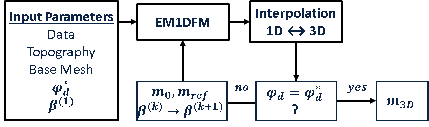

.. _tkc_lessons:

Lessons worth highlighting
==========================

The inversion of multiple data sets can greatly increase the complexity of the
modelisation and interpretation. This section presents some the lessons worth
sharing for future projects.

.. _tkc_LC1D:

Laterally Constrained 1D inversion
----------------------------------

We designed a laterally
constrained 1D inversion procedure in order to get a more consistent
conductivity distribution, as represented schematically in
:numref:`fig_Processing_Lateral_EM1D_Algo`.

- Between each 1D iteration, an average conductivity model is interpolated
- onto a global 3D mesh and used as a reference for subsequent inversions.

- A global data misfit and regularization parameters are used to control
- individual 1D inversions, similar to the framework used for 3D algorithms.

- Individual 1D inversions are used to populate a large 3D mesh.

.. _tkc_ppm2TF:

FEM data conversion: Ppm to Total Field
---------------------------------------
