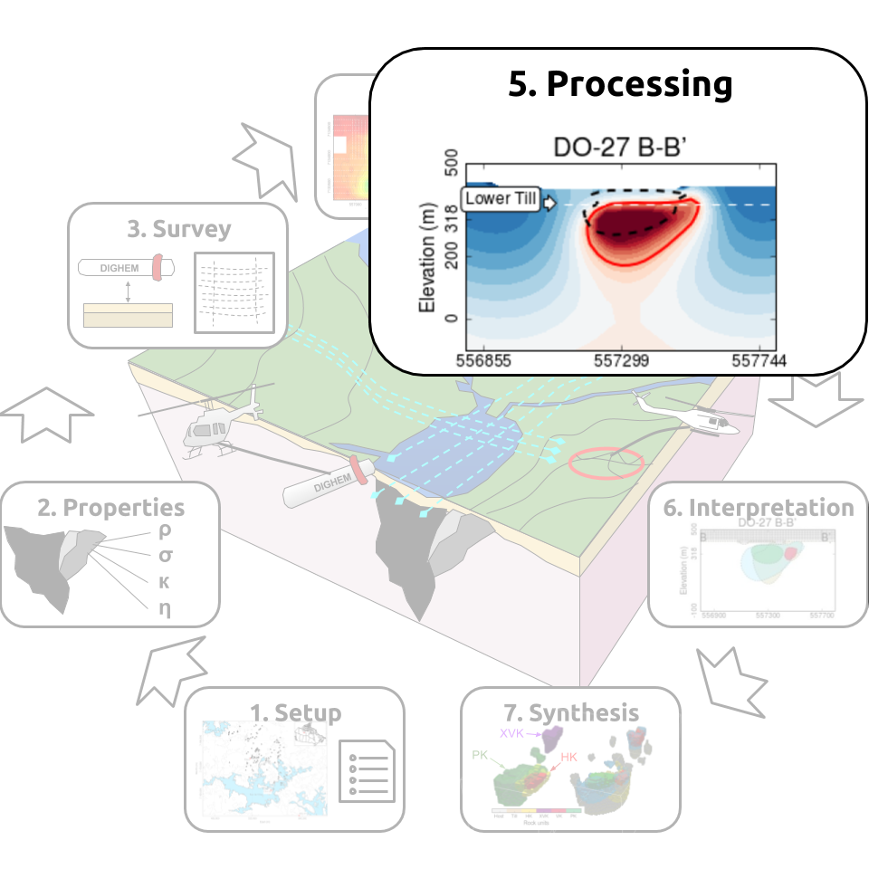
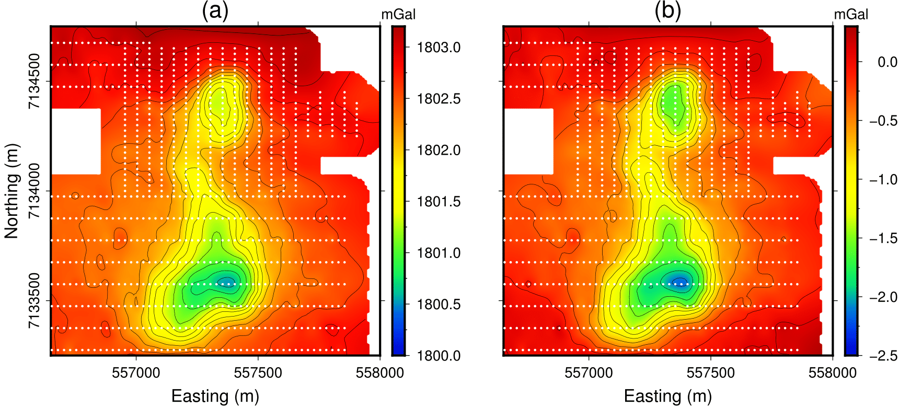
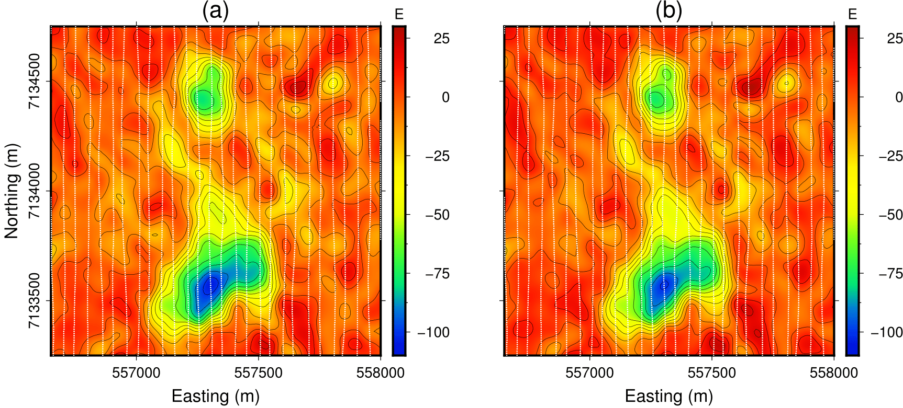
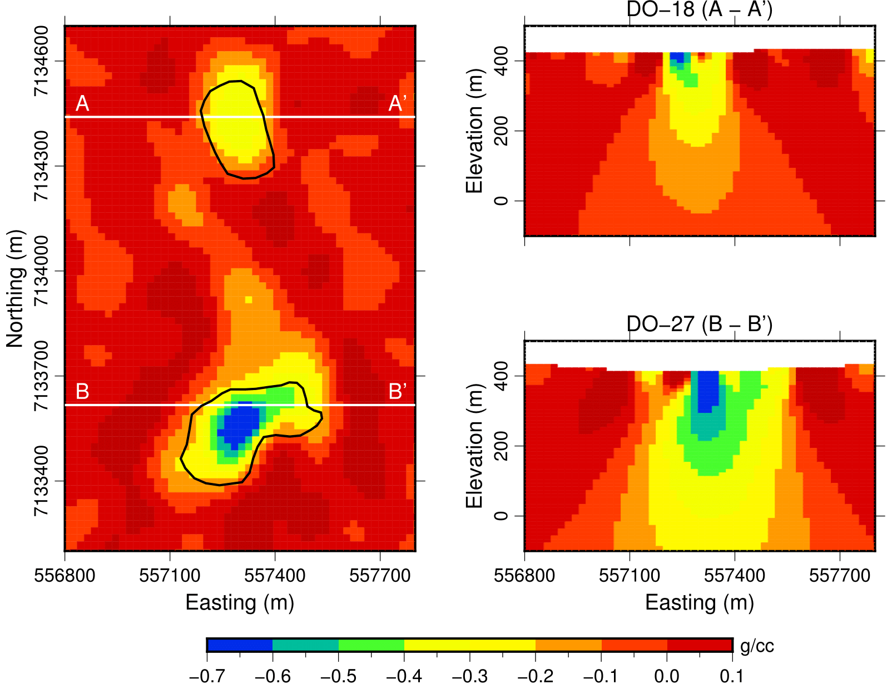
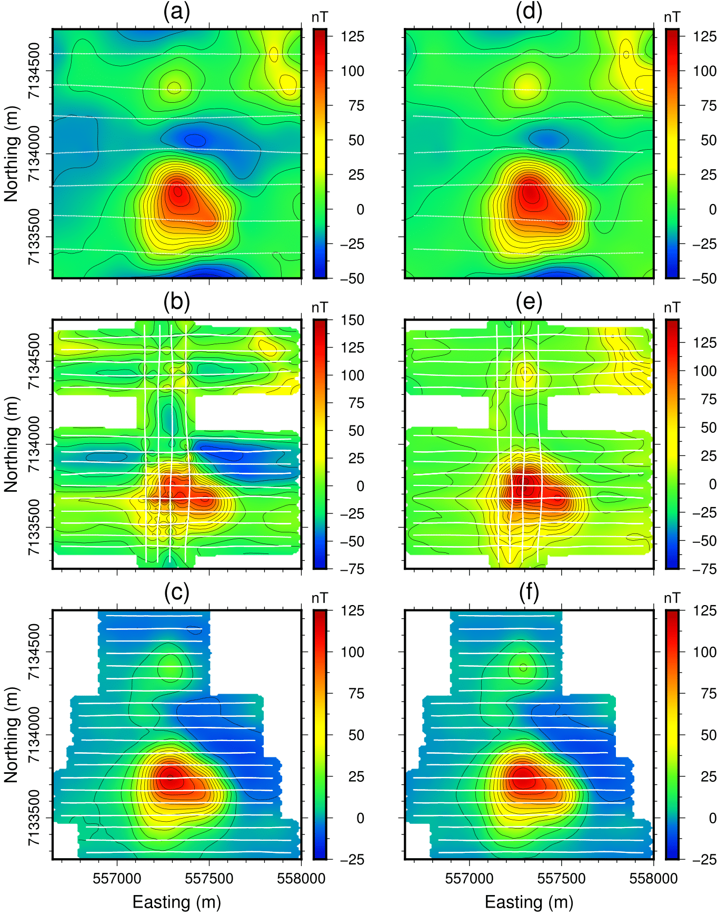
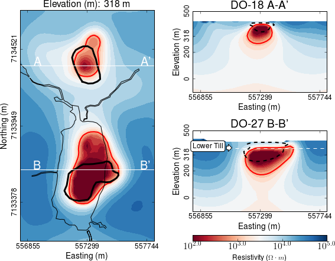
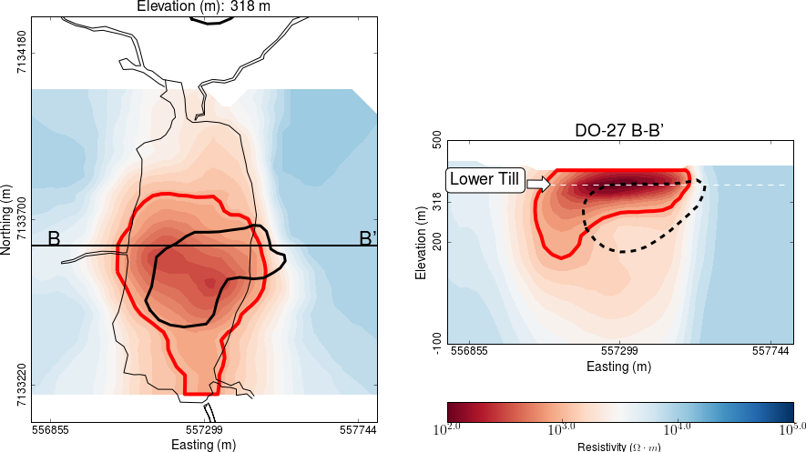
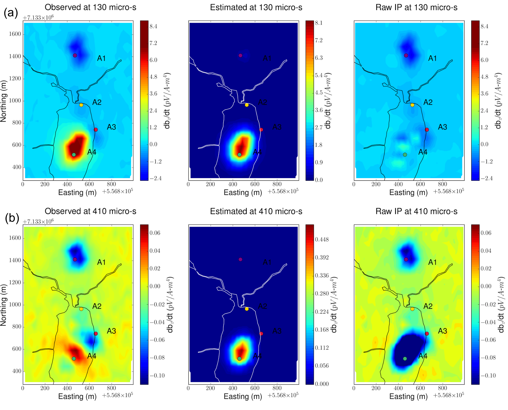
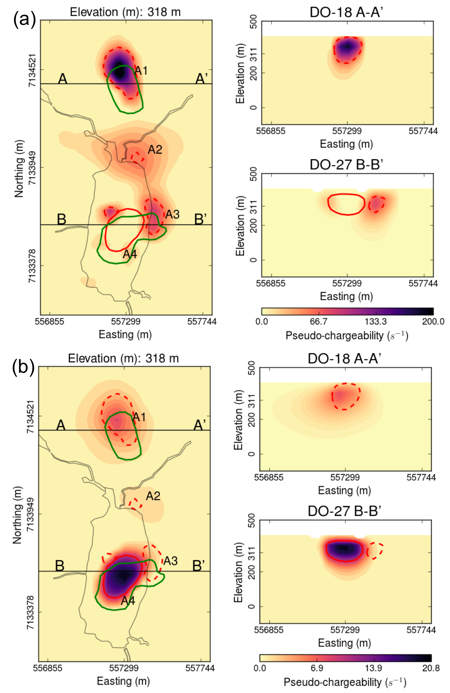
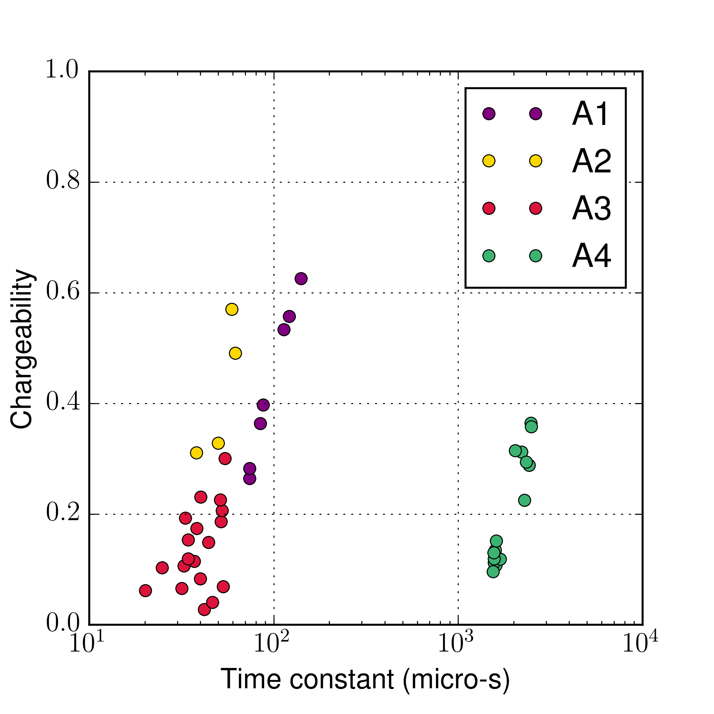

.. _tkc_processing:

Processing
==========

This section provides an overview of the data quality control and inversion
procedure of the geophysical data.

Gravity
-------

In preparation for the inversion, the following processing steps were taken
on the ground gravity data:

- Since elevation information were only provided for the southern survey, the
  vertical position of the gravity stations were assigned from the topography
  model.

- The Bouguer corrected hovered around 1800 mGal, from which we subtracted a
  regional field of 1803.163 mGal.

:numref:`fig_Processing_Grav` compares the gravity data before and after
leveling. The processed data shows a substantial negative density contrast in
the area of the two pipes and a smaller negative contrast between them.

Data were then inverted with the UBC-`GRAV3D`_ inversion software. Uncertainty
of 0.045 mGal were assigned to the gravity data Inversion parameters for the
mesh and regularization are presented below.

+--------------------------------------------------------------+-----------------+
| Number of cells                                              | 105 x 114 x 49  |
+--------------------------------------------------------------+-----------------+
| Core cell size                                               | 20 x 20 x 20    |
+--------------------------------------------------------------+-----------------+
| Regularization :math:`[\alpha_s,\alpha_y,\alpha_x,\alpha_z]` | 1e-4, 1, 1, 1   |
+--------------------------------------------------------------+-----------------+
| Target chi factor (:math:`\phi_d^*`)                         | 1.0             |
+--------------------------------------------------------------+-----------------+

.. figure:: images/gravFinalCrop.png
    :align: right
    :figwidth: 50%
    :name: fig_Processing_Inv_Grav

Sections through the recovered density model are presented in
:numref:`fig_Processing_Inv_Grav`. We note the following features:

- Two density lows near at the
  location of the kimberlite pipes and extending at depth.

- A continuous density low is also observed between the two pipes but appears
  to be limited to roughly 75 m below topography.

.. _GRAV3D: http://grav3d.readthedocs.io/en/latest/

Gravity Gradiometry
-------------------

In preparation for the second density inversion, the following processing steps were taken
on the airborne gravity gradient data:

- Data locations were converted from their native coordinate system NAD83 to NAD27.

- The survey extent was reduced to the limits of the DOI

- Gradient data were level with a DC shift 2 Eotvos

:numref:`fig_Processing_GravGrad` compares the gravity data before and after
processing.

Data were then inverted with the UBC-`GG3D`_ inversion software. Uncertainty
of 5 Eotvos obtained by calculating the standard deviation of the west-most
line of data, which was considered to be in the background and away from the
kimberlites. The mesh contained 20 m and 10 m cells in the horizontal and
vertical directions, respectively

Sections through the recovered density model are presented in
:numref:`fig_Processing_Inv_GravGrad`.

- Density anomalies are recovered directly at the location of the known
  kimberlite pipes conduit with low density material extending northwards from
  DO-27 (similar to that of the gravity result).

- The near surface fluctuations in density contrast can also be observed in
  the data.

Going forward
"""""""""""""

We have recovered two density models from the ground gravity and airborne
gravity gradiometry. Two major challenges were faced in using the ground
gravity data:

- The missing elevation over DO-18 had to be inferred.

- The center of the DO-18 anomaly differs by approximately 100 m with the
  known position of the pipe. This suggests that the two ground surveys may
  not have been stitched together accurately.

Going forward, we will focus on the airborne data set as we
have more confidence in the accuracy of the gravity gradiometry data.

.. _GG3D: http://gg3d.readthedocs.io/en/latest/

Magnetics
---------

We have three magnetic datasets collected with different instruments and at
different times. Before inverting the data, we first proceeded with the
following leveling steps:

- Data extent from the VTEM and DIGHEM surveys was reduced to the extent of
  the AeroTEM survey.

- We subtracted a constant from the DIGHEM and VTEM magnetic data such that
  the values away from the main anomalies were zero. The removal of a DC
  component was preferred over a polynomial fit because the latter can remove

- In case of the AeroTEM magnetic data, it was noticed that each individual
  line had a varying DC shift. By comparing data points that have similar
  locations to those of the VTEM magnetic data, we were able to level each line
  in the AeroTEM magnetic data separately.

:numref:`fig_Processing_Mag` compares each datasets before and after leveling.
The peak magnetic anomalies measured over DO-27 are consistent across surveys.
The signal from both DO-27 and DO-18 are now visible on the AeroTEM data set.

.. figure:: images/vtemIndCrop.png
    :align: right
    :figwidth: 50%
    :name: fig_Processing_InvInd_Mag

Data sets were combined and inverted with the UBC-`MAG3D`_ inversion software.
We use the same mesh as for the density inversion. Sections through the
recovered density model are presented in :numref:`fig_Processing_InvInd_Mag`.
We note the following:

- The largest susceptibilities are concentrated on the outer edge of DO-27.

- Moderate to low susceptibilities are recovered at the center of
  DO-18 and at depth.

.. Remanent magnetization
.. """"""""""""""""""""""

.. _MAG3D: http://mag3d.readthedocs.io/en/latest/

Frequency-Domain EM
-------------------

1D Inversion
""""""""""""

In preparation for a full 3D interpretation, we first inverted the FEM data in
1D. The 1D inversion assumes only vertical variations in conductivity, which
greatly reduces the complexity and computational cost compared to a full 3D
inversion. It can provide a first-order estimate for the background
conductivity and validate the positioning, normalization and noise level
associated with the data. We designed specifically for this project a
:ref:`Laterally Constrained<tkc_LC1D>` 1D inversion strategy that uses the
UBC-`EM1DFM`_ inversion algorithm as its central solver.

.. figure:: images/Processing_FEM1D.png
    :align: right
    :figwidth: 50%
    :name: fig_Processing_FEM1D

Inversion parameters used for the 1D inversion are summarized below. Sections
through the recovered conductivity model after convergence of the
:ref:`Laterally Constrained<tkc_LC1D>` are presented in
:numref:`fig_Processing_FEM1D`. The main features are:

- Conductivity highs mainly restricted to the upper 200 m below topography

- Host Archean granitic rocks are highly resistive (:math:`2 \times 10^{4} \Omega \cdot m`)

- The horizontal conductor near DO-18 seems to arc down in cross-section. This is likely due to the 1D representation of a compact 3D object.

+----------------------+----------------------------------+
| Data type            |       (HCP) In-phase, Quadrature |
+----------------------+---------------+---------+--------+
| Uncertainty          |   900 Hz      | 7,200 Hz| 56 kHz |
|                      +---------------+---------+--------+
|                      | 1 nT          | 3 nT    | 5 nT   |
+----------------------+---------------+---------+--------+
| Number of stations   | 1153                             |
+----------------------+---------------+------------------+
| Discretization       |   Depth       | Cell Size        |
|                      +---------------+------------------+
|                      | 0 < z < 40 m  | 2.5 m            |
|                      +---------------+------------------+
|                      | 40 < z < 100 m| 5 m              |
|                      +---------------+------------------+
|                      |100 < z < 400 m| 10 m             |
+----------------------+---------------+------------------+
|Reference conductivity|  :math:`5 \times 10^{-4}` S/m    |
+----------------------+---------------+------------------+

.. _EM1DFM: https://gif.eos.ubc.ca/sites/default/files/EM1DFM_manual.pdf

3D Inversion
""""""""""""

Although the 1D inversion of the FEM data has yielded valuable information,
the geometry of the TKC deposit is clearly 3D and hence a more sophisticated
inversion algorithm is required. We use a tiled
version of `e3D_octree`_ code, an inversion algorithm adapted from
:cite:`haber2014`. The 3D inversion is
computationally challenging and required additional processing steps:

- Data were sub-sampled at 400 m station spacing along survey lines, for a total of 216 stations

- Pseudo-3D conductivity model obtained above was transfered to an octree mesh with 2 m cells

- Data were :ref:`converted<tkc_ppm2TF>` from *ppm* to *Total Field* values.

:numref:`fig_Processing_FEM3D` presents sections through the recovered
conductivity model. We note the following features:

- Both pipes show up as discrete and compact conductors extending vertically
  at depth.

- The conductivity structure associated with DO-18 appears to be close to the
  surface and the pipe is about 150 m in diameter.

- The upper limit of DO-27 is between 20 to 50 m below the lake; this is
  roughly the known thickness of till and lake bottom sediments
  :cite:`Eggleston2008`.

While this upper limit seems well-defined by the inversion, the deeper limits
of the pipe remains unclear. The bulk of high conductivity (:math:`>10^{-2}`
S/m) extends to at most 100 m below the till and the conductivity values
gradually decrease below that. This may be a consequence of lack of resolving
power by the survey.   Our result does not exclude the possibility for a
deeply rooted conductive pipe, for which the FEM is weakly sensitive.

.. _e3D_octree: https://gif.eos.ubc.ca/sites/default/files/e3d_octree_manual.pdf

Time-Domain EM
--------------

1D Inversion
""""""""""""

We had access to AeroTEM II and VTEM surveys, but the AeroTEM II data were
generally noisier away from the main EM anomalies. As a result, we choose to
only invert the positive VTEM data.  Using a similar strategy as implemented
for the DIGHEM data, we first invert the VTEM data in 1D with lateral
constraints using the UBC-`EM1DTM`_ inversion software. Since few of the time
channels measured over DO-18 are positive, we focus our efforts on DO-27. We
use the same mesh, starting conductivity and inversion parameters as for the
FEM 1D inversion.

:numref:`fig_Processing_TEM1D` displays sections
through the recovered conductivity model. The highest conductivity is centered
at a depth corresponding to the interface between the till and the pipe below.
The conductive anomaly extends to the surface and to depths of about 200 m.

To carry out the above analysis we worked only with positive data. We note
however that even the positive VTEM data at early times may still be
contaminated with IP effects. Therefore, when trying to fit these decay curves
in a voxel-based inversion code, these effects can manifest themselves as
spurious artifacts, which may lead to erroneous interpretations. For this
reason, we resorted to a cooperative inversion strategy.

.. _EM1DTM: https://gif.eos.ubc.ca/sites/default/files/EM1DTM_manual.pdf

Cooperative Inversion
---------------------

We have so far inverted DIGHEM and VTEM data sets independently.  While
sensing the Earth differently, both EM systems are probing the same
conductivity structure and should therefore agree on the general shape of the
kimberlite pipe. In both cases, the horizontal location and vertical extent of
the DO-27 kimberlite pipe are consistent. The pipe appears to extend to depths
:math:`>` 200 m below the surface. The two EM systems disagree however on the upper
limit of the pipe.

.. figure:: images/Processing_CoopAlgorithm.png
    :align: right
    :figwidth: 50%
    :name: fig_Processing_CoopAlgo

To find a single conductivity structure that adequately explains the deposit,
we re-invert both data sets with a cooperative inversion strategy
:cite:`McMillan2014`. Due to the limited coverage of the positive VTEM data,
we limit the analysis to DO-27. :numref:`fig_Processing_CoopInv` gives a
schematic representation of the cooperative inversion workflow.

1- The DIGHEM data are inverted in 1D to get a general distribution and range
of conductivity values. Since this model is already stored and interpolated in
3D, it is readily transfered to a different mesh to serve as a starting model
for the 3D code.

2- The outcome of the 3D DIGHEM inversion is then used as a
reference model to guide the VTEM inversion.

3- This iterative process is repeated until: (a) both data sets can be
predicted within an acceptable level; and (b) the recovered models do not
change substantially between each cycle (:math:`\Delta \mathbf{m} < \delta`). Four
iterations were carried out.

.. figure:: images/Processing_CoopInv.png
    :align: center
    :figwidth: 100%
    :name: fig_Processing_CoopInv

:numref:`fig_Processing_CoopInv` compares the sequence of inverted models.
From left to right: (1) unconstrained FEM 1D inversion, (2) unconstrained FEM
3D inversion, (3) final cooperative  FEM and (4) final cooperative  TEM model.

IP Processing
-------------

Extracting chargeability information from airborne EM data is a field of
active research. We follow TEM-IP inversion workflow developed by
:cite:`Kang2016`. This workflow includes four steps:

1) Invert TEM data, and recover an estimated conductivity model,
   :math:`\sigma_{est}`, as shown in :numref:`fig_Processing_CoopInv`

2) Estimate the fundamental data, :math:`F[\sigma_{est}]`, and  subtract them from :math:`d`;
   this generates raw IP data. This process is referred to as *EM-decoupling*.

3) Using a linear form of the IP response, invert the raw IP data at multiple
   times to recover pseudo-chargeability.

4) Finally, consider a single cell at which pseudo-chargeabilities at multiple
   times have been obtained. Use a Cole-Cole model :cite:`cole1941` to parameterize
   time-dependent conductivity, and solve a small inverse problem to estimate:
   :math:`\eta` and :math:`\tau` with fixed :math:`c` (either 1 or 0.5).

EM-Decoupling
"""""""""""""

    EM-decoupling.

:numref:`fig_Processing_IP_Decoupling` illustrates how our EM decoupling is effective  by concentrating on two
times: 130 and 410 :math:`\mu s`, with plan view  maps of :math:`d`, :math:`F[\sigma_{est}]`, and
:math:`d^{IP}_{raw}`. At 130 :math:`\mu s`, near A4 we effectively removed the positive
high anomaly (from the conductive DO-27 pipe) to reveal low amplitude IP
features. Near A1-A3 the EM-decoupling results in stronger negatives. At 410
:math:`\mu s`, near A4, the EM-decoupling makes a greater impact, and it converts
positive observations to large amplitude negative IP data.

IP Inversion
""""""""""""

Having separated the EM and IP signals in the VTEM data, the obtained
:math:`d^{IP}_{raw}` at each time channel can now be inverted to recover at a 3D
pseudo-chargeability. The inversion is carried out for all time channels as prescribed in :cite:`Kang2016`.

    Pseudo-chargeabilities at (a) early and (b) late times.

:numref:`fig_Processing_IP_Model` presents the recovered pseudo-
chargeabilities at two time channels: 130 and 410 :math:`\mu s`.

- Four chargeable bodies are imaged close to the four IP anomalies, A1-A4,
  that were previously recognized.

- At 130 :math:`\mu s` three chargeable bodies close to A1,A2, and A3 are
  recovered, but none at A4 (DO-27).

- At 410 :math:`\mu s`, a chargeable body is imaged close to A4

These distinct chargeable features reflect the different time
decays associated with the IP signals: A1-A3 decay faster than A4.

Extracting intrinsic IP parameters
""""""""""""""""""""""""""""""""""

We have recovered a distribution of pseudo-chargeability values at multiple
times and we now wish to use those results to extract intrinsic information
about the polarization parameters of the kimberlites. We use a :ref:`Cole-
Cole<electrical_conductivity_lab_setup_measurements>` model to characterize the
complex conductivity in Laplace domain:

:math:`\sigma(s) = \sigma_{\infty} - \frac{\sigma_{\infty} \eta}{1+(1-\eta)(s\tau)^c}`

where :math:`s=\imath\omega` is a Laplace transfrom parameter, :math:`\sigma_{\infty}` is conductivity at infinite frequency (S/m),
:math:`\eta` is chargeability, :math:`\tau` is time constant (s), :math:`c` is
frequency dependency. In our analyses, :math:`\sigma_{\infty}` and :math:`c`
are assumed to be known, hence we are only estimating the chargeability
(:math:`\eta`) and time constant (:math:`\tau`) in the inversion.

    Cross plots of recovered time constant and chargeability values.

:numref:`Processing_IP_Parameters` presents a cross-plot of the recovered
chargeability (:math:`\eta`) and time constant (:math:`\tau`) for the cells close to A1-A4 anomalies.

- A4 can easily be distinguished from others by :math:`\tau`
- A1 and A3 can be differentiated by :math:`\eta` and perhaps by :math:`\tau`
- The distinction between A1 and A2 is subtle, but it may be possible based upon  :math:`\tau` values

