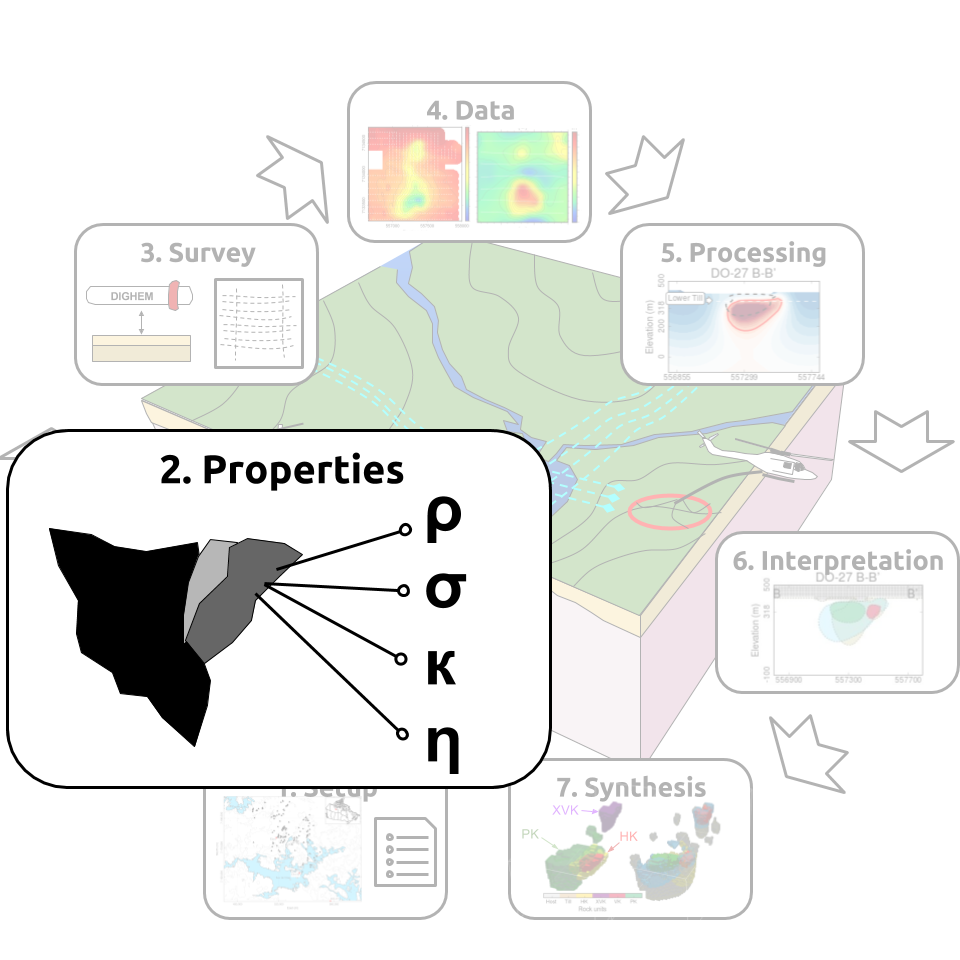
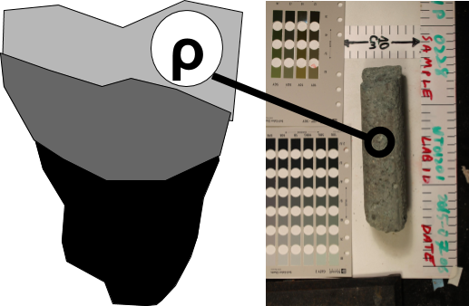
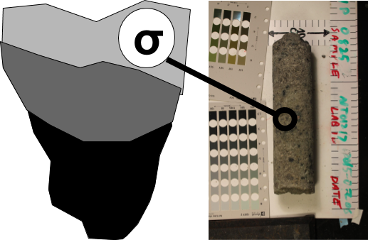

.. _tkc_properties:

Properties
==========

A common geophysical fingerprint for a kimberlite pipe near the poles is a
circular strong magnetic anomaly, with a gravitational low and an anomalous EM
response. The composition of the kimberlite pipes exhibits different physical
properties than those of the host rock and forms the basis for a geophysical
exploration model.

.. _tkc_density:

Density
-------

Kimberlite pipes are generally associated with negative gravity anomalies due
to their low density, although some exceptions exist :cite:`Reed2007`. In the Lac de Gras region, pyroclastic units (PK) are highly variable
in composition, but are often made up of a mix of fine grain volcaniclastic sediments (tuff, lapilli) and larger xenoliths of country rock. Fragments of wood, shale, siltstone and mudstone clasts are common depending on the
style of eruption and depositional environment :cite:`Pell1997`.
Moreover, olivine-rich volcaniclastic sediments are readily
altered to clay minerals through low-temperature metamorphism, further
contributing to lower the density :cite:`Masun1999`. Overall, we expect the
density of kimberlite pipes to be less than that of the background granitic
rock.

.. _tkc_susceptibility:

Susceptibility
--------------

.. figure:: images/Core_HK_Susc.png
    :align: right
    :figwidth: 20%
    :name: core_hk_susc

The bulk magnetic susceptibility of kimberlite rocks is highly variable and
depends largely on the concentration and size of magnetite grains. Intrusive
rocks, such as HK and VK units, tend to have a stronger magnetic signature
than the host rock and PK kimberlite :cite:`Power2007` :cite:`Reed2007`. In
addition, there has been many documented cases of kimberlite pipes with strong
remanent magnetization :cite:`Clark1983` :cite:`Macnae1985`
:cite:`Hargraves1989` :cite:`Keating2004`. At high latitude, such as in the
Lac de Gras region, remanence is clearly identified by the reverse (-)
polarity of the field. Therefore, we expect the susceptibility of kimberlite
pipes to be higher than that of the background granitic rock, but we must be
aware that the response may not by purely induced.

.. _tkc_conductivity:

Conductivity
------------

Electrical conduction is relevant to understanding of the geology of kimberlites
through a number of routes. First, many kimberlite pipes are filled with
olivine-rich volcaniclastic sediments :cite:`Masun1999` and generally
serpentinized through low-temperature metamorphism. Further weathering in the
upper region of the kimberlite pipes alters the rock to clay minerals which
are conductive compared to the host rocks. Secondly, glacial scouring of the
low competency kimberlitic rocks often results in the thick accumulation of
glacial till and lake sediments, which are typically conductive. The Lac de
Gras region is located in a sub-Arctic region with a documented permafrost
layer of variable thickness :cite:`Golder2014`. Laboratory and
field measurements have shown strong dependencies between temperature and the
EM response.

.. _tkc_chargeability:

Chargeability
-------------

.. figure:: images/Core_HK_Charg.png
    :align: right
    :figwidth: 20%
    :name: core_hk_charg

From the perspective of kimberlite exploration, little has been done in the
past to use chargeability as a diagnostic physical property. Ice and near-
surface clays are known to be chargeable. The temperature dependence of
conductivity :cite:`Grimm2015` and the presence of ice, as well as fine
glaciofluvial sediments, can be the sources of chargeability. The resulting IP
signal is often considered as "noise" that impedes the interpretation of EM
data and it is commonly referred to as IP contamination
:cite:`Kozhevnikov2012`. Recent studies, however, have shown that negative
transients in time-domain EM data could be attributed to more interesting geological
features :cite:`El-Kaliouby2004` :cite:`Flores2009`
:cite:`Kratzer2012` :cite:`Kang2014`. In this study, we will attempt to
extract chargeability information from the EM data to characterize the
kimberlite rocks.

Conceptual model
----------------

In summary, we have four physical properties which could be diagnostic in
differentiating between kimberlites and host rock, as well as between the
different kimberlitic rock types.
Overall we expect:

.. _TKCgeoTable:

+---------------------------+-------------------+--------------------+---------------------+-------------------+
|       **Rock Unit**       | **Density**       | **Susceptibility** | **Conductivity**    | **Chargeability** |
+---------------------------+-------------------+--------------------+---------------------+-------------------+
| Glacial till              |  Moderate         | None               |  Moderate-high      |        Low        |
+---------------------------+-------------------+--------------------+---------------------+-------------------+
| Host rock                 |  Moderate         | None               |         Low         |  Low              |
+---------------------------+-------------------+--------------------+---------------------+-------------------+
| HK                        |  Low-moderate     | High               |     Low-moderate    |  Low              |
+---------------------------+-------------------+--------------------+---------------------+-------------------+
| VK                        |  Low              | Low-moderate       |   Moderate-high     |  High             |
+---------------------------+-------------------+--------------------+---------------------+-------------------+
| PK                        |  Low              | Low-moderate       |   Moderate-high     |  Moderate-high    |
+---------------------------+-------------------+--------------------+---------------------+-------------------+
| Table of physical properties for typical kimberlitic rocks found in the Lac de Gras region.                  |
+--------------------------------------------------------------------------------------------------------------+

