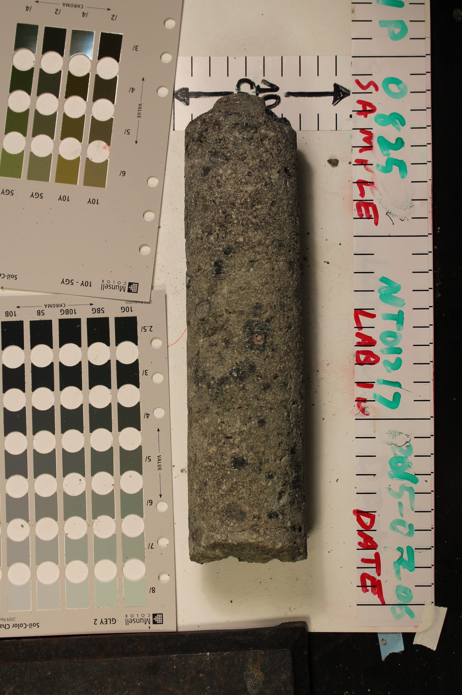
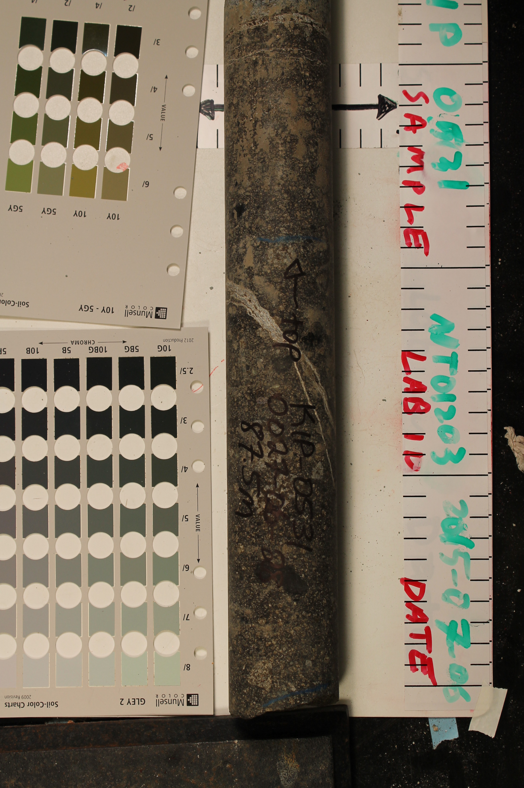

.. _tkc_properties:

Properties
==========

The composition of the kimberlite pipes exhibits different physical properties
than those of the host rock and forms the basis for a geophysical exploration
model.

Density
-------

.. figure:: images/Core_PK_Density.jpg
    :align: right
    :figwidth: 25%
    :name: core_pk_den

At Lac de Gras, the pyroclastic nature of VK and PK makes the rocks highly
porous and generally have low density, although some exceptions exist (Reed and
Witherly, 2007). Overall, we expect the density of kimberlites
to be less than that of the background granitic rock.

Susceptibility
--------------

.. figure:: images/Core_HK_Susc.jpg
    :align: right
    :figwidth: 25%
    :name: core_hk_susc

HK and VK kimberlites tend to have higher magnetic susceptibilities than the
host rock and PK kimberlite (Power and Hildes, 2007; Reed and Witherly, 2007).
In addition, HK is often remanently magnetized (Clark, 1983; Macnae, 1985;
Hargraves, 1989; Keating and Sailhac, 2004).

Conductivity
------------

Electrical conduction is relevant to understanding the geology of kimberlites
through a number of routes. First, many kimberlite pipes are filled with
olivine-rich volcaniclastic sediments (Masun, 1999) and generally
serpentinized through low temperature metamorphism. Further weathering in the
upper region of the kimberlite pipes alters the rock to clay minerals which
are conductive compared to the host rocks. Secondly, glacial scouring of the
low competency kimberlitic rocks often results in the thick accumulation of
glacial till and lake sediments, which are typically conductive. The Lac de
Gras region is located in a sub-Arctic region with a documented permafrost
layer of variable thickness (Golder Associated Ltd., 2014). Laboratory and
field measurements have shown strong dependencies between temperature and the
EM response.

The temperature dependence of conductivity (Grimm and Stillman, 2015) and the
presence of ice, as well as fine glaciofluvial sediments, can be the sources
of chargeability, and in turn significant IP signals.

Chargeability
-------------

From the perspective of kimberlite exploration, however, the existence of an
IP signal is not necessarily important. Ice and near-surface clays are known
to be chargeable. Their presence distorts EM signals and impedes
interpretation (Smith and Klein, 1996; Kozhevnikov and Antonov, 2012). As
such, the existence of negative transients is usually considered to be “noise”
and it is commonly referred to as IP contamination. Recent studies, however,
have shown that negative transients in EM data could be attributed to more
interesting geological features and thus the negative transients are “signal”
(El-Kaliouby and Eldiwany, 2004; Flores and Peralta-Ortega, 2009; Kratzer and
Macnae, 2012; Kang et al, 2014).

Conceptual model
----------------

In summary, we have four physical properties which could be diagnostic in
differentiating between kimberlites and host rock, as well as between the
different kimberlitic rock types.
Overall we expect:

.. _TKCgeoTable:

+---------------------------+-------------------+--------------------+---------------------+-------------------+
|       **Rock Unit**       | **Density**       | **Susceptibility** | **Conductivity**    | **Chargeability** |
+---------------------------+-------------------+--------------------+---------------------+-------------------+
| Glacial till              |  Moderate         | None               |  Moderate-high      |        Low        |
+---------------------------+-------------------+--------------------+---------------------+-------------------+
| Host rock                 |  Moderate         | None               |         Low         |  Low              |
+---------------------------+-------------------+--------------------+---------------------+-------------------+
| HK                        |  Low-moderate     | High               |     Low-moderate    |  Low              |
+---------------------------+-------------------+--------------------+---------------------+-------------------+
| VK                        |  Low              | Low-moderate       |   Moderate-high     |  High             |
+---------------------------+-------------------+--------------------+---------------------+-------------------+
| PK                        |  Low              | Low-moderate       |   Moderate-high     |  Moderate-high    |
+---------------------------+-------------------+--------------------+---------------------+-------------------+
| Table of the physical properties for the geologic units in the Cluny survey area.                            |
+---------------------------+-------------------+--------------------+---------------------+-------------------+

