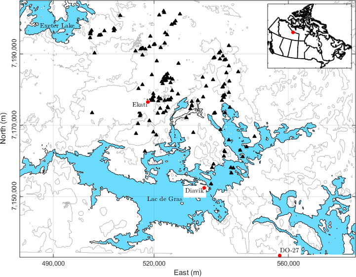
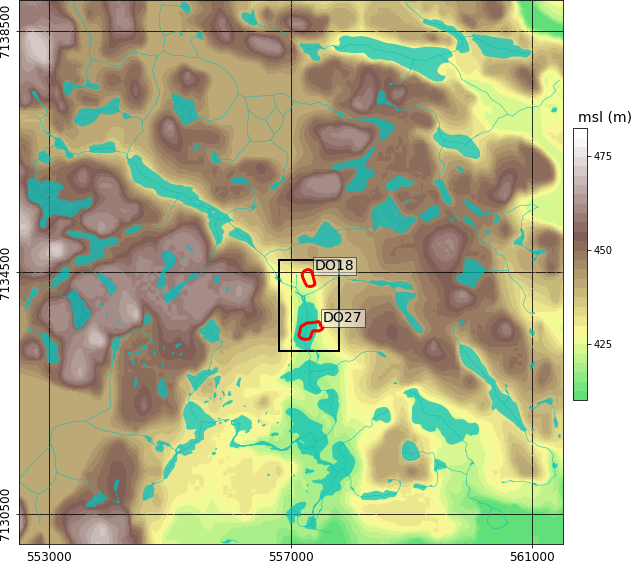
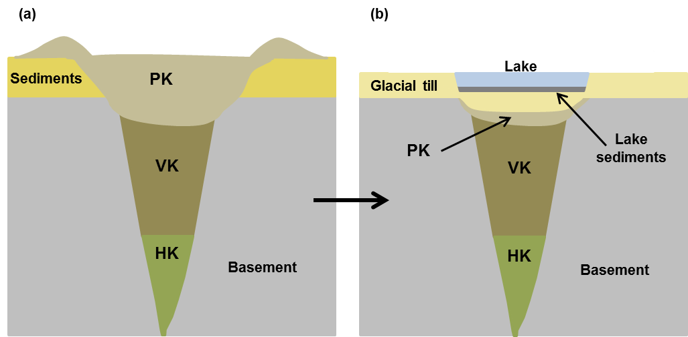

.. _tkc_setup:

Setup
=====

The Northwest Territories in Canada has been surveyed extensively for
diamondiferous kimberlites since the early 1980s. The Lac de Gras region has
been particularly productive, and hosts two of the largest Canadian deposits:
the Ekati and Diavik Diamond Mines. More than 150 kimberlite pipes have been
discovered in this region :cite:`Pell1997` :cite:`McClenaghan2002`. Despite
this impressive number, it is estimated that less than 10% of those
kimberlites are of economic interest. Understanding new deposits early in the
exploration program remains an important problem in diamond exploration, as
exemplified by the history of the TKC deposit.

Historical background
---------------------

    Topography and hydrology near the DO-27/DO-18 kimberlites. The region of
    interest (black) and near surface outlines (red) of DO-27 and DO-18  based
    on drilling are shown for reference.

The early 1990s saw a rush to open Canada’s first diamond mine, and in late
1992, a geophysical airborne survey discovered two kimberlites, called DO-18
and DO-27. At the time of discovery, the area was referred to as the Tli Kwi
Cho (TKC) kimberlite complex. :numref:`fig_tkc_location` shows the locations
of the kimberlites and indicates the extent of DO-27 and DO-18 at the surface
based on drilling.

Following the discovery, the interpretation of the two kimberlites evolved
over five geologic models, indicative of the uncommon geometry of the deposit
:cite:`Harder2009`. What was initial thought to be a large complex was later
understood to be disconnected bodies created in multiple volcanic phases. The
resource estimate was also revised down over the years as presented in the
:ref:`table below<TKCResEstTable>`, partially contributing to the Canadian junior
stock market crash of 1994 :cite:`Coopersmith2006`. At the time of writing, the deposit is owned by `Peregrine Diamonds Ltd`_.

.. _Peregrine Diamonds Ltd: https://www.pdiam.com/projects/peregrine-exploration

.. _TKCResEstTable:

+---------------------------+-----------------------------+
|       **Year**       	    | **Resource Estimate (Mt)**  |
+---------------------------+-----------------------------+
|       1994           	    |  50                         |
+---------------------------+-----------------------------+
| 1995                 	    |  25                         |
+---------------------------+-----------------------------+
| 2005-2008            	    |  30                         |
+---------------------------+-----------------------------+
|TKC resource estimate over the years.                    |
|(adapted from :cite:`Harder2008a`)                       |
+---------------------------+-----------------------------+

The goal of our work is to determine how well our modern-day inversions of
geophysical data could have helped the exploration program at the time of discovery.
We will attempt to answer the following questions:

- How much information could have been extracted form the airborne geophysical data?

- Can we differentiate between kimberlite units based on multiple physical properties?

Geological Background
---------------------
The surrounding lithology at TKC consists of post-Yellowknife Supergroup
granite. A thin layer of mudstone covers the granites a the surface
:cite:`Harder2008`. The Wisconsinan glaciation (Dyke and Prest, 1987)
covered the Lac de Gras region with glacial till and ultimately removed the
mudstone and part of the PK unit. The erosion that followed the glaciation
left approximately 10%-20% of the TKC kimberlite complex exposed at the
surface :cite:`Doyle1999`, with the rest below a layer of till 5-50 m thick.
:numref:`fig_tkc_kimberlite` shows a conceptual model for a kimberlite pipe in
the Lac de Gras region before and after glaciation. A lake was present above
DO-27 during the acquisition of the geophysical data.

.. The latest model by Harder et al (2009) hypothesized that DO-27 was created in
.. multiple volcanic phases. HK kimberlite intrusions are found on the
.. northeastern side of DO-27 from the initial phase, whereas a subsequent phase
.. created VK kimberlite (Doyle et al, 1999). This VK was disturbed during
.. another eruption, slightly to the southwest, which infilled the pipe with PK
.. kimberlite. In contrast to its southern neighbor, DO-18 is a VK kimberlite;
.. this supports the idea that its origin is distinctly different in geology and
.. evolution from DO-27. Harder et al (2008) and Doyle et al (1999) conclude that
.. DO-18 is not related to DO-27, despite their proximity.

    Schematic of a typical Lac de Gras kimberlite at (a) emplacement time and
    (b) after glaciation removed the top layers. A lake may be present after
    glaciation.

Many different types of kimberlite can exist within a pipe, and unfortunately,
there are several classifications and naming conventions :cite:`Pell1997`
:cite:`Kjarsgaard2007`. Here, we divide kimberlitic rocks into three types based on
their depositional environment: 

- Hypabyssal (HK): intrusive, igneous, nonfragmented rock, root of the volcanic pipe. 
- Volcaniclastic (VK): extrusive, fragmental, main volcanic body.
- Pyroclastic (PK): a subclass of VK, extrusive, violent, deposited after an explosive event.

