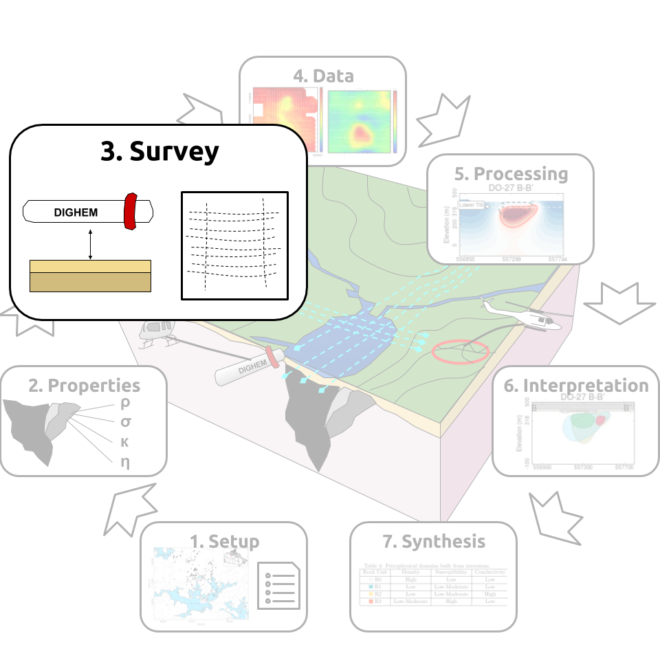
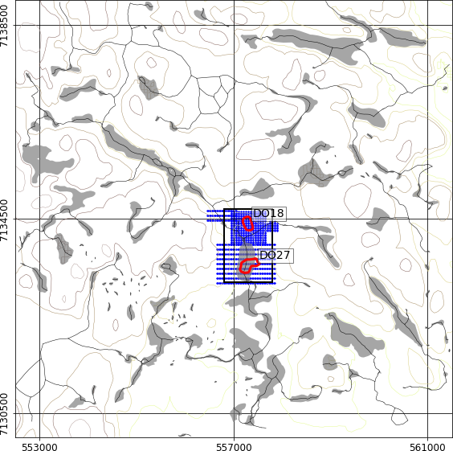
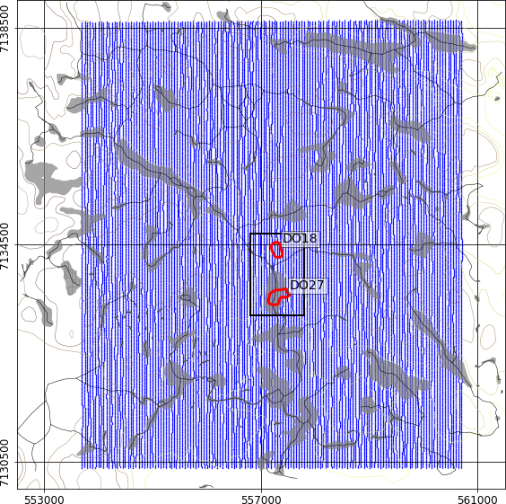
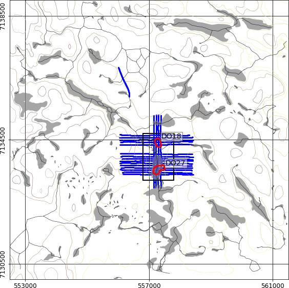

.. _tkc_survey:

Survey
======

The TKC deposit has been used as a testbed for airborne and ground geophysics,
with over 10 known surveys carried out over the deposit. In this section, we
review the acquisition configuration of 5 of these surveys.

All data used in this study were converted from their native coordinate system
to the NAD27-UTM 12N (`EPSG 26712`_) projection prior to processing.

.. _EPSG 26712: http://spatialreference.org/ref/epsg/nad27-utm-zone-12n/

+---------------------------+-------------------+----------+
|       **Survey**          | **Data Type**     | **Year** |
+---------------------------+-------------------+----------+
| DIGHEM*                   |  FEM, magnetics   | 1992     |
+---------------------------+-------------------+----------+
| Aerodat                   |  FEM,magnetics    | 1993     |
+---------------------------+-------------------+----------+
|        NanoTEM            |  TEM              | 1993     |
+---------------------------+-------------------+----------+
| Ground magnetics          |  Magnetics        | 1993     |
+---------------------------+-------------------+----------+
| Ground gravity*           |  Gravity          | 1994     |
+---------------------------+-------------------+----------+
| Falcon*                   |Gravity gradiometry| 2001     |
+---------------------------+-------------------+----------+
| AeroTEM I                 |  TEM, magnetics   |2001      |
+---------------------------+-------------------+----------+
| AeroTEM II*               |  TEM, magnetics   |2003      |
+---------------------------+-------------------+----------+
| VTEM*                     |  TEM, magnetics   |2004      |
+---------------------------+-------------------+----------+
| Resolve                   |FEM, magnetics     | 2006     |
+---------------------------+-------------------+----------+
| Falcon                    |Gravity gradiometry| 2006     |
+---------------------------+-------------------+----------+
| HeliSAM                   | TEM (total field) | 2014     |
+---------------------------+-------------------+----------+
| * Used in this study                                     |
+----------------------------------------------------------+

.. _survey_DIGHEM:

Frequency EM + Magnetics
------------------------

.. figure:: images/Survey_DIGHEM.png
    :align: right
    :figwidth: 50%
    :name: fig_Survey_DIGHEM

    Airborne DIGHEM survey collected in 1992

The first airborne survey acquired at TKC was the DIGHEM system in 1992,
responsible for the discovery of both DO-27 and DO-18. The survey consisted of
15 lines flown in the EW orientation at a 200 m line spacing, for a total of
52 line-km. The nominal flight height of the survey bird was 30 m. The DIGHEM
system was equip with a co-axial and a co-planar loop configuration. The :ref:`table
below<DIGHEMconfig>` summaries the separation and frequencies measured
by each coil pair. A magnetometer sensor inside the EM bird was used to
collect Total Field magnetic data.

.. _DIGHEMconfig:

+---------------------------+-----------------------+--------------------+
|       **Configuration**   |**Frequencies (Hz)**   | **Separation (m)** |
+---------------------------+-----------------------+--------------------+
| Co-axial                  |  1000, 5500           |  8                 |
+---------------------------+-----------------------+--------------------+
| Co-planar                 |  900, 7200            |  8                 |
|                           +-----------------------+--------------------+
|                           |   56000               |   6.3              |
+---------------------------+-----------------------+--------------------+

Ground Gravity
--------------

    Ground gravity stations collected in 1994.

The ground gravity data were collected in the winter of 1994 in two different
surveys. The surveys were leveled and combined into a single survey. Stations
are spaced every 25 m in the easting direction and every 100 m in the northing
direction over DO-27. Over DO-18, stations are collected every 50 m and every
25 m in the easting and northing directions, respectively. This gives a total
of 972 data locations. We note that only elevation data for the
survey over DO-27 was supplied to us. However, given that the data were
collected in the winter, we used our elevation model
:numref:`fig_tkc_location` and assume gravity stations were collected on the
surface of the frozen lake.

Gravity Gradiometry
-------------------

    Airborne Falcon survey collected in 2001

Airborne gravity gradiometry data were collected in 2001 using the Falcon
fixed-wing system. The survey covered a much larger area around the known
deposit in an effort to find additional drilling targets. Over 140 survey
lines were flown along the North-South direction, with an approximate line
spacing of 50 m, for a total of 1,120 line-km. The nominal flight height of
the survey was 50 m. After processing, the Falcon system returns the vertical
component of the gravity field :math:`g_{z}` and the vertical component of the
gradient tensor :math:`g_{zz}`. The fundamentals for the gravity and gravity
gradiometry surveys can be reviewed in `GPG Gravity`_.

.. _GPG Gravity: http://gpg.geosci.xyz/content/gravity/index.html

Time EM + Magnetics
-------------------

.. _survey_AeroTEM:

    Airborne AeroTEM survey collected in 2003.

AeroTEM
"""""""

The first time-domain electromagnetic survey to be collected at TKC was an
helicopter borne AeroTEM I system flown in 2001, then re-flown in 2003 with a
new generation of equipment AeroTEM II. Fifteen survey lines were flown in the
East-West orientation, with 4 additional lines flown NS. The overlap between
the two sets of lines covered the approximate location of DO-27 and DO-18 with
the objective of determining the vertical of the kimberlite pipes. The AeroTEM
system is a concentric transmitter-receiver coil system mounted on a rigid
platform.
The AeroTEM transmitter waveform is a triangular current pulse of 1150
microseconds duration operating at a base frequency of 150 Hz. The transmitter
loop consists of 8 turns of copper wire, 5 m in diameter, with a maximum
current  of 250 A that produces a peak moment of 40,000 Am2.
A cesium-vapour magnetometer bird is towed 10 m above the EM system.

.. _survey_VTEM:

.. figure:: images/Survey_VTEM.png
    :align: right
    :figwidth: 50%
    :name: fig_Survey_VTEM

    Airborne VTEM survey collected in 2004.

VTEM
""""

Due to peculiar negative data recorded by the AeroTEM system, the decision was
made to collect a second TEM survey in 2004 with an helicopter-born VTEM
system. A total of 20 lines were flown orientated EW at a 75 m line spacing,
with an additional 2 tie lines along NS for a total of 39 line-km. The VTEM
system measured the vertical component of the magnetic field using a
concentric loop configuration. A cesium-vapour magnetometer bird is attached 15 m
below the helicopter.
