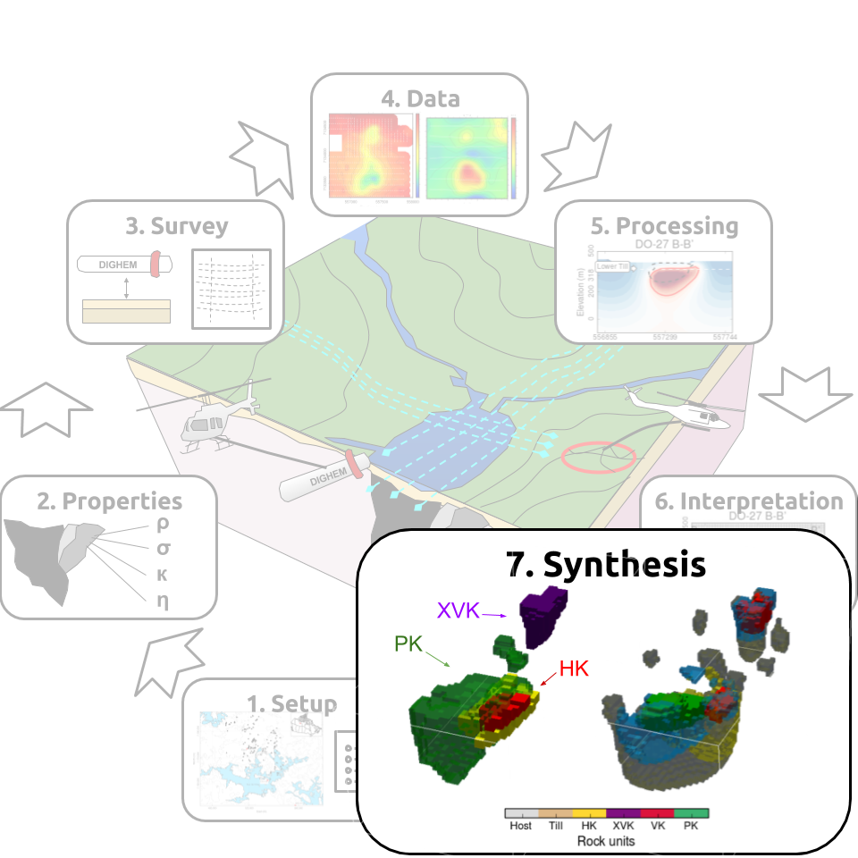

.. _tkc_synthesis:

Synthesis
=========

Two primary questions that motivated the initial study were:

- Can

- Can conductive and chargeable units,

:numref:`Interpretation_RockGeology` compares our rock model to the geological model build from drilling.

.. figure:: images/Interpretation_RockGeology.png
    :align: center
    :figwidth: 100%
    :name: Interpretation_RockGeology
