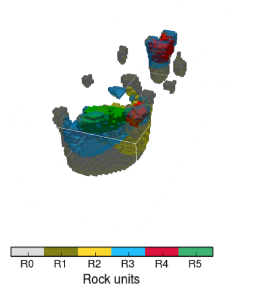
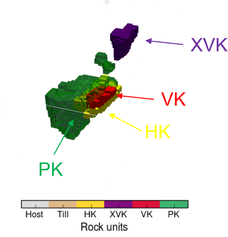

.. _tkc_synthesis:

.. figure:: images/TKC_7Steps_Synthesis.png
    :align: right
    :figwidth: 30%

Synthesis
=========

Two primary questions that motivated the initial study were:

- How much information could have been extracted form the airborne geophysical data at the time of discovery?

  Geophysical inversion would have easily determined that DO-27 and DO-18 were
  seperate bodies. The geometry of both pipes could have estimated prior to drilling for a more optimal exploration program.

- Can we differentiate between the kimberlite units based on multiple physical properties?

  From a geophysical perspective, the kimberlites differs mainly in their
  chargeability parameters and by the presence of a strongly magnetic HK unit
  (only present at DO-27).

In this study, no explicit information regarding the known geology has
been used to constrain the inversion. Only the general kimberlite model, the
component rock types and the expected physical property contrasts were
incorporated. Despite that, we obtained a rock model whose major features were
representative of the geologic model obtained from drilling.

All of the data used in the analysis were obtained from airborne surveys which
are far easier, and less costly, to collect than ground data. We note that if
a single borehole had been drilled in the heart of the DO-27 pipe, then the
geologic intepretation of the geophysical data would have greatly benefitted;
this could have had a major impact upon the exploration program

