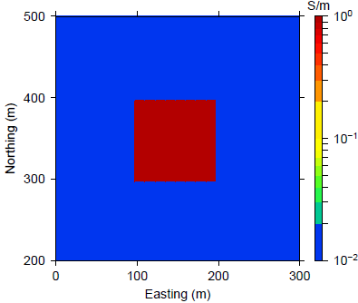
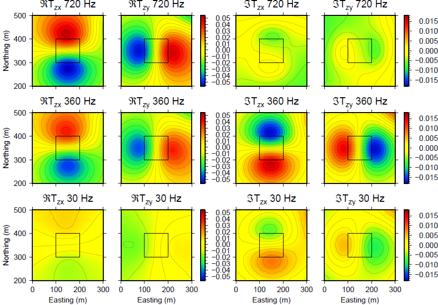
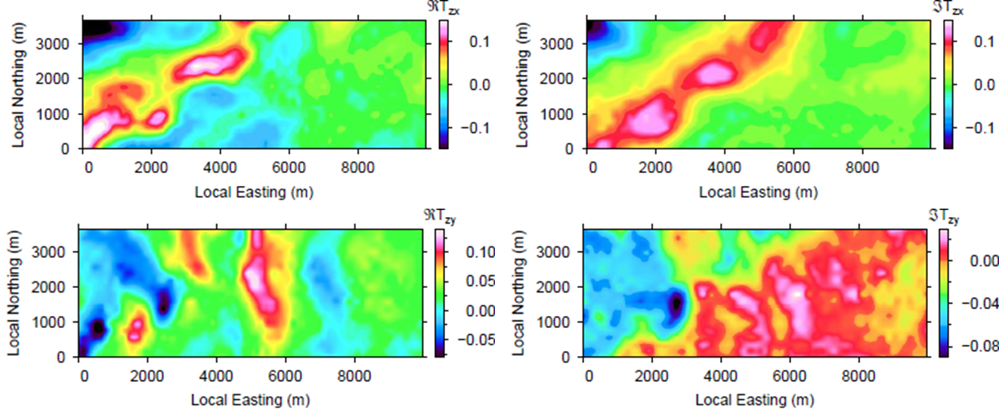

.. _emc_data:

Data
====

The Z-axis tipper electromagnetic technique (ZTEM) is a natural source geophysical method. It is similar to the magnetotelluric method (MT) but only the magnetic fields are measured :cite:`lo08`. The vertical component of the magnetic field is recorded along flight lines while the horizontal field components are measured at a fixed reference station on the surface. Transfer functions relate the vertical components to the horizontal component as shown in Equation :eq:`emceq1`:

.. math:: \mathbf{H}_z (\mathbf{r}) = T_{zx} (\mathbf{r},\mathbf{r}_0) \mathbf{H}_x(\mathbf{r}) +  T_{zy} (\mathbf{r},\mathbf{r}_0) \mathbf{H}_y(\mathbf{r})
        :name: emceq1

        Plan view map showing a conductive block in a halfspace.

        ZTEM tipper data for 3 select frequencies over the conductive block shown in :numref:`emc12`.

Each tipper has an in-phase and a quadrature component. To get a feel for this type of data, we first look at a synthetic example. The true model consists of a conductive block in a halfspace, as shown in :numref:`emc12`. Tipper data are :ref:`simulated <forward_modelling>` in 3D and the in-phase and quadrature components are plotted for select frequencies (:numref:`emc13`).

A few key things can be seen in the data. First, the anomaly over a block has a high peak and a low peak. Additionally, the orientation of the anomaly changes when we look at the :math:`T_{zx}` tipper versus the :math:`T_{zy}` tipper. Looking a bit closer and assuming a standard right-hand coordinate system, we can deduce that the ZTEM data are negative when going from a resistive region to a conductive region. Alternatively, the data are positive when traveling from a conductive to a resistive region. Outside of the anomaly, the data are zero. Because the tipper data are based on a ratio of the horizontal magnetic fields and the vertical magnetic field, ZTEM data are insensitive to uniform backgrounds as well as 1D layered earths. Thus, the data only show anomalies for 3D conductivity variations, such as this block in a halfspace.

Secondary observations include how the data change as frequency changes. For the in-phase (real) data, the amplitude increases with frequency. Recall that higher frequencies have a lower skin depth than lower frequencies, and are thus more sensitive to near-surface regions. The imaginary or quadrature data show the same anomaly orientations for the two tippers but the amplitudes are lower in general and in this case, the middle frequency plotted in :numref:`emc13` has the highest amplitudes.

This simple example showcases what ZTEM data look like and exemplifies that interpretation directly from the data is not always straightforward. But, with these patterns in mind, we can now look at the field data over Elevenmile Canyon and get first-hand ideas about the conductivity structures at depth.

The data over Elevenmile Canyon were collected by Geotech Ltd. in 2011 using a helicopter-based ZTEM and aeromagnetic system. The survey consisted of 200 line kilometers with 200 m spacing over a 38 square km area about 45 km east of Fallon, Nevada. There are approximately 20,000 data locations. The flight lines are shown in :numref:`emc2`. The in-phase and quadrature components of the tipper transfer functions are calculated from raw field data for siz frequencies ranging from 20 to 720 Hz. Preliminary processing such spike removal, attitude corrections, and filtering were applied to the data by Geotech.

Data were collected for six frequencies: 30, 45, 90, 180, 360, and 720 Hz. When comparing data maps between frequencies, the images are similar but smaller details change. :numref:`emc3` shoes the in-phase (real) and quadrature (imaginary) components of :math:`T_{zx}` and :math:`T_{zy}` for hte 30 Hz frequency in a local grid.

        The four components of the lowest (30 Hz) frequency data are shown in (a)-(d).

First-hand ideas about the conductivity structures can be obtained by evaluating the data. ZTEM data over a conductive block will show a high and low anomaly while data over a halfspace or a layered earth will be zero. Therefore, we can expect little to no 3D conductivity structures in the eastern portion of the survey area as the tipper data is roughly zero to the east of 6000 m. In the western portion of the area, the real and imaginary component of :math:`T_{zx}` show a north-west trending anomaly while in the :math:`T_{zy}` components show anomalies of different shapes in the area. This shows the difference between the two tippers and the different magnetic field components they take use.

Despite getting a few initial ideas from the data, the data remain hard to interpret. The next page delves into :ref:`processing and inverting <emc_processing>` the data to better understand the conductivity.
