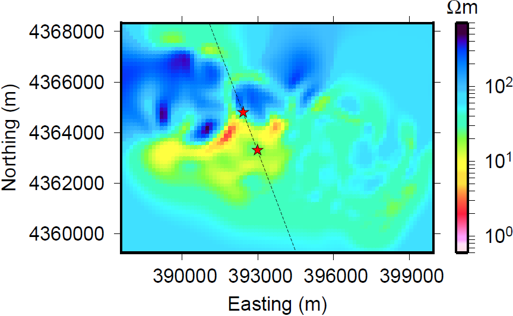
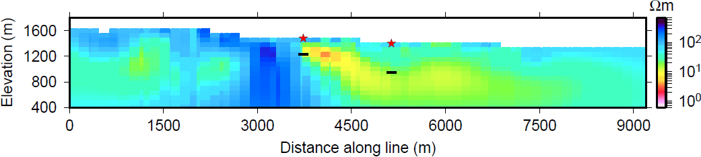

.. _emc_interpretation:

Interpretation
==============

    Depth slice of final inverse model at 1047 m. Two well locations are
    indicated with red stars. The line connecting the stars indicates
    where the cross-section in :numref:`emc8` is taken.

.. figure:: ./images/FIGURE_2.png
    :name: emc22
    :figwidth: 45%
    :align: right

    Cropped geology map (:cite:`hess97`) with the flight lines of the ZTEM
    survey. The survey consists of 20 lines, separated by 200 m. Each line
    is approximately 11 km long. Geologic units mapped at the surface are
    Qoa (surface alluvium), Kg (granites), Tys (non-marine sedimentary
    rocks), TRs (limestone), Tor (rhyolitic welded tuff), and Tv (volcanic
    rocks) :cite:`page65`. The pins show the locations of wells and a DC
    resistivity survey.

On the :ref:`previous page <emc_processing>`, the ZTEM data were processed and
inverted. :numref:`emc7` shows the final recovered model, in UTM coordinates,
slices to a depth of 1037 m. The model shows a large conductor as expected,
with a large resistive area in the northwest. Resistivities are near the
background value in the eastern portion of the model, and this indicates a
lack of contrasting lithology within the alluvial fan. The boundary between
this unit and the conductive region is indicative of the faults previously
mapped along the mountain front, and shown on the geology map. For ease of
reference, the geology map is reproduced on this page in :numref:`emc22`.

Several wells were drilled at the survey site in the early 1980s. We
specifically looked at two wells logs :cite:`rosewood81,rosewood81b` markes as
"1" and "2" in :numref:`emc22`. In well "1", argillite and siltite comprised
the first ~550 m, followed by granite. A mixture of sediments, volcanics, and
argillite was found in the first ~250 m in well "2", followed by granite.
Thus, between these two wells, the depth of the granite, considered to be the
basement unit, decreases. We expect the granite to be resistive compared to
the overlying material. A cross-sectional view (:numref:`emc8`) shows that
depth to the granite correlates with the model recovered from the inversion.
The depth to the top of the granite basement is marked with black lines
underneath the location of the wells. At well "2", the boundary between the
overlying conductor and the underlying resistor agrees with the top of the
granite basement. The resistor appears close to t he surface and extends to
depth in the western portion of the recovered model and thus likely represents
the basement granite. The conductive unit above the granite basement extends
deeper at well "1", indicating a deeper depth to basement. This agrees well
with the well data. The difference in depth to basement between the two wells
is ~300 m. This difference and the deepening conductor in the 3D model
possible relate to faulting. The high conductive zone trends roughly north-
west like the mappes faults in the Dixie Valley and its high conductivity may
indicate fluid flow or alteration.

    Cross-section of the model. The cut lies along the lines between wells
    "1" and "2" in :numref:`emc7` and looks east. The model is cut-off at
    the bottom at approximately 1 skindepth. The black lines indicate the
    depth to granite in the well logs.
