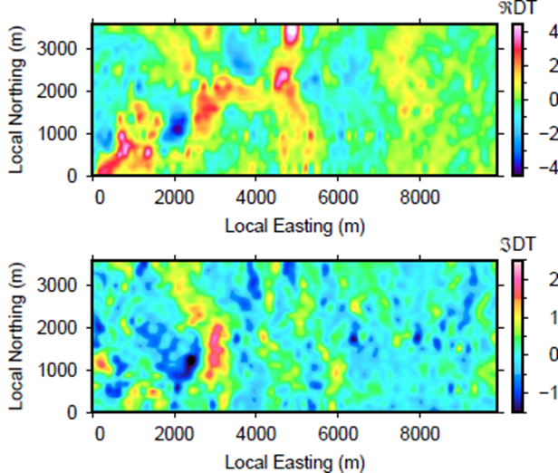
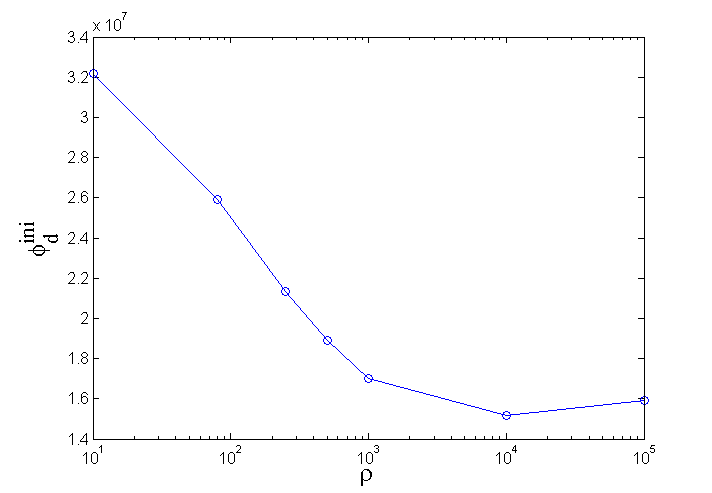
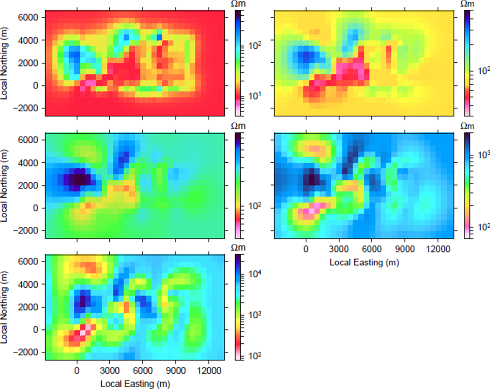

.. _emc_processing:

Processing
==========

To understand the first-order conductivity structures in the data, we
calculate the divergence of the tippers using horizontal derivatives for each
in-phase and quadrature component per frequency :cite:`lo08`:

.. math::
    DT = \nabla \cdot T = \frac{\partial T_{zx}}{\partial x} +
         \frac{\partial T_{zy}}{\partial y},

where :math:`T` is defined as :math:`{T_{zx} \choose T_{zy}}`. Effectively,
the fivergence generates maxima and minima over anomalies that are easier to
interpret compared to peak-and-trough signatures in the data. This method
provides a first look at the geometries and locations of structures of
interest. Warm and cool colours correspond to regions of higher and lower
conductivity, respectively. :numref:`emc4` shows the DT plot using the in-
phase and quadrature component of the 30 Hz data, which has the greatest depth
of penetration.

    Tipper divergence plot using (a) in-phase and (b) quadrature
    components of 30 Hz data. Warm colours are associated with higher
    conductivities and cool colours with lower conductivities.

The in-phase DT plot shows a high conductivity structures extending from hte
local origin of coordinates to (x,y) = (5000,3000). The region for x > 6000 m
shows little signal, meaning that only small variations in conductivity exist.
This agrees with our initial look at the :ref:`data <emc_data>` in
:numref:`emc3`. The quadrature DT plot shows similar features with smaller
amplitudes. Noteworthy signatures are the large minima on the left-hand side
and the large maxima in the same location as the in-phase plot. From these
plots, we deduce that the majority of structure, including a large conductor,
is on the west side of the survey grid.

Next, the ZTEM data are inverted to obtain a 3D conductivity model. An important component of ZTEM :ref:`inversion <inversion>` is the choice of background conductivity, primarily because the tipper data are most responsive to relative changes in electrical conductivity and are only weakly dependent upon the absolute value of conductivity in 3D environments. Recall that data are collected for 6 fequencies, and there is an in-phase and quadrature component for each transfer function. Thus, we have 24 individual data maps and a total of ~480,000 data points. We first assign uncertainties (percentage errors and a floor) to the data and separately invert the data for the individual frequencies. The assigned uncertainties were then adjusted so that all data maps could be fit equally well. The full data set, with new assigned uncertainties, was then inverted. This procedure eliminates over-fitting of certain maps while under-fitting others.

    Initial data misfit plotted versus uniform resistivity model. The plot
    shows that the best fitting background model has a resistivity of 10,000
    :math:`\Omega m`, which is unusually high.

ZTEM data has a nonzero response only where there is a change in conductivity
in the horizontal directions (i.e., x and y), and hence the tipper data for a
halfspace, or a 1D conductivity structure, are zero. This complicates the task
of choosing a reference model. To better understand the effects of different
reference models, we performed several coarse :ref:`inversions <inversion>`
with the reference models ranging from 10 to 100,000 :math:`\Omega m`. The
data were kept in a local coordinate system to minimize the number of cells in
the mesh and thus, reduce computation time.

    Depth slices of the inverse models. The initial and reference models were
    (a) 10 :math:`\Omega m`, (b) 80 :math:`\Omega m`, (c) 250 :math:`\Omega
    m`, (d) 1,000 :math:`\Omega m`, and (e) 10,000 :math:`\Omega m`. Models
    (a) and (b) are plotted depths of 1,087 m and 837 m, respectively. Models
    (c)-(e) are plotted at 587 m. Plotting depths were chosen as roughly 1
    skindepth.

We first compare the initial :ref:`data misfit <inversion>` for each coarse
inversion, shown in :numref:`emc5`. The data misfit reaches a minimum for a
background model of 10,000 :math:`\Omega m`, meaning that this is the best-
fitting background. This however seems unusually high considering the local
geology (:numref:`emc2`) and may not be the best reference model to use in the
inversion.

We now look closer at the models corresponding to the background
conductivities. :numref:`emc6` shows a depth slice of the recovered models. In
models (a), (b), and (c), plotted at ~1 skin depth, a large conductor is seen
through the centre of the image. The conductor is flanked by a high resistive
area to the west and east. For models (d) and (e), pltoted at 587 m, or the
same depth as (c), the structures are deeper and smoother. The observation
that the same high conductivity structure appears in all inversions provides
increased confidence that this structure is required in order to fit the data.
Comparing these results to the divergence plot in :numref:`emc4`, we also
notice the similarities in the location and structure of the conductor as well
as the lower resistive areas on the east side. The larger resistors towards
the west side of the model, separated by a small conductor, can also be seen
in the DT plot.

For each of the above inversions, the data are fitted approximately equally
well and the same structures are apparent in the models although the depths
vary. Without any geologic input, each reference model is therefore equally
valid. This shows that choosing a reference model is not arbitrary and we
require additional geologic or geophysical data to confidently choose the most
appropriate bacground model.

A small Wenner DC resistivity survey was collected in the survey area, marked
as "3" in :numref:`emc2`. The maximum electrode spacing was 27 m. The apparent
resistivity data shows the beginning of an asymptote at the largest spacings
and this corresponds to an apparent resistivity of ~50 to 100 :math:`\Omega
m`. The location of the survey is within the Elevenmile Canyon, which runs out
to an alluvial fan in the valley. Considering that sediments from the canyon
are carried out into the valley, the resistivity at marker "3" is likely
similar to those of the alluvium. Additionally, the ZTEM data and the DT plots
(:numref:`emc3` and :numref:`emc4`) show very low signal in the area of the
alluvium, indicating little deviation from the background resistivity. Model
(b) in :numref:`emc6` indicates a resistivity in the area of the alluvium that
is approximately equal to that obtained from the DC data. For this reason, we
choose a background resistivity of 80 :math:`\Omega m`.

The :ref:`inversion <inversion>` was rerun using a finer mesh so that greater
detail in the conductivity could be obtained. The reference model for the
final fine-meshed inversion was 80 :math:`\Omega m`. The uncertainties are
defined to maintain equal weight of each data grid as decribed earlier. The
final model is interpreted on the :ref:`next page <emc_interpretation>`.
