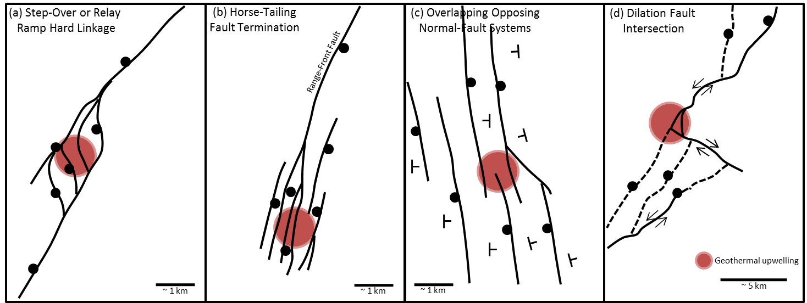

.. _emc_properties:

Properties
==========

.. figure:: ./images/geothermal.png
        :name: geo
        :align: right
        :figwidth: 70%

        Two examples of generic geothermal systems. Modified from :cite:`Munoz2014`.

        Examples of common structure settings for geothermal systems in the Great Basin, Western USA. Figure modified from :cite:`FauldsEtAl2011`.

A generic geothermal consists of a clay cap and a reservoir (:numref:`geo`), where the clay cap is more conductive than the reservoir and the background rocks. The heat flow and fluids alter the overlying rocks, generating clays, which tend to be more conductive than the background. Therefore, exploration for geothermal system using EM look for conductive targets that indicate fluid flow and alteration.

In the Basin and Range system in Nevada, the structures that control the fluid flow are based on faults, as shown in :numref:`geo2`. Referring back to the geology map (:numref:`emc2`), we know there are a number of faults in the Elevenmile Canyon region. In addition, the geology maps shows outcrops of generally resistive units, such as alluvium, granites, limestone, and sedimentary rocks. Thus, we are looking for a conductive body that can indicate alteration, clays, and fluid flow. The :ref:`survey <emc_survey>` used in this case-history is a natural-souce EM method calld ZTEM.

