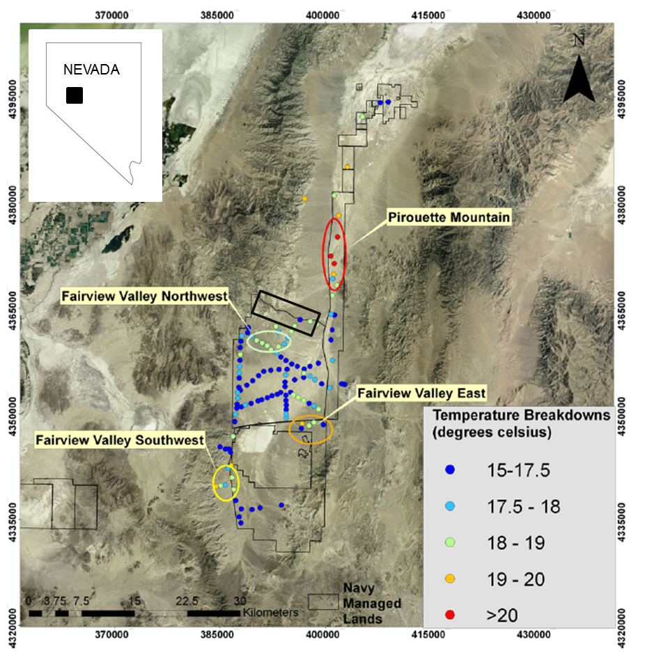
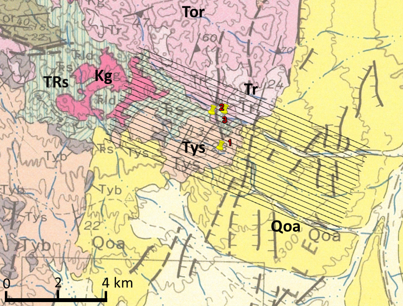

.. _emc_setp:

Setup
=====

        Figure from :cite:`SkordEtAl2011` showing temperature measurements between the Dixie and Fairview Valleys. The location of the Elevenmile Canyon survey area is outlined in black and lies just north of the Fairview Valley Northwest anomaly.

        Cropped geology map (:cite:`HessJohnson1997`) with the flight lines of the ZTEM survey. The survey consists of 20 lines, separated by 200 m. Each line is approximately 11 km long. Geologic units mapped at the surface are Qoa (surface alluvium), Kg (granites), Tys (non-marine sedimentary rocks), TRs (limestone), Tor (rhyolitic welded tuff), and Tv (volcanic rocks) :cite:`Page1965`. The pins show the locations of wells and a DC resistivity survey.

The Elevenmile Canyon, located in the Basin and Range of western Nevada 45 km east of Fallon, Nevada, contains a low geothermal anomaly :cite:`Mankthemthong2008`. The canyon lies on the eastern flank of the Stillwater Range and extends into the basin between the Dixie and Fairview Valleys. Both these valleys are associated with geothermal activity and particularly the Dixie Valley has been extensively studied (e.g., :cite:`BlackwellEtAl1999,GolanBenoit2000,BlackwellEtAl2007, WannamakerEtAl2007,PenfieldEtAl2010`.

The Fairview Peak and Dixie Valley fault zones ruptured in 1954 :cite:`Mankthemthong2008`. The orientations of the faults and the regional structural setting have created a transition zone between the two valleys, bounded by the Louderback Mountains to the east and the Stillwater Range to the west. The Elevenmile Canyon anomaly occurs at the end of the main Dixie Valley fault while the Fairview Valley fault steps eastward on the opposing side of the valley.

A shallow, two-meter temperature survey, where temperature is measured at 1 m, 1.5 m, and 2 m depths, shows a 1.5-2.5 :math:`^{\circ}` C anomaly south of the area of interest and a 3-4 :math:`^{\circ}` C anomaly at close-by Pirouette Mountain :cite:`SkordEtAl2011`. :numref:`emc1` shows the temperature readings and the location of the Elevenmile Canyon survey area. Additionally, a thermal anomaly was confirmed at the survey area :cite:`LazaroEtAl2011`. A LiDAR study in the same general area mapped four fault zones and concluded that the geothermal temperature anomalies are associated with these complex fault structures :cite:`HeltonEtAl2011`. :numref:`emc2` shows a geologic map of the area :cite:`HessJohnson1997`. Faults are mapped in the aluvium near the boundary between the Stillwater Range and the basin. All of the mapped faults trend north-south, as do those in the Dixie Valley.

