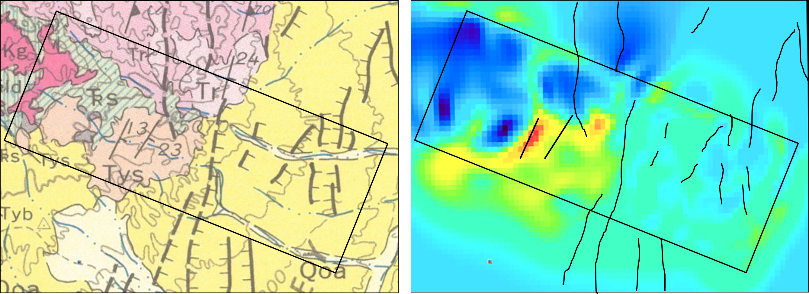
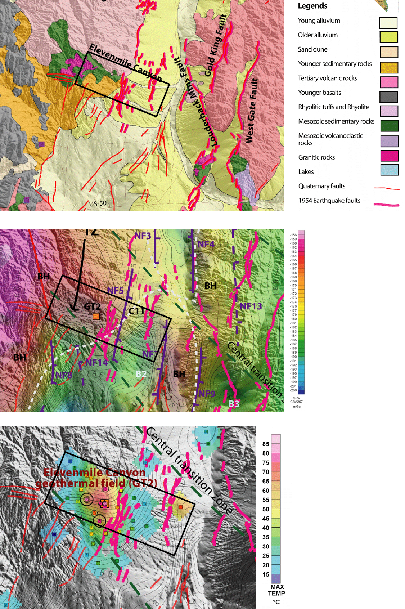

.. _emc_synthesis:

Synthesis
=========

        Comparison of the (left) geology map (:numref:`emc22`) and (right) recovered depth slice (:numref:`emc7`). Black lines on the recovered model show the faults from the geology map. The black box outlines the ZTEM survey area.

        Data from :cite:`mank2008` presents a number of data sets in the area around Elevenmile Canyon. Figures modified from :cite:`mank2008`. The top panel shows a geologic map, similar to :numref:`emc22` with faults in the region. The middle panel shows gravity data collected over the region. The bottom panel shows borehole temperature data collected. The black box outlines the ZTEM survey area.

:numref:`emc9` compares the geologic map with the recovered model. The faults from the geologic map are overlaid on the recovered model, where some fault show good correlation between the high conductive region. In addition, :cite:`mank2008` present a number of data sets that include the Elevenmile Canyon that are used here to further support the findings from the ZTEM data (:numref:`emc10`).

The data presented in :numref:`emc10` shows the geothermal anomaly to be directly to the west of a set of faults created by the 1954 earthquakes. The location of the Elevenmile Canyon anomaly based on the gravity and temperature data agrees nicely with the high-conductivity anomaly from the ZTEM region. Additionally, fault mapping shows that the geothermal anomaly occurs at the southern end of the major fault generated by the 1954 earthquakes. Interestingly, at the northern end of the fault, another geothermal anomly has been recognized, known as the Pirouette Mountain anomaly.

This case history used ZTEM data and 3D inversions to provide a conductivity model over the Elevenmile Canyon. The results show a large conductor in the same region as other geophysical datasets and may be indicative of the fault system and fluid flow related to geothermal activity.
