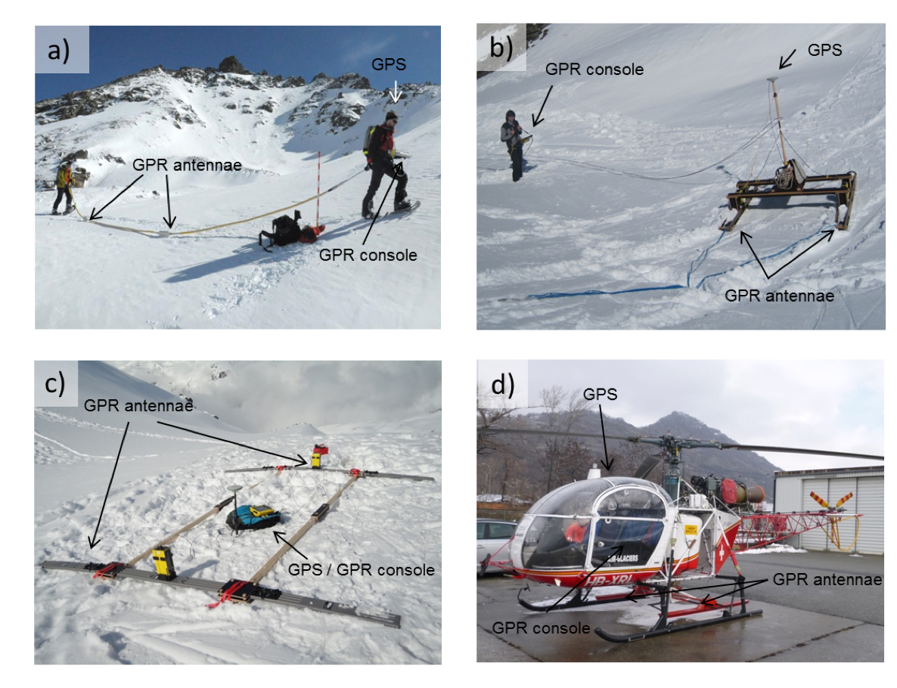

.. _rockglacier_survey:

Surveys
=======

Our first attempts to image the Furggwanghorn rock glacier involved acquiring
surfaced-based GPR data using two different acquisition systems and three
different antennae (second to fourth columns in :ref:`Table 3<GPRspecTable>`
and :numref:`pulseEKKO_gprsys` a - c). GPR data were recorded along multiple
lines during the Winter / Spring of 2010, 2011 and 2012 and during the Summer
of 2012. See the caption to :numref:`furggwanghorn_gprsurvey` for the
locations of three of these lines (G1 - G3).

    Winter/Spring deployment of different GPR systems: (a) 50 MHz Mala Rough
    Terrain Antennae, (b) Sled mounted 50 MHz pulseEKKO PRO, (c) rigid frame
    mounted 25 MHz pulseEKKO PRO and (d) helicopter mounted 60 MHz GSSI
    SIR-3000.

.. _GPRspecTable:

**Table 3:** Data acquisition systems used for surface-based GPR surveying the Furggwanghorn rock glacier.

.. csv-table::
    :header:  "Division","Ground","Ground","Ground","Helicopter"

    "| System","pulseEKKO PRO","pulseEKKO PRO","Mala RTA","GSSI SIR-3000"
    "| Nominal Antennae frequency (MHz)","50­­­­","25","50","60"
    "| Antenna separation (m)","2","4","4","2"
    "| Antenna configuration","Parallel-broadside","Perpendicular-broadside ","Parallel-endfire","Parallel-broadside"
    "| Sampling rate (ns)","1.6","3.2","1.46","1.46"
    "| Trace length (ns)","2000","5040","1547","3000"
    "| Antenna transportation","Sled","Rigid frame","Snake antennae","Helicopter"
    "| Positioning","Diff. GPS","Diff. GPS","Diff. GPS","Diff. GPS"

After obtaining disappointing results from the surface-based GPR surveys, a
few lines of H-GPR data were recorded in the Winter / Spring of 2012. The high
quality of the 2012 H-GPR images prompted the full 3D GPR survey during the
Winter / Spring of 2013. A total of ~9000 m of H-GPR data were acquired 15 ‑
20 m above ground along sixteen ~450 m long east-west lines separated by an
average of ~10 m and along four ~340 m long north-south lines
(:numref:`furggwanghorn_gprsurvey`). In addition to crossing the active rock
glacier (ARG in :numref:`furggwanghorn_geo`), the lines traversed parts of the
rock glacier’s root zone (RGRZ), inactive and relict rock glaciers (IRG and
RRG), the talus, and several bedrock outcrops.

.. figure:: images/furggwanghorn_gprsurvey.png
    :align: center
    :figwidth: 80%
    :name: furggwanghorn_gprsurvey

    Locations of H-GPR lines (green lines) acquired during the Winter / Spring
    of 2012 and 2013 and boreholes (yellow dots). The surface-based GPR
    sections G1 - G3 presented in :numref:`Ground_dataprocB` were recorded in
    the vicinity of boreholes F4 ‑ F7 close to and subparallel to H-GPR
    profiles H1 and H5.

